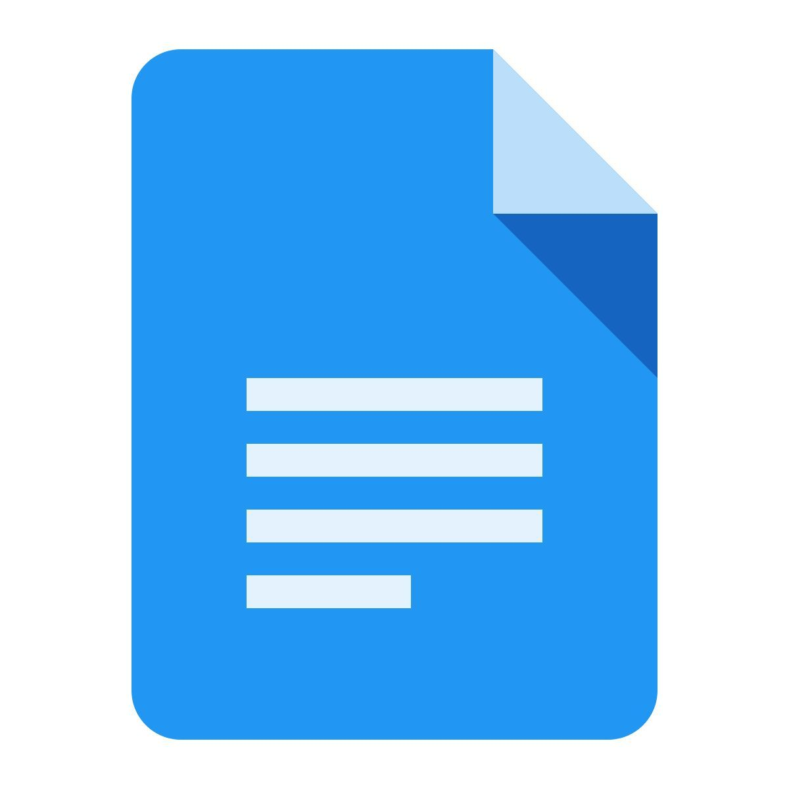
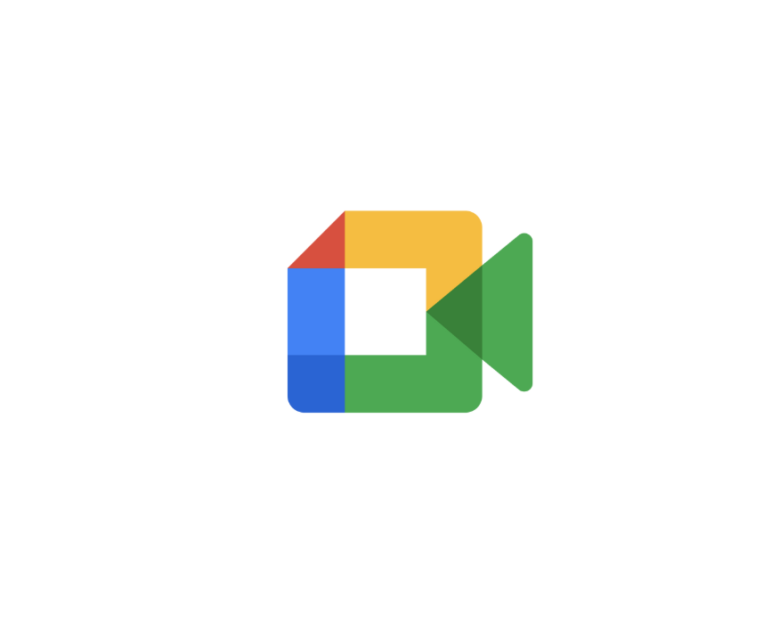
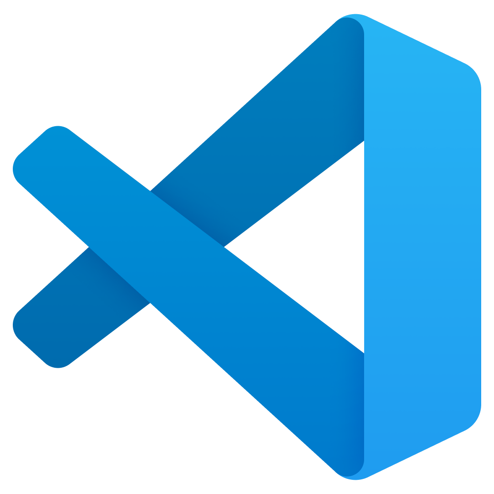
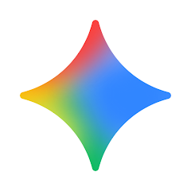
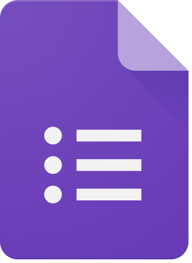

# Ferramentas

Para garantir a eficiência e a colaboração da equipe, utilizamos diferentes ferramentas que otimizam desde a comunicação até o controle de versão. A _Tabela 1_ detalha cada uma delas e mostra como sua integração agiliza e organiza o nosso dia a dia.

|                             Ícone                              |                                                            Ferramenta                                                             | Finalidade                                                            |
| :------------------------------------------------------------: | :-------------------------------------------------------------------------------------------------------------------------------: | :-------------------------------------------------------------------- |
|  | [Github](https://github.com/) | Hospedagem e versionamento do projeto. |
|  | [Google Docs](https://docs.google.com/document/u/0/?hl=pt-BR) | A documentação do projeto é centralizada no Docs. |
|  | [Draw.io](https://app.diagrams.net/) | Elaboração das Rich Pictures e dos Diagramas. |
|  | [Google Meet](https://www.microsoft.com/pt-br/microsoft-teams/group-chat-software) | Gravação das apresentações. |
|  | [WhatsApp](https://www.whatsapp.com/?lang=pt_br) | Comunicação diária entre os integrantes da equipe. |
|  | [Docsify](https://www.mkdocs.org/user-guide/installation/) | Criação das páginas de documentação. |
|  | [Vscode](https://code.visualstudio.com/download) | Atualização de documentos do projeto. |
|  | [Chat-gpt](https://chatgpt.com/) | Ferramenta de auxílio na resolução de dúvidas. |
|  | [YouTube](https://www.youtube.com/) | Hospedagem dos vídeos produzidos. |
|  | [Gemini](https://gemini.google.com/app?hl=pt-BR) | Ferramenta de suporte na busca por respostas e soluções. |
|  | [Google Formulários](https://docs.google.com/forms/u/0/) | Ferramenta para elaboração de formulários. |

_Tabela 1_: Tabela de Ferramentas utilizadas. Fonte: 

## Histórico de Versões

| Versão | Data       | Descrição                                     | Autor                                                                                             | Revisores                                            |
| ------ | ---------- | --------------------------------------------- | ------------------------------------------------------------------------------------------------- | -------------------------------------------------- |
| 1.0    | 27/08/2026 |  Adicionado tabela de ferramentas utilizadas  | [Breno Teixeira](https://github.com/BrenoLTeixeira), [Enzo Menali](https://github.com/menali17), [Gabriel Diniz](https://github.com/GabrielDiniz12) ,[Geovanna Umbelino](https://github.com/GeovannaUmbelino), [Lucas Oliveira](https://github.com/dev-LucasDpaula), [Paulo Vitor Gomes](https://github.com/gpaulovit)   e [Pedro Américo](https://github.com/dev-americo)                                         | [Breno Teixeira](https://github.com/BrenoLTeixeira), [Enzo Menali](https://github.com/menali17), [Gabriel Diniz](https://github.com/GabrielDiniz12) ,[Geovanna Umbelino](https://github.com/GeovannaUmbelino), [Lucas Oliveira](https://github.com/dev-LucasDpaula), [Paulo Vitor Gomes](https://github.com/gpaulovit)   e [Pedro Américo](https://github.com/dev-americo)         |

