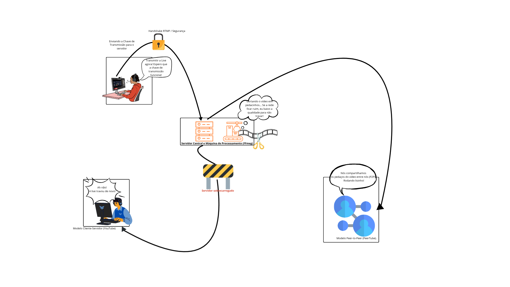

<!--
# SubEquipe_01
O relatório deverá conter a estrutura de focos estabelecida a seguir, bem como versionamentos, metodologia e participantes por foco.
Não omitir tópicos.

## Focos do Relatório:
### FOCO_01: Artefatos Generalistas & NFR Framework
Entrega Mínima: um artefato generalista (ESCOPO: Rich Picture ou Mapa Mental) e um SIG na notação do NFR Framework.
Mira-se no MM no FOCO, com a entrega mínima.
### Participantes no Foco_01
| Nome do Membro |

EXEMPLO:
| Fulano 
### Metodologia do Foco_01
Espaço para contar um pouco sobre como ocorreu o trabalho em equipe. Vídeos ajudam aqui.
### Rich Picture OU Mapa Mental
Rich Picture ou Mapa Mental 
### NFR Framework
SIG de <<critério de qualidade>> na notação do NFR Framework.
#

### FOCO_02: Engenharia Reversa & Modelagem BPMN
Entrega Mínima: um modelo, na notação BPMN, do fluxo do software encontrado com a Engenharia Reversa.
Mira-se no MM no FOCO, com a entrega mínima.
### Participantes no Foco_02
| Nome do Membro |

EXEMPLO:
| Fulano |
### Metodologia do Foco_02
Espaço para contar um pouco sobre como ocorreu o trabalho em equipe. Vídeos ajudam aqui.
### Processo de Engenharia Reversa Aplicado
Descrever o contexto no qual foi aplicada a Engenharia reversa, bem como o processo de Engenharia Reversa, explicando as etapas, as ferramentas utilizadas, e os achados. Embasar na literatura as colocações.  
### Modelagem BPMN
Modelo, na notação BPMN, de um fluxo levantado ao realizar o processo de Engenharia Reversa.

#
### FOCO_03: IA Generativa
Entrega Mínima: pontos de vista de cada membro da equipe sobre as lições aprendidas e uso da IA Generativa.
TODOS DEVEM PARTICIPAR!
### Participantes no Foco_03
| Nome do Membro | Lições Aprendidas | Uso da IA Generativa (SENSO CRÍTICO) |

EXEMPLO:
| Fulano | Compreendi sobre Engenharia Reversa, conseguindo recuperar o fluxo de pagamento de uma aplicação de comércio eletrônico, bem como representar em BPMN esse fluxo. Usei Mapa Mental para estruturar os principais elementos desse fluxo, sendo útil nos debates em equipe. Modelei o SIG de Segurança na notação do NFR Framework. | A IA Generativa ajudou a compreender melhor sobre alguns pormenores da teoria da Engenharia Reversa, mas alucinou na geração de modelos, seja em NFR Framework, seja em BPMN. Isso demandou ajustes nos modelos usando como base a literatura especializada, conforme consta no relatório.

#
## Versionamentos
|Nome do Membro | Contribuição | Data

EXEMPLO:
| Fulano  |  1. Elaboração do Artefato Mapa Mental & BPMN do FLuxo de Pagamento & Ponto de Vista sobre o Uso de IA Generativa | XX/XX/XXXX
OBS: TODOS DEVEM PARTICIPAR, MOSTRANDO SEUS PONTOS DE VISTA E COMO COLABORARAM NA ENTREGA.

--
# Observações: 
Entregável: Relatório, documentado no GitPages, revelando:
## Entrega Mínima (por subgrupo da equipe): um artefato generalista (ESCOPO: Rich Picture ou Mapa Mental), um SIG na notação do NFR Framework, um modelo, na notação BPMN, do fluxo do software encontrado com a Engenharia Reversa, e pontos de vista de cada membro da equipe sobre as lições aprendidas e uso da IA Generativa. Mira-se no MM, com a entrega mínima.

## Como ir além, para conseguir menções superiores?
Embasar cada artefato gerado e cada decisão tomada na literatura;
Manter rastros claros para o trabalho em equipe (ex. vídeos das reuniões e atas bem elaboradas), evidenciando práticas metodológicas (ex. reuniões periódicas das metodologias ágeis; checklists; debates, e assim vai);
Usar os vários recursos de modelagem, seja do NFR Framework, seja da notação BPMN, e
Reportar os pontos de vista de forma fundamentada, clara e com senso crítico.

## 📌A ideia não é quantidade, e sim qualidade do que é entregue.

## Apresentação:
Apresentação (para a professora) explicando o artefato elaborado, com: (i) rastro claro aos membros participantes (MOSTRAR QUADRO DE PARTICIPAÇÕES & COMMITS); (ii) justificativas & senso crítico sobre o trabalho realizado, e (iii) comentários gerais sobre o trabalho em equipe. Tempo da Apresentação: +/- 10min. Recomendação: Apresentar diretamente via Wiki ou GitPages do Projeto. Baixar os conteúdos com antecedência, evitando problemas de internet no momento de exposição nas Dinâmicas de Avaliação.

A Wiki ou GitPages do Projeto deve conter, PARA CADA SUBGRUPO, um tópico dedicado ao relatório com a entrega mínima, versionamentos, referências, e demais detalhamentos gerados pela equipe nesse escopo.
Demais orientações disponíveis nas Diretrizes (vide Aprender3).

--->

## SubEquipe_01

O relatório deverá conter a estrutura de focos estabelecida a seguir, bem como versionamentos, metodologia e participantes por foco. Não omitir tópicos.

#### Focos do Relatório:

##### FOCO_01: Artefatos Generalistas & NFR Framework

##### Participantes no Foco_01
| Nome do Membro |
| :--- |
| [Gabriel Diniz](https://github.com/GabrielDiniz12) (Responsável pela elaboração da Rich Picture) |
| [NOME DO COLEGA](https://github.com/) (Responsável pelo SIG - NFR Framework) |

##### Metodologia do Foco_01
Para o desenvolvimento dos artefatos deste foco, a equipe adotou uma abordagem colaborativa. A partir da pesquisa de Engenharia reversa extraímos os principais conceitos técnicos e decidimos dividir a modelagem em duas perspectivas complementares: uma visual/informal (Rich Picture) e outra analítica voltada aos atributos de qualidade (NFR Framework). 

Do lado visual, optou-se pela criação de uma **Rich Picture** visando traduzir a complexidade do ecossistema de *streaming* de vídeo para uma linguagem intuitiva e acessível. A modelagem priorizou a síntese visual sobre a precisão formal, utilizando metáforas lúdicas (como o cadeado de segurança e a máquina fatiando o vídeo) e balões de fala para contrastar as emoções dos usuários diante dos gargalos de rede (modelo centralizado) e a fluidez da distribuição descentralizada (P2P).

Paralelamente, para a análise dos requisitos não-funcionais, a equipe elaborou um **SIG (*Softgoal Interdependency Graph*)** na notação do **NFR Framework**. A construção do modelo foi guiada pelo objetivo global de maximizar a Qualidade de Serviço e de Experiência (QoS/QoE) nas transmissões, ramificando as metas de acordo com as três frentes da nossa pesquisa: Segurança na Ingestão (Frente A), Eficiência de Processamento (Frente B) e Escalabilidade de Distribuição (Frente C).

---

##### Rich Picture
Abaixo está o diagrama Rich Picture elaborado pela equipe, representando o fluxo técnico recuperado nas três frentes de pesquisa da Engenharia Reversa (Ingestão, Processamento e Distribuição):

##### NFR Framework
Abaixo está o SIG detalhando as interdependências e as operacionalizações dos requisitos de qualidade (QoS/QoE) na arquitetura mapeada:

*(inserir aqui a sua do SIG e qualquer breve explicação adicional que queira dar sobre os nodos que você criou).*

---

##### FOCO_02: Engenharia Reversa & Modelagem BPMN
Entrega Mínima: um modelo, na notação BPMN, do fluxo do software encontrado com a Engenharia Reversa. Mira-se no MM no FOCO, com a entrega mínima.

##### Participantes no Foco_02
| Nome do Membro |
| :--- |
| [NOME DO COLEGA DA FRENTE A] |
| [Gabriel Diniz](https://github.com/GabrielDiniz12) (Responsável pela Frente B - Processamento e Transcodificação) |
| [NOME DO COLEGA DA FRENTE C] |
| [NOME DO COLEGA RESPONSÁVEL PELO BPMN] |

##### Metodologia do Foco_02
<!---
A engenharia reversa foi conduzida sob duas perspectivas metodológicas distintas. Na abordagem de **Caixa Preta (Black-Box)** aplicada ao YouTube, utilizou-se a observação no lado do cliente e a inspeção de telemetria via *Stats for Nerds* e fluxo de dados de rede. Na abordagem de **Caixa Aberta (White-Box)** aplicada ao ecossistema do PeerTube, utilizou-se a Análise Estática de Código e de Documentação para extrair o funcionamento da ingestão, transcodificação e topologia de distribuição P2P.
--->

##### Processo de Engenharia Reversa Aplicado

---

### Frente B: Processamento e Transcodificação de Mídia

#### Introdução
A engenharia reversa de software consiste no processo de exame e compreensão de um sistema existente para recapturar ou recriar o seu projeto e decifrar os requisitos implementados <a href="#ref4">[⁴]</a>. Basicamente, por meio de técnicas de busca conseguimos descobrir como algo foi criado, fazendo o processo inverso de ciclo de vida de um software, assim além de aprendermos diferentes formas de pensamento, conseguimos referências práticas para aplicarmos em nossos próprios projetos <a href="#ref6">[⁶]</a>.

#### Metodologia
Como apontado pela literatura, existem dois cenários de engenharia reversa <a href="#ref4">[⁴]</a>:
1.  **Com código-fonte disponível (Caixa Aberta / *White-Box*):** onde se busca recuperar aspectos mais globais do projeto a partir do código. Esta técnica foi aplicada no **PeerTube**.
2.  **Sem código-fonte disponível (Caixa Preta / *Black-Box*):** onde o código não está disponível, exigindo outros métodos de descoberta. Esta técnica foi aplicada no **YouTube**.

#### YouTube
Como a infraestrutura do YouTube é proprietária e seu código-fonte é fechado, a engenharia reversa do seu sistema de processamento de mídia baseou-se puramente em métodos de observação no lado do cliente.

##### Metodologia Aplicada:
*   **Técnica:** Inspeção da telemetria através da ferramenta nativa Stats for Nerds (Estatísticas para Nerds) no reprodutor de vídeo do YouTube <a href="#ref8">[⁸]</a> e monitoramento de requisições de rede HTTP.
*   **Propósito da Abstração:** Recuperar o modelo lógico de funcionamento do algoritmo de Adaptive Bitrate Streaming (ABR) e de compressão <a href="#ref18">[¹⁸]</a>.

##### Fluxo Investigado e Recuperado:
Ao analisar o tráfego gerado por uma transmissão, inferiu-se que o backend transcodifica o vídeo em tempo real e delega o controle da reprodução ao cliente por meio de protocolos de streaming como MPEG-DASH ou HTTP Live Streaming (HLS) <a href="#ref7">[⁷]</a>. A arquitetura deduzida demonstra três pilares lógicos de funcionamento:

*   **Empacotamento e Segmentação:** O player web não consome o vídeo como um fluxo contínuo. Ao invés disso, o conteúdo é dividido em pequenos segmentos que são servidos via solicitações HTTP de intervalo. Em transmissões ao vivo (Live), a literatura corrobora que blocos de vídeo podem ser encurtados para cerca de 1 a 2 segundos para diminuir drasticamente a latência de ponta a ponta na transmissão <a href="#ref10">[¹⁰]</a>.
*   **Mecanismo de Decisão Adaptativa (ABR):** A lógica de controle do cliente (player) avalia constantemente métricas expostas no Stats for Nerds para evitar o esgotamento do buffer <a href="#ref19">[¹⁹]</a>. As principais heurísticas são a estimativa de banda (Connection Speed) e a saúde do buffer de vídeo medido em segundos (Buffer Health) <a href="#ref9">[⁹]</a>. Caso ocorram problemas de rede e o buffer decaia, o sistema aplica uma redução imediata na resolução para impedir o travamento e paradas na reprodução, conhecidas como rebuffering <a href="#ref11">[¹¹]</a>.
*   **Adoção de Codecs de Alta Eficiência:** As estatísticas em tempo real confirmam a transição lógica para codecs avançados no processamento da borda, como o VP9 (estabelecido pelo Google) e o AV1. O uso destes codecs economiza largura de banda mantendo uma qualidade visual similar ou superior ao H.264, alcançando uma economia de dados na faixa de 40% a 50% <a href="#ref12">[¹²]</a>, o que é mandatório para permitir o streaming de altas resoluções em redes com infraestrutura instável.

#### Abordagem no PeerTube
Ao contrário do YouTube, o ecossistema do PeerTube possui código aberto e documentação acessível, permitindo uma abordagem de engenharia reversa focada na Análise Estática de Código e Extração de Fatos da arquitetura do servidor <a href="#ref13">[¹³]</a>.

##### Metodologia Aplicada:
*   **Técnica:** Busca por termos-chave e fluxos de dados na documentação da arquitetura, investigando bibliotecas de manipulação de vídeo e as estruturas do servidor e da rede <a href="#ref15">[¹⁵]</a>.
*   **Propósito da Abstração:** Mapear fisicamente como uma plataforma descentralizada lida com a alta carga de processamento exigida pelo streaming adaptativo, eliminando gargalos de fonte única de banda <a href="#ref14">[¹⁴]</a>.

##### Fluxo Investigado e Recuperado:
*   **Gestão de Tarefas (Filas):** O servidor PeerTube expõe uma API REST para interagir com o cliente. O processamento do vídeo em si não bloqueia a aplicação, sendo gerenciado de forma eficiente no backend para preservar o desempenho geral do servidor <a href="#ref15">[¹⁵]</a>.
*   **Transcodificação e Empacotamento:** Quando uma transmissão ao vivo (RTMP) chega, o backend valida a segurança e dispara de forma assíncrona tarefas do FFmpeg. O FFmpeg converte o fluxo e o divide em segmentos curtos referenciados em uma lista de reprodução HLS (arquivos .m3u8 e segmentos .ts) para que sejam servidos estaticamente <a href="#ref16">[¹⁶]</a>.
*   **Distribuição Híbrida e P2P:** O player no navegador, apoiado na biblioteca hls.js com um carregador customizado, permite que os segmentos de vídeo sejam baixados tanto via solicitações HTTP quanto via conexões P2P diretamente de outros navegadores que assistem à live naquele momento <a href="#ref17">[¹⁷]</a>.

#### Fluxo de Engenharia Reversa: Ciclo de Processamento e ABR
Ao cruzar as observações e documentações, a arquitetura recuperada para a transformação do fluxo bruto em streaming adaptativo segue este modelo lógico:
1.  **Ingestão:** O servidor de origem recebe o fluxo de vídeo contínuo em protocolo fechado, como o RTMP <a href="#ref16">[¹⁶]</a>.
2.  **Codificação Múltipla (Encoding):** O motor de processamento paraleliza a geração de múltiplas versões do vídeo. O sistema cria uma escada (ladder) de codificação com diferentes taxas de bits e resoluções para compor as qualidades do ABR <a href="#ref18">[¹⁸]</a>.
3.  **Segmentação (Empacotamento):** O fluxo longo é cortado em pequenos blocos (chunks). Segmentos curtos, tipicamente entre 1 e 5 segundos, aceleram a capacidade de adaptação do algoritmo e reduzem a latência ponta a ponta <a href="#ref10">[¹⁰]</a>.
4.  **Lógica ABR no Cliente:** O player do cliente acessa o arquivo de descrição da mídia (manifesto). Utilizando um algoritmo de controle, o player avalia as medições recentes da taxa de transferência da rede (throughput) e o nível atual do buffer em segundos <a href="#ref9">[⁹]</a>.
5.  **Adaptação Dinâmica:** Se a conexão instabiliza, o player entra em estado de downscale, solicitando um bloco de menor qualidade para evitar esvaziar a fila. O principal objetivo prático da lógica é evitar interrupções (rebuffering) a todo custo <a href="#ref5">[⁵]</a>.

#### Rastreabilidade e Verificação Profunda
Para validar os modelos arquiteturais inferidos da engenharia reversa, a Frente B amparou-se em pesquisa independente da equipe e em documentações técnicas especializadas de infraestrutura de streaming web. Os principais fundamentos levantados pelo grupo foram:
*   **Padrões de Streaming Adaptativo (HLS e MPEG-DASH):** O particionamento em pequenos segmentos servidos por HTTP permite o streaming flexível de alta qualidade, transicionando entre diferentes resoluções de forma imperceptível e agnóstica a codecs de vídeo <a href="#ref20">[²⁰]</a>.
*   **Telemetria e Qualidade de Experiência (QoE):** Pesquisas demonstram que a tolerância dos espectadores à interrupção é mínima; cada incidente de rebuffering resulta na diminuição e abandono de audiência. Isso justifica a heurística crítica do player em rebaixar bruscamente a qualidade visual para manter o vídeo rodando continuamente e a métrica de abandono controlada <a href="#ref11">[¹¹]</a>.
*   **Latência em Streaming ao Vivo:** A literatura técnica de infraestrutura atesta que a latência possui uma relação direta e mecânica com o comprimento do segmento de vídeo. Segmentos demasiadamente longos inserem um atraso intrínseco irreversível, exigindo o trade-off de pacotes curtos na casa de 1 a 5 segundos para transmissões ao vivo <a href="#ref10">[¹⁰]</a>.
*   **Transição de Codecs de Alta Eficiência:** O avanço empírico do processamento é justificado pelas eficiências de compressão: o codec AV1 consegue reduzir os arquivos em até 30% ou mais perante o HEVC mantendo a mesma percepção visual, enquanto o VP9 traz alívio considerável ao substituir o H.264 para reprodução limpa na web móvel <a href="#ref12">[¹²]</a>.

---

## Versionamentos

| Versão | Nome do Membro | Contribuição | Data |
| :- | :-: | :- | :-: |
| 1.0 | [Gabriel Diniz](https://github.com/GabrielDiniz12)| Adição da Rich Picture e Metodologia Aplicada no Foco 01 | 27/08/2026 |
| 1.1 | [Gabriel Diniz](https://github.com/GabrielDiniz12)| Adiciona introducao, metodologia e analise caixa preta do YouTube | 27/08/2026 |
| 1.2 | [Gabriel Diniz](https://github.com/GabrielDiniz12)| Adiciona analise caixa aberta e mapeamento estrutural do PeerTube | 27/08/2026 |
| 1.3 | [Gabriel Diniz](https://github.com/GabrielDiniz12)| Adiciona ciclo de processamento unificado e rastreabilidade na literatura | 27/08/2026 |
