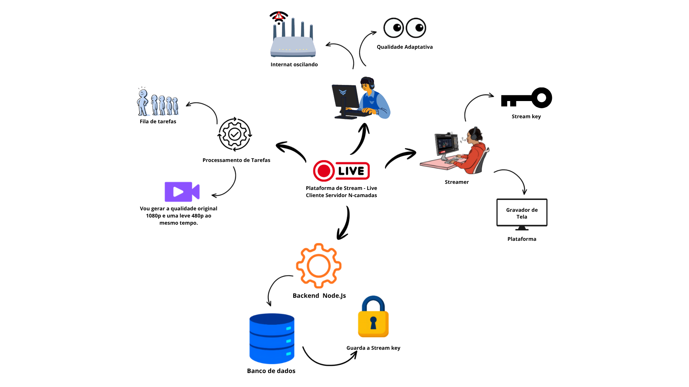
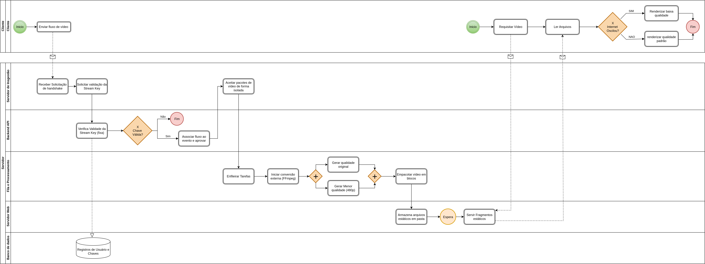
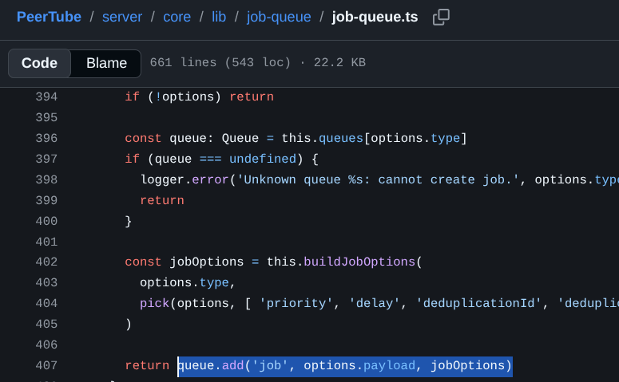
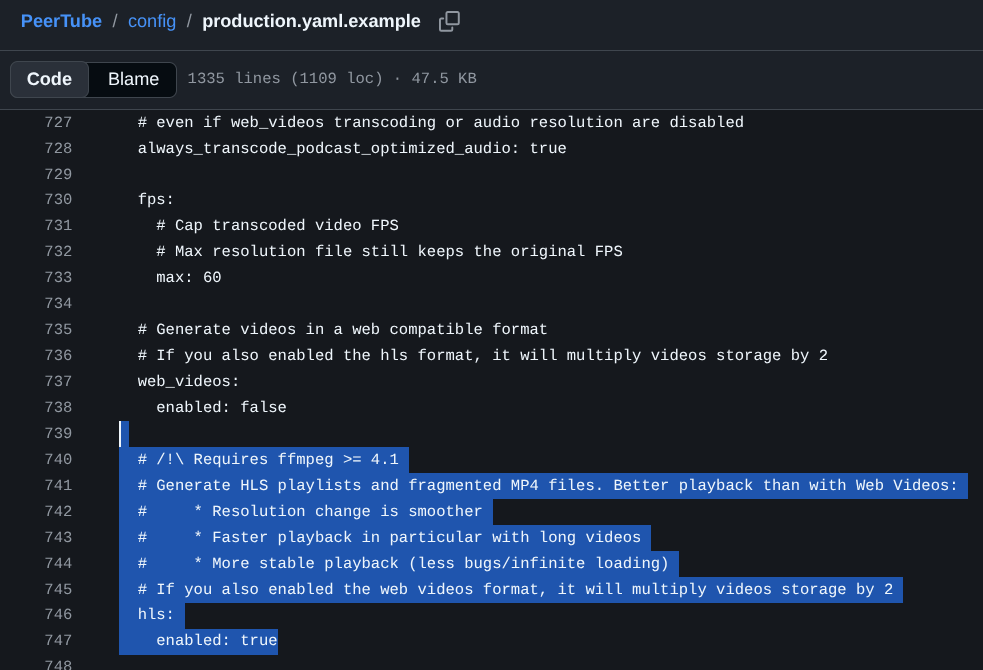

# SubEquipe_01

O relatório deverá conter a estrutura de focos estabelecida a seguir, bem como versionamentos, metodologia e participantes por foco. Não omitir tópicos.

# FOCO_01: Artefatos Generalistas & NFR Framework

## Participantes no Foco_01
| Nome do Membro |
| :--- |
| [Gabriel Diniz](https://github.com/GabrielDiniz12) - Participou de todos os desenvolvimentos |
| [Breno Teixeira](https://github.com/BrenoLteixeira) - Participou de todos os desenvolvimentos |
| [Pedro Americo](https://github.com/dev-americo) - Participou de todos os desenvolvimentos |

## Metodologia do Foco_01

Para o desenvolvimento dos artefatos deste foco, a equipe adotou uma abordagem colaborativa. A partir da pesquisa de Engenharia Reversa, extraímos os principais conceitos técnicos e decidimos dividir a modelagem em três perspectivas complementares: uma visual e informal (**Rich Picture**), uma analítica voltada aos atributos de qualidade (**NFR Framework**) e uma processual focada no fluxo operacional (**BPMN**).

Do lado visual, optou-se pela criação de uma **Rich Picture** visando traduzir a complexidade do ecossistema de *streaming* de vídeo para uma linguagem intuitiva e acessível. Este artefato difere-se de um mapa mental comum, pois um bom *Rich Picture* deve conter os interessados e as fontes de informação, além de fluxos claros. A modelagem priorizou a síntese visual sobre a precisão formal, permitindo anotar funcionalidades e não funcionalidades, bem como manter os rastros para as fontes de informação. Foram utilizadas metáforas lúdicas (como o cadeado de segurança e a máquina fatiando o vídeo) e balões de fala para contrastar as emoções dos usuários diante dos gargalos de rede (modelo centralizado) e a fluidez da distribuição descentralizada (P2P).

Paralelamente, para a análise dos requisitos não funcionais, a equipe elaborou um **SIG (*Softgoal Interdependency Graph*)** na notação do **NFR Framework**. A construção do modelo foi guiada pelo objetivo global de maximizar a Qualidade de Serviço e de Experiência (QoS/QoE) nas transmissões, ramificando as metas de acordo com as três frentes da nossa pesquisa: Segurança na Ingestão (Frente A), Eficiência de Processamento (Frente B) e Escalabilidade de Distribuição (Frente C).

Por fim, para representar a integração operacional do sistema, elaborou-se um diagrama de fluxo de processos na notação **BPMN**. Este modelo teve como objetivo consolidar a arquitetura ponta a ponta do nosso ecossistema híbrido, conectando de forma clara as três frentes de desenvolvimento: o início do fluxo através da ingestão segura e da validação de chaves (*Frente A*), a delegação da transcodificação assíncrona para o FFmpeg via Fila de Tarefas (*Frente B*) e a etapa final de distribuição (*Frente C*). Nessa última etapa (Frente C), o diagrama ilustra o desacoplamento da entrega do vídeo, mostrando o servidor web (Nginx) atuando como *proxy reverso* no estilo Cliente-Servidor, servindo diretamente os fragmentos estáticos de mídia aos espectadores para adaptação de qualidade (ABR) no navegador.

---

## Rich Picture
Abaixo está o diagrama Rich Picture elaborado pela equipe, representando o fluxo técnico recuperado nas três frentes de pesquisa da Engenharia Reversa (Ingestão, Processamento e Distribuição):

<font size="3"><p style="text-align: center">Figura 1: Richpicture.</p></font>



<div align="center">
  <br>
  <iframe width="560" height="315" src="https://www.youtube.com/embed/sGlNq-2CP-U" title="Apresentação NFR Framework" frameborder="0" allow="accelerometer; autoplay; clipboard-write; encrypted-media; gyroscope; picture-in-picture; web-share" referrerpolicy="strict-origin-when-cross-origin" allowfullscreen></iframe>
</div>

## NFR Framework
Abaixo está o SIG detalhando as interdependências e as operacionalizações dos requisitos de qualidade (QoS/QoE) na arquitetura mapeada:

<font size="3"><p style="text-align: center">Figura 2: NFR.</p></font>


<div align="center">
  <br>
  <iframe width="560" height="315" src="https://www.youtube.com/embed/54bIDqhGzMw" title="Apresentação NFR Framework" frameborder="0" allow="accelerometer; autoplay; clipboard-write; encrypted-media; gyroscope; picture-in-picture; web-share" referrerpolicy="strict-origin-when-cross-origin" allowfullscreen></iframe>
</div>


## BPMN
Abaixo está o modelo estruturado na notação padronizada BPMN, ilustrando o fluxo do software encontrado e consolidado com a Engenharia Reversa.

<font size="3"><p style="text-align: center">Figura 3: BPMN.</p></font>



<div align="center">
  <br>
  <iframe width="560" height="315" src="https://www.youtube.com/embed/0_sxf6QI13k" title="Apresentação NFR Framework" frameborder="0" allow="accelerometer; autoplay; clipboard-write; encrypted-media; gyroscope; picture-in-picture; web-share" referrerpolicy="strict-origin-when-cross-origin" allowfullscreen></iframe>
</div>

---

# FOCO_02: Engenharia Reversa & Modelagem BPMN
Entrega Mínima: um modelo, na notação BPMN, do fluxo do software encontrado com a Engenharia Reversa. Mira-se no MM no FOCO, com a entrega mínima.

## Participantes no Foco_02
| Nome do Membro |
| :--- |
| [Breno Teixeira](https://github.com/Brenolteixeira) (Responsavel pela Frente A - Ingestão de Sinal e APIs de Controle)|
| [Gabriel Diniz](https://github.com/GabrielDiniz12) (Responsável pela Frente B - Processamento e Transcodificação) |
| [Pedro Americo](https://github.com/dev-americo) (Responsável pela Frente C - Distribuição de Vídeo e Rede) |

## Metodologia do Foco_02

A engenharia reversa foi conduzida sob duas perspectivas metodológicas distintas. Na abordagem de **Caixa Preta (Black-Box)** aplicada ao YouTube, utilizou-se a observação no lado do cliente e a inspeção de telemetria via *Stats for Nerds* e fluxo de dados de rede. Na abordagem de **Caixa Aberta (White-Box)** aplicada ao ecossistema do PeerTube, utilizou-se a Análise Estática de Código e de Documentação para extrair o funcionamento da ingestão, transcodificação e topologia de distribuição P2P.

## Frente A: Ingestão de Sinal e APIs de Controle (Upstream)

### 1. Introdução

A **[engenharia reversa de software](#ref2)** consiste, basicamente, em analisar um sistema que já existe para entender como ele foi desenvolvido, quais são seus componentes e quais requisitos foram implementados. Na prática, é como fazer o caminho contrário ao desenvolvimento tradicional de um software, saindo da implementação e tentando chegar a uma visão mais geral do projeto e da arquitetura.

Durante o trabalho, utilizamos técnicas de busca e análise para entender como determinadas partes dos sistemas funcionam. Esse processo não serve apenas para descobrir como um software foi construído, mas também ajuda a entender diferentes formas de pensar e projetar sistemas, além de fornecer referências que podem ser utilizadas em outros projetos [2](#ref2).

---

### 2. Metodologia

De acordo com a literatura estudada, podemos trabalhar com dois cenários principais de engenharia reversa [1](#ref1):

1. **Com código-fonte disponível (Caixa Aberta / White-Box):** nesse caso, temos acesso ao código e podemos analisá-lo diretamente para tentar entender a estrutura e o funcionamento do sistema [1](#ref1). Essa abordagem foi utilizada no **PeerTube**.

2. **Sem código-fonte disponível (Caixa Preta / Black-Box):** nesse cenário, o código-fonte não está disponível, então precisamos utilizar outras formas de investigação, como documentação e observação do comportamento do sistema [1](#ref1). Essa abordagem foi utilizada no **YouTube**.

---

### 3. Ingestão de Sinal e APIs de Controle

Para realizar a análise, combinamos algumas técnicas de engenharia reversa.

A primeira foi a **análise estática do código-fonte**, utilizada para identificar a estrutura do PeerTube, seus componentes, funções, variáveis e as relações entre eles [1](#ref1).

Também utilizamos a **análise de fluxo de dados**, observando a comunicação entre os diferentes componentes e o tráfego de informações pela rede [1](#ref1). Com isso, foi possível entender melhor o comportamento do sistema durante a transmissão.

Por fim, utilizamos a **análise de documentação**, consultando manuais, guias e especificações das APIs públicas. Essa etapa foi importante para relacionar os componentes encontrados com os conceitos do domínio da aplicação, o que está relacionado ao chamado *Concept Assignment Problem* [3](#ref3) [1](#ref1).

---

### 4. Abordagem no YouTube (Análise Caixa Preta)

Como o código-fonte do YouTube é proprietário e não está disponível para análise [1](#ref1), foi necessário utilizar uma abordagem de caixa preta. Para isso, utilizamos principalmente a documentação disponível e a observação do comportamento das chamadas de rede [1](#ref1).

#### Metodologia aplicada

A principal técnica utilizada foi a análise da especificação da **YouTube Live Streaming API v3** [1](#ref1), juntamente com a observação das chamadas de rede realizadas pelo cliente durante o processo de inicialização de uma transmissão.

O objetivo foi deixar de lado os detalhes de baixo nível da comunicação e tentar entender o modelo lógico e a arquitetura utilizada pelo YouTube para realizar a ingestão de vídeo [2](#ref2).

#### Fluxo investigado e recuperado

A partir da análise, foi possível perceber que o YouTube organiza o processo de transmissão ao vivo em diferentes recursos, cada um com uma função específica.

1. **Autenticação via OAuth 2.0:** o usuário realiza a autenticação para garantir uma sessão segura.

2. **Recurso `liveBroadcasts`:** representa o evento da transmissão em si, contendo informações como título, descrição, horário agendado e visibilidade [1](#ref1).

3. **Recurso `liveStreams`:** representa as configurações técnicas do fluxo de vídeo, como resolução, taxa de quadros, codecs e a chave utilizada para a transmissão [1](#ref1).

Depois que um `liveBroadcast` é associado a um `liveStream` por meio da API, o backend do YouTube disponibiliza um endpoint seguro para receber o vídeo utilizando **RTMPS**, normalmente pela porta TCP 443. Como resultado, são fornecidos o endereço do servidor e uma chave exclusiva para a transmissão.

Essa separação entre o evento e o fluxo de mídia permite, por exemplo, reutilizar uma mesma configuração de transmissão em diferentes eventos, tornando o sistema mais flexível [2](#ref2).

---

### 5. Abordagem no PeerTube (Análise Caixa Aberta)

No caso do PeerTube, como o código-fonte está disponível, foi possível realizar uma análise mais direta do funcionamento interno do sistema.

Utilizamos a **análise estática do código-fonte** para identificar os principais componentes do backend, observando tanto onde eles são definidos quanto onde são utilizados por outras partes do sistema [1](#ref1).

#### Metodologia aplicada

A análise foi realizada diretamente no repositório oficial do GitHub, procurando por termos e padrões relacionados às transmissões ao vivo, como **`live`**, **`rtmp`**, **`create-live`** e **`stream-key`**.

A partir dessas buscas, conseguimos localizar as rotas e os controladores implementados em TypeScript/Node.js e identificar os principais pontos de entrada da API REST que estão relacionados ao gerenciamento das transmissões via RTMP [1](#ref1).

#### Estrutura de código identificada

Entre os principais arquivos encontrados estão:

- **`server/controllers/api/videos/live.ts`:** responsável pelas rotas utilizadas pelo cliente para solicitar a criação de uma transmissão ao vivo [1](#ref1).

- **`server/models/video/video-live-session.ts`:** responsável por definir a estrutura utilizada para armazenar as informações das sessões de transmissão no banco de dados [1](#ref1).

Outro ponto importante observado durante a análise foi que o backend Node.js não recebe e processa diretamente todo o conteúdo do vídeo. Ele funciona principalmente como um coordenador do processo. O backend verifica a autorização da transmissão e, depois, delega o recebimento do sinal de vídeo para o servidor ou plugin responsável pelo RTMP [1](#ref1).

---

### 6. Fluxo de Engenharia Reversa: Ciclo de Ingestão e Controle (Upstream)

Depois de juntar as informações obtidas tanto pela análise estática quanto pela análise dinâmica, foi possível organizar o processo de ingestão do sinal em algumas etapas principais.

#### Etapa 1: Registro e criação do container da transmissão

1. **Solicitação da live:** o cliente web envia uma requisição **`POST /api/v1/videos/live`** para o backend [1](#ref1).

2. **Geração dos metadados:** o backend cria um novo objeto de vídeo no banco de dados, inicialmente com o status **`"pending"`**. Nesse processo, também são geradas as informações necessárias para a transmissão, como a chave de stream e o endereço do servidor RTMP [3](#ref3) [1](#ref1).

3. **Configuração:** o criador da transmissão copia essas informações e as configura em um software de transmissão, como o **OBS Studio** [1](#ref1).

#### Etapa 2: Handshake e autenticação do sinal de vídeo

1. **Início do envio:** o OBS Studio inicia a conexão com o servidor utilizando RTMP ou RTMPS e envia a chave de transmissão como parte do processo de autenticação [1](#ref1).

2. **Interceptação e validação:** o servidor de mídia, como o plugin RTMP do PeerTube, recebe a tentativa de conexão. Antes de começar a receber os dados de vídeo, ele consulta o backend Node.js para verificar se a chave utilizada é válida [1](#ref1).

3. **Autorização do fluxo:**

   - **Se a chave for válida:** o backend altera o status do vídeo para **`"live"`**, registra a sessão em **`video-live-session`** e permite que o servidor RTMP comece a receber os dados da transmissão [1](#ref1).

   - **Se a chave for inválida:** a conexão é rejeitada e o processo de transmissão não é iniciado [1](#ref1).

#### Etapa 3: Controle e resiliência da sessão

1. **Monitoramento:** durante a transmissão, o sistema acompanha o recebimento dos frames para verificar se o fluxo continua funcionando normalmente [1](#ref1).

2. **Tolerância a falhas:** caso aconteça uma queda momentânea na conexão do transmissor, o sistema não encerra a transmissão imediatamente. Existe um período de tolerância que permite que o OBS Studio tente se reconectar. Dessa forma, é possível evitar que os espectadores sejam desconectados imediatamente durante uma instabilidade rápida [1](#ref1).

3. **Encerramento:** quando o OBS Studio encerra a transmissão ou o período de tolerância termina sem que aconteça uma reconexão, o backend finaliza oficialmente a sessão. O status do vídeo passa para **`"finished"`** e os processos associados à transmissão são encerrados [1](#ref1).

---

### 7. Conexão e Alinhamento Teórico com a Disciplina (ADSW)

O processo de engenharia reversa realizado nesta frente também permitiu relacionar a análise prática com alguns dos conceitos estudados na disciplina.

#### Nível de abstração

Durante a análise, começamos observando detalhes do código do PeerTube, que representam um nível mais baixo de abstração [2](#ref2). A partir dessas informações, conseguimos chegar a uma representação mais geral do funcionamento da transmissão, como o fluxo de estados envolvendo início, autenticação, transmissão e encerramento [2](#ref2).

#### Grau de abstração

A análise também começou de maneira mais detalhada, investigando funções específicas e mecanismos de validação, e depois foi aumentando o nível de abstração até chegar a uma visão mais geral da arquitetura, envolvendo o OBS Studio, o backend Node.js, o servidor RTMP e o player utilizado pelos espectadores [2](#ref2).

#### Extração de fatos e tratamento de fatos

As informações encontradas diretamente no código, como as funções responsáveis pelas rotas e pela validação, podem ser consideradas parte da **extração de fatos** [1](#ref1).

Depois disso, essas informações foram organizadas em um fluxo lógico, com etapas como início, handshake, transmissão, tolerância a falhas e finalização. Essa organização representa o **tratamento dos fatos**, já que selecionamos e relacionamos as informações mais importantes para conseguir entender o funcionamento geral do sistema [1](#ref1) [2](#ref2).

#### Concept Assignment Problem

Por fim, o *Concept Assignment Problem* mostra a importância de relacionar os elementos encontrados durante a engenharia reversa com os conceitos do domínio da aplicação.

No nosso caso, não basta apenas identificar elementos como portas TCP, variáveis ou sessões no código. É necessário entender o que esses elementos representam dentro do funcionamento do sistema, como o controle da transmissão, a autenticação, a resiliência do sinal e o streaming em tempo real [3](#ref3).

---

## Frente B: Processamento e Transcodificação de Mídia

### Introdução
A Engenharia Reversa é o processo de examinar e compreender um sistema existente, como forma de estudo, pesquisa e planejamento para recriar e/ou criar um projeto e decifrar os requisitos implementados <a href="#ref1">[¹]</a>. Trata-se, basicamente, de "conhecer o que existe" para poder criar ou aprimorar algo; isso ocorre quando se realiza o processo inverso do ciclo de vida de um software. Dessa forma, é possível aprimorar formas de pensamento e encontrar referências práticas para aplicação no projeto da disciplina <a href="#ref2">[²]</a>.

### Metodologia
Como apontado pela literatura, existem dois cenários de engenharia reversa <a href="#ref1">[¹]</a>:
1.  **Com código-fonte disponível (Caixa Aberta / *White-Box*):** onde se busca recuperar aspectos mais globais do projeto a partir do código. Esta técnica foi aplicada no **PeerTube**, visto que há acesso à documentação do projeto, etc.
2.  **Sem código-fonte disponível (Caixa Preta / *Black-Box*):** o código não está disponível, logo, devem-se buscar outros métodos de descoberta. Esta técnica foi aplicada no **YouTube**.

### YouTube
Como a infraestrutura do YouTube é proprietária e seu código-fonte não está disponível publicamente, a análise foi conduzida como engenharia reversa de caixa-preta, utilizando observação do comportamento externo do sistema. Essa abordagem é compatível com a literatura de engenharia reversa, que descreve técnicas de análise sem acesso ao código-fonte, incluindo a observação do fluxo de dados em rede <a href="#ref1">[¹]</a><a href="#ref2">[²]</a>.

#### Metodologia Aplicada:
*   **Técnica:** A telemetria de reprodução foi inspecionada por meio da ferramenta *Stats for Nerds*, que expõe informações de resolução, buffer, codecs e velocidade de rede <a href="#ref5">[⁵]</a>. Essas observações foram associadas ao monitoramento das requisições de rede HTTP realizadas durante a reprodução.
*   **Propósito da Abstração:** O objetivo foi recuperar um modelo lógico do funcionamento do *Adaptive Bitrate Streaming* (ABR), distinguindo o que foi observado no cliente do que foi inferido com apoio da literatura técnica.

#### Fluxo Investigado e Recuperado:
A análise de caixa-preta foi utilizada para formular um modelo lógico de entrega adaptativa. A literatura sobre streaming segmentado descreve a entrega de conteúdo em pequenos segmentos via HTTP, com múltiplas versões em diferentes taxas de bits, permitindo ao cliente escolher a representação adequada às condições atuais <a href="#ref4">[⁴]</a><a href="#ref7">[⁷]</a>.

*   **Empacotamento e Segmentação:** O modelo observado é compatível com a entrega segmentada por HTTP: o conteúdo é dividido em pequenos blocos e disponibilizado em representações alternativas. Em aplicações de baixa latência, a AWS demonstra que a duração do segmento possui efeito direto sobre a latência; por exemplo, segmentos de aproximadamente 1 segundo podem produzir cerca de 5 segundos de latência, enquanto segmentos de 2 segundos resultam em latência maior dependendo da configuração do player <a href="#ref7">[⁷]</a>. Portanto, a relação entre segmentos menores e menor latência é tratada aqui como fundamentação de infraestrutura, e não como medição interna do YouTube.
*   **Mecanismo de Decisão Adaptativa (ABR):** O *Stats for Nerds* expõe variáveis como velocidade de conexão, integridade do buffer e resolução atual/ideal <a href="#ref5">[⁵]</a>. A literatura de ABR descreve algoritmos que utilizam throughput, ocupação do buffer ou uma combinação dos dois para selecionar a próxima representação <a href="#ref6">[⁶]</a><a href="#ref12">[¹²]</a>. Assim, as mudanças de qualidade observadas no cliente podem ser interpretadas como comportamento compatível com adaptação ABR, sem afirmar que a lógica proprietária interna do YouTube foi recuperada diretamente.
*   **Adoção de Codecs de Alta Eficiência:** Fontes técnicas consultadas registram a adoção de AV1 e VP9 pelo ecossistema do YouTube. O SempreUpdate descreve o uso do AV1 para conteúdo 4K/HDR e o VP9 como codec amplamente associado ao YouTube, além de destacar a maior eficiência de compressão desses formatos <a href="#ref9">[⁹]</a>.

### Fluxo de Engenharia Reversa: Ciclo de Processamento e ABR (YouTube)
Ao cruzar a observação do cliente com a fundamentação técnica, o modelo lógico da entrega adaptativa pode ser descrito da seguinte maneira:

1.  **Ingestão:** A documentação oficial do Google confirma que o YouTube Live aceita RTMP, RTMPS, HLS e DASH como protocolos de **ingestão** para clientes de terceiros <a href="#ref13">[¹³]</a>. Essa fonte sustenta o lado de entrada da arquitetura e não deve ser interpretada, isoladamente, como prova do protocolo utilizado na reprodução no navegador.
2.  **Escada de Qualidade:** A literatura de ABR descreve a geração de múltiplas versões do vídeo com diferentes resoluções e bitrates, formando uma *encoding ladder* <a href="#ref11">[¹¹]</a>. No caso do YouTube, essa estrutura é tratada como uma inferência arquitetural compatível com o comportamento adaptativo observado, e não como acesso direto ao backend proprietário.
3.  **Segmentação:** O conteúdo adaptativo é particionado em segmentos independentes. A documentação técnica de ABR apresenta exemplos de segmentos curtos, e a AWS demonstra a relação direta entre duração do segmento e latência <a href="#ref7">[⁷]</a><a href="#ref11">[¹¹]</a>.
4.  **Decisão ABR no Cliente:** O cliente dispõe de métricas de rede, buffer e qualidade de reprodução por meio do *Stats for Nerds* <a href="#ref5">[⁵]</a>. Modelos de ABR estudados na literatura usam informações de throughput e/ou buffer para selecionar a próxima representação <a href="#ref6">[⁶]</a><a href="#ref12">[¹²]</a>. A relação com o algoritmo específico do YouTube permanece uma inferência de caixa-preta.
5.  **Adaptação Dinâmica:** Quando as condições de rede pioram, algoritmos ABR podem selecionar uma representação de menor bitrate para preservar o buffer e reduzir o risco de *rebuffering* <a href="#ref6">[⁶]</a><a href="#ref12">[¹²]</a>. Essa formulação descreve o princípio de funcionamento observado/compatível, sem atribuir ao YouTube uma implementação interna não publicada.

### Abordagem no PeerTube
Diferente do YouTube, o PeerTube é um ecossistema de código aberto com documentação bastante acessível. Isso permitiu focar a engenharia reversa na Análise Estática de Código e na Extração de Fatos diretamente da arquitetura do servidor da plataforma <a href="#ref10">[¹⁰]</a>.

#### Metodologia Aplicada:
*   **Técnica:** Buscou-se por termos-chave e fluxos de dados na documentação da arquitetura, investigando as bibliotecas de manipulação de vídeo e as estruturas de rede e servidor <a href="#ref10">[¹⁰]</a>.
*   **Propósito da Abstração:** O propósito foi mapear fisicamente como uma plataforma descentralizada lida com a carga pesada de processamento exigida pelo streaming adaptativo, eliminando a dependência de uma única fonte de banda que poderia atuar como um gargalo.

#### Fluxo Investigado e Recuperado:
*   **\*\*Gestão de Tarefas (Filas):\*\*** A análise do código revela que o trabalho é adicionado a uma fila de *jobs*.

<font size="3"><p style="text-align: center">Figura 3: Evidência: Gestão de Tarefas por Filas.</p></font>



**Disponibilidade:** [GitHub — `server/core/lib/job-queue/job-queue.ts`](https://github.com/Chocobozzz/PeerTube/blob/develop/server/core/lib/job-queue/job-queue.ts)

*   **\*\*Transcodificação e Empacotamento:\*\*** O arquivo de configuração atesta que o HLS está habilitado. A configuração prevê a geração de listas de reprodução (playlists) HLS e menciona a utilização de arquivos no formato *fragmented* MP4.

<font size="3"><p style="text-align: center">Figura 4: Evidência: Configuração e Empacotamento HLS.</p></font>



**Disponibilidade:** [GitHub — `config/production.yaml.example`](https://github.com/Chocobozzz/PeerTube/blob/develop/config/production.yaml.example)

*   **Distribuição Híbrida e P2P:** O player no navegador, apoiado na biblioteca hls.js com um carregador customizado, permite que os trechos do vídeo sejam baixados tanto via solicitações HTTP normais quanto por conexões P2P, obtendo os dados diretamente de outros usuários que estão assistindo à live no mesmo momento <a href="#ref10">[¹⁰]</a>. Segundo a documentação arquitetural do projeto, os segmentos podem ser obtidos tanto por P2P quanto por HTTP.

### Fluxo de Engenharia Reversa: Ciclo de Processamento e ABR (PeerTube)
Cruzando as observações empíricas com a documentação disponível, chegou-se a um modelo lógico de como o fluxo bruto é transformado em streaming adaptativo:
1.  **Ingestão:** O servidor de origem recebe o fluxo de vídeo contínuo através de um protocolo de ingestão, como o RTMP.
2.  **Codificação Múltipla (Encoding):** O motor de processamento trabalha em paralelo para gerar várias versões do vídeo. É criada uma "escada" (ladder) com diferentes resoluções e taxas de bits, compondo as opções de qualidades do ABR <a href="#ref11">[¹¹]</a>.
3.  **Segmentação (Empacotamento):** O fluxo longo é fatiado em pequenos blocos (chunks). Segmentos mais curtos, como os exemplos de 2 a 4 segundos apresentados na literatura técnica, permitem decisões de adaptação mais frequentes, embora aumentem o número de requisições ao servidor <a href="#ref11">[¹¹]</a>.
4.  **Lógica ABR no Cliente:** Modelos de ABR estudados na literatura usam informações de throughput e/ou buffer para selecionar a próxima representação <a href="#ref6">[⁶]</a><a href="#ref12">[¹²]</a>.
5.  **Adaptação Dinâmica:** Se a conexão se tornar instável, o player entra em estado de *downscale* e solicita um bloco de qualidade menor para não esvaziar a fila. O grande objetivo prático da lógica é evitar interrupções e travamentos (*rebuffering*) a todo custo <a href="#ref11">[¹¹]</a>.

### Rastreabilidade e Verificação Profunda
Para validar os modelos arquiteturais inferidos na engenharia reversa, a Frente B apoiou-se em observações do comportamento do cliente e em documentações técnicas especializadas. Os principais fundamentos levantados foram:
*   **Padrões de Streaming Adaptativo (HLS e MPEG-DASH):** O particionamento em segmentos pequenos servidos por HTTP e a existência de representações alternativas são características centrais do streaming adaptativo <a href="#ref4">[⁴]</a><a href="#ref14">[¹⁴]</a>.
*   **Telemetria e Qualidade de Experiência (QoE):** O *Stats for Nerds* disponibiliza informações sobre buffer, rede, resolução e codecs <a href="#ref5">[⁵]</a>. A literatura de ABR prioriza evitar rebuffering e manter estabilidade antes de maximizar a qualidade visual <a href="#ref12">[¹²]</a>.
*   **Latência em Streaming ao Vivo:** A duração do segmento possui relação direta com a latência do streaming; a AWS apresenta exemplos quantitativos de como segmentos menores reduzem o atraso, dependendo do pipeline e do player <a href="#ref7">[⁷]</a>.
*   **Codecs de Alta Eficiência:** O material consultado registra o uso de AV1 e VP9 pelo YouTube e descreve ganhos de eficiência de compressão desses codecs, sem atribuir um percentual único de economia a todos os cenários <a href="#ref9">[⁹]</a>.

---

## Frente C - Distribuição de Vídeo e Topologia de Rede

### Introdução
A engenharia reversa de software consiste no processo de exame e compreensão de um sistema existente para recapturar ou recriar o seu projeto e decifrar os requisitos implementados [1](#ref1). Basicamente, por meio de técnicas de busca conseguimos descobrir como algo foi criado, fazendo o processo inverso de ciclo de vida de um software, assim além de aprendermos diferentes formas de pensamento, conseguimos referências práticas para aplicarmos em nossos próprios projetos [2](#ref2).

### Metodologia
Como apontado pela literatura, existem dois cenários de engenharia reversa [1](#ref1):
1.  **Com código-fonte disponível (Caixa Aberta / *White-Box*):** onde se busca recuperar aspectos mais globais do projeto a partir do código. Esta técnica foi aplicada no **PeerTube**.
2.  **Sem código-fonte disponível (Caixa Preta / *Black-Box*):** onde o código não está disponível, exigindo outros métodos de descoberta. Esta técnica foi aplicada no **YouTube**.

Fiz Uma analise usando meu conhecimento, testes e consultando a documentação do Peertube e algumas informações do Youtube. Durante meus estudos anotei e organizei minhas anotações com IA, no vídeo abaixo eu falo do que aprendi nessa entrega para comprovação do meu estudo.

**ADICIONAR VIDEO**

### PeerTube

O PeerTube possui um código aberto, logo é possível analisá-lo na íntegra, além disso a documentação do projeto é muito bem detalhada e mostra os detalhes da aplicação.

#### Componentes do Backend

Há 2 componentes base, sendo um deles o PostgreSQL como o banco de dados e o NGINX que é um proxy reverso (auxilia na distribuição dos arquivos estáticos de vídeo e os entrega). Mas a distribuição depende de:

- **Web Torrent:** Esse aparato ajuda a coordenar o P2P, utilizando a lógica do torrent em que temos arquivos, no caso do PeerTube pedaços de vídeos, que são utilizados para aliviarem a carga do servidor em transferir os vídeos. Dessa forma, se há um outro usuário ouvindo o mesmo vídeo e ele está mais próximo do que o servidor, o Peertube utiliza os arquivos dele para que o espectador assista o vídeo/live [16](#ref16).
- **Gerenciador Torrent:** Ao enviar um vídeo a API cria um arquivo torrent correspondente e registra ele no banco de dados, isso é um pré-requisito para a distribuição P2P [16](#ref16).
- **Processamento da Live:**
  - Requisição de Live
  - Validação de Stream token (Chave única de cada usuário)
  - delegação de FFmpeg (processamento de vídeo) de forma assíncrona
  - Faz a distribuição do vídeo em fatias HLS (o youtube também faz isso), que são guardados de maneira estática.

#### Componentes do Cliente

Como o modelo do PeerTube é P2P o cliente não é só um "consumidor" ele também ajuda a distribuir os vídeos em uma rede, como uma teia. Dessa forma, não depende de um único servidor.

- **VideoJS e hls.js:** São frameworks que são utilizados para ler e processar os vídeos HLS (picados) no navegador. Esses vídeos reduzem a latência, pois são pedaços de vídeo que são enviados a cada instante [17](#ref17).
- **P2P Media Loader:** O gerenciador do P2P, que coordena e conecta diferentes usuários para que eles compartilhem as playlists de HLS e assim reduzam as requisições para o servidor [17](#ref17). E caso não existam outros usuários consumindo a mesma requisição, o navegador faz a requisição HTTP diretamente para o servidor.

Percebe-se que o Cliente é algo muito mais ativo do que no YouTube, ele ajuda a desafogar o trafego do servidor principal, já que a infraestrutura necessária para inúmeras requisições no mesmo servidor não é barata. O P2P entra como uma solução a meu ver muito inteligente para esse problema de custo, mas sofre com a manutenção desse ecossistema, que é mais complexa.

#### Redundância de Rede

O PeerTube mapeou corretamente um problema que ele teria ao realizar o projeto, que é a falta de infraestrutura, dessa forma ele implementou o P2P como foi explicado [anteriormente](#componentes-do-cliente), mas a malha de rede e transferência de arquivos não é apenas sobre navegadores, mas sobre servidores também, assim há uma redundância nos conteúdos [17](#ref17).

Servidores compartilham arquivos entre si, ou seja, as requisições de um vídeo podem ser fornecidos por outros usuários que estão vendo aquele vídeo naquele momento ou por diferentes servidores, o que protege o sistemas contra falhas e quedas. O YouTube faz esse processo aumentando a própria infraestrutura, já o PeerTube conta com a comunidade para crescer essa distribuição.

#### Embasamento Teórico

Neste tópico foi feito o embasamento teórico e conceitos encontrados no PeerTube, fazendo um resumo de tudo que foi aprendido.

##### O Estilo Arquitetural Peer-to-Peer (P2P)

O estilo P2P e uma arquitetura de sistemas distribuizados caracterizada pela descentralizacao das funcoes na rede, onde cada nodo realiza tanto as funções de cliente quanto de servidor.

Na documentação do PeerTube há as seguintes tarefas:

- **Responsabilidades como Cliente:** O navegador do espectador envia solicitações de fragmentos de video para outros navegadores na rede e recebe as respostas [16](#ref16).
- **Responsabilidades como Servidor:** O navegador do espectador disponibiliza os segmentos (HLS) de video que já estão salvos, recebendo e atendendo requisições de download de outros navegadores conectados [16](#ref16).

##### Vantagens e Desvantagens do Modelo de Distribuicao

- **Minimiza Gargalos de Fonte Unica:** O P2P é utilizado para distribuir os dados e realizar o balanceamento dessas requisições, eliminando o gargalo que poderia existir com várias requisições diferentes em um mesmo servidor [18](#ref18).
- **Eliminação de pontos únicos de falha:** No PeerTube, os recursos são distribuídos entre vários nós, ou seja, se a conexão com o servidor principal oscilar ou se um par for desconectado, os nós restantes ajudam a concluir os arquivos que faltaram. O lado ruim é que ainda depende de uma rede de pares para isso [18](#ref18).
- **Complexidade:** Como a principal desvantagem identificada há a complexidade, o código para isso é complexo e orquestrar todos esses fluxos de dados e de rede é uma tarefa extremamente difícil, sendo assim não creio que seguiremos com essa escolha devido ao requisito de tempo da matéria [18](#ref18).

---

### Youtube

Foi escolhida para ser nossa referência no que tange a popularidade, robustez e conhecimento do público sobre a plataforma, ela é a maior plataforma de vídeos do mundo. Mas ela faz parte de uma empresa privada e não possui código aberto, sendo assim minha pesquisa se limitou a algumas informações disponibilizadas pela empresa e testes que fiz no navegador.

A infraestrutura do Youtube é composta por diversas centrais e servidores espalhados pelo mundo, que centralizam boa parte do que é processado pela plataforma, é uma infraestrutura extremamente cara, mas proporciona melhor controle dos processos pela Google.

#### Componentes do Servidor

Se tratam dos data centers e servidores da google espalhados pelo mundo, bem como o sistema de gerenciamento dessa sistema.

- **Sistemas de Balanceamento de Carga Global (GSLB):** É um sistema que age de maneira inteligente, analisando a requisição do usuário e delegando para o servidor mais próximo que contém aquela informação e que está mais "livre" [19](#ref19).
- **Google Global Cache (GGC):** É um conjunto de servidores globais espalhados pelo mundo, e possuem as informações e vídeos mais acessados em uma disponibilidade maior para fazer requisições [19](#ref19).
- **Servidores de Ingestão de Mídia:** São dedicados a transmissões ao vivo, que fazem o processamento e a distribuição de processos [20](#ref20).

#### Componentes do Cliente

Diferente do PeerTube o navegador do cliente consome os vídeos de forma passiva em relação a recursos locais, atua mais como um receptor

- **HTML5 Player com Media Source Extensions (MSE):** O navegador vai carregando pedaços binários de vídeo com o tempo, dessa forma há uma redução da latência. Esse fenômeno pode ser visto na [figura](#fig1) abaixo, em que realizei um teste para ver isso na prática [21](#ref21).
- **Reprodutor Adaptativo:** O reprodutor faz a análise continuamente da internet do usuário, caso essa internet tenha oscilações ou esteja com uma banda curta, o reprodutor faz a requisição do vídeo com uma qualidade menor, para que não ocorra travamentos durante a reprodução [21](#ref21).
- **Isolamento de Recursos:** A principal diferença para o P2P do PeerTube, o consumo de recursos é somente de oriundos do servidor, não há o compartilhamento entre os usuários.

#### Protocolos de Transporte e Entrega de Rede

- **HTTP sobre TCP:** O vídeo só é entregue ao cliente se o a conexão TCP tiver sucesso, é um dos meios pelo qual o navegador muda automaticamente a qualidade do vídeo [20](#ref20).
- **HTTP sobre QUIC:**O vídeo é entregue sem estabelecer a segurança do TCP, ou seja, os arquivos são enviados com o mínimo de checagem possível [20](#ref20).

Cada um dos protocolos é utilizado em determinado momento, mas o padrão é o QUIC e se ocorrer algum problema é acionado o TCP. Sendo assim esses dois se complementam.

#### Embasamento Teórico

##### Estilo Arquitetural

A distribuição de video do YouTube baseia-se estritamente no estilo arquitetural Cliente-Servidor, caracterizado por:

- **Separação de Papeis:** Em que o Cliente apenas faz o consumo de recursos e esperam as respostas dos servidores, e os servidores que aguardam as requisições e processam os dados e pedidos que foram necessários [18](#ref18).
- **Orientação a Conexão Confiável:** O player estabelece sessões de comunicação confiáveis (tipicamente via protocolos orientados a conexão como o TCP) com os endpoints de cache [20](#ref20).

##### Vantagens e Desvantagens

- **Facilidade de Gerenciamento e Centralização:** Todos os dados de video, politicas de privacidade, segurança e metadados são centralizados em servidores com controles de acesso superiores aos dos clientes. Isso garante que atualizações de dados sejam mais facilmente administráveis de forma consistente, diferentemente de modelos distribuídos, como o P2P do PeerTube.
- **Redes de Trafego de Bloqueio e Sobrecarga:** O modelo sofre com o risco (teórico) de sobrecarga de servidores se o volume de solicitações simultâneas de clientes for excessivo.
- **Dependência:** Nesse modelo há uma dependência de que se um servidor cair pode haver uma queda em toda uma rede ou região, pois as requisições dependem só dele.

#### Testes Youtube

##### O Teste de PING (Latência e RTT)

`54 packets transmitted, 54 received, 0% packet loss, time 53061ms`
`rtt min/avg/max/mdev = 10.942/16.020/43.793/5.364 ms`

- **Latência Média (RTT):** O tempo médio de ida e volta foi de **16.02 milissegundos**. Contata-se que levou apenas 16 milésimos de segundo para o computador "conversar" com o servidor de vídeo do YouTube e receber a resposta.
- **Perda de Pacotes (Packet Loss):** A linha `0% packet loss` mostra que a conexão está estável. Dos 54 pacotes enviados, todos os 54 voltaram.

##### O Teste de TRACEROUTE (A Rota)

Resultados do teste:

```
americo@Americo-52i7-Mint:~$ traceroute rr2---sn-oxunxg8pjvn-cncd.googlevideo.com
traceroute to rr2---sn-oxunxg8pjvn-cncd.googlevideo.com (189.6.55.141), 30 hops max, 60 byte packets
1  _gateway (192.168.0.1)  4.959 ms  5.433 ms  5.397 ms
2  10.48.0.1 (10.48.0.1)  12.624 ms  15.657 ms  15.179 ms
3  bd0601a5.virtua.com.br (189.6.1.165)  16.895 ms  16.877 ms  16.860 ms
4  bd0602a0.virtua.com.br (189.6.2.160)  16.580 ms  16.806 ms  16.790 ms
5  bd063779.virtua.com.br (189.6.55.121)  16.360 ms  16.515 ms  16.497 ms
6  * * *
7  * * *
...
29  * * *
30  * * *
```

- **Salto 1 (`192.168.0.1`):** É o roteador Wi-Fi da casa.
- **Salto 2 (`10.48.0.1`):** É o equipamento do provedor de internet (provavelmente um roteador no bairro).
- **Saltos 3 a 5 (`virtua.com.br`):** Dados estão viajando pela operadora. No salto 5 (`189.6.55.121`), os dados chegam à borda da rede deles em aproximadamente 16 ms.

**Asteriscos (`* * *`) do salto 6 em diante**
Para proteger seus servidores contra ataques (como DDoS) e economizar processamento, empresas gigantes como o Google/YouTube configuram seus roteadores internos para ignorar e não responder a solicitações de Traceroute (pacotes ICMP).

---

### FOCO_03: IA Generativa
##### Participantes no Foco_03

| Nome do Membro | Lições Aprendidas | Uso da IA Generativa (SENSO CRÍTICO) |
| :--- | :--- | :--- |
| [Gabriel Diniz](https://github.com/GabrielDiniz12) | Aplicar a engenharia reversa foi uma experiência inédita para mim — bem desafiadora, mas fascinante. Ao analisar o YouTube, o fato de não termos acesso ao código-fonte me obrigou a trabalhar com a abordagem de Caixa Preta (*Black-Box*), o que exigiu muita pesquisa em documentações externas. Já no caso do PeerTube, a experiência foi o oposto: pude fazer uma exploração profunda usando a técnica de Caixa Aberta (*White-Box*) através da documentação oficial. Outro grande marco no meu aprendizado foi participar da montagem da *Rich Picture*. O desafio de pegar fluxos técnicos complexos e traduzi-los para uma linguagem puramente visual foi a minha primeira experiência real com isso, e acabou sendo um excelente exercício prático de abstração. | Usei a IA Generativa para pesquisar. Ela foi essencial para me ajudar a filtrar e analisar uma massa de mais de 40 artigos e links, especialmente sobre a infraestrutura do YouTube. Além disso, foi fundamental para esclarecer jargões de redes que eu não dominava e apontar detalhes da arquitetura que eu havia deixado passar. A IA também me ajudou a estruturar e revisar o texto final. O único ponto frustrante foi que ela se mostrou bem "teimosa" em uma tarefa simples: ordenar sequencialmente os números das referências e hiperlinks no texto. Tive que intervir e corrigir isso manualmente várias vezes ao longo do documento. Ainda assim, apesar dessa limitação na formatação, a ferramenta me deu muita agilidade e enriqueceu bastante o resultado do projeto. |
| [Pedro Americo](https://github.com/dev-americo) | Fui líder desse subgrupo e tivemos dificuldade com o tema, pegamos o streaming de vídeo com exibição ao vivo como um desafio pessoal, queriamos aprender como funciona de perto essas relações. Creio que atingimos esse objetivo nessa unidade, apesar das dificuldades, trabalhando de maneira assíncrona, buscando referências, etc. nós conseguimos entregar e compreender a nossa área de pesquisa. Os artefatos de rich picture, NFR e BPMN mostram que compreendemos o fluxo da informação e a lógica a ser seguida, misturando aspectos do youtube e do peer tube. | Pessoalmente gosto e estudo bastante com a IA, faço anotações com ela e peço explicações e exemplos. Nesse trabalho nossa equipe fez o trabalho primeiro no notion, adicionando tudo que haviam encontrado de forma um tanto desorganizada, após isso fizemos pesquisas mais aprofundadas e resumos com a IA. Eu ia pesquisando na documentação anotando em um bloco de notas em markdown e ia perguntando exemplos e tecnologias para a IA, mesmo não entendo completamente as linguagens tecnicas consegui entender o fluxo das informações e como são realizados, depois disso pedi para a IA reescrever meus resumos de maneira lógica, depois fui lendo e conferindo o que ela estava fazendo. Gostei bastante de ter feito essa engenharia reversa e acho que mais importante do que tecnologias utilizadas a lógica por traz das informações e decisões foi compreendida com sucesso. |
| [Breno Teixeira](https://github.com/brenolteixeira)| No começo, o projeto foi um baita desafio. Eu nunca tinha mexido com engenharia reversa, muito menos estudado a fundo como funciona um sistema de streaming de vídeo tão complexo. Mas, com o andamento das aulas, algumas pesquisas por fora e as trocas de ideia com o pessoal do grupo, a coisa começou a fluir bem melhor. Outra parte que pegou um pouco foi montar o SIG usando o NFR Framework. De cara, achei muito difícil organizar aquele mar de informações que a gente tinha coletado. Só que, quando parei para analisar com calma cada dado que veio das frentes do projeto, modelar as metas e as contribuições acabou ficando bem mais tranquilo. |Sobre o uso de IA, ela acabou ajudando bastante na organização do meu fluxo de trabalho. O que eu costumava fazer era ler os conteúdos e escrever meus próprios resumos, anotando o que eu entendia, o que achava mais importante e o que realmente ia agregar ao projeto. Depois, eu jogava isso na IA só para ela dar uma limpada e reestruturar as ideias de um jeito mais claro. Ela também quebrou um galho enorme na hora de formatar a documentação em Markdown, corrigindo errinhos de português e acertando a sintaxe dos hiperlinks. Por outro lado, vi logo de cara que não dava para confiar nela para tudo. Quando fui começar o NFR Framework, estava meio perdido para montar o SIG e pedi para a IA gerar um esboço inicial só para me dar um norte. O resultado foi terrível: ela entregou uma estrutura totalmente confusa e errada. Ali eu vi que, para tarefas mais conceituais, não ia rolar, e descartei a ideia na mesma hora. |
---

### Referências Bibliográficas

<a id="ref1"></a>**[1]** JUNIOR, A. J. S. C. et al. *Engenharia Reversa*. Universidade Federal Fluminense (UFF), 2005. **Trecho utilizado:** seção “Técnicas de Engenharia Reversa sem o Código-Fonte”. Disponível em: <https://www2.ic.uff.br/~otton/graduacao/informaticaI/apresentacoes/eng_reversa.pdf>.

<a id="ref2"></a>**[2]** BRAGA, R. T. V.; PENTEADO, R. *Engenharia Reversa e Reengenharia*. Universidade de São Paulo (USP). **Trecho utilizado:** discussão conceitual sobre engenharia reversa, nível e grau de abstração. Disponível em: <https://www.inf.ufpr.br/silvia/ES/reengenharia/reengenharia.pdf>.

<a id="ref3"></a>**[3]** FREITAS, F. G.; LEITE, J. C. S. P. *Aplicando reuso de software na construção de ferramentas de engenharia reversa*. Anais do XI Simpósio Brasileiro de Engenharia de Software (SBES 1997), PUC-Rio, 1997. **Trecho utilizado:**  Concept Assignment Problem. Disponível em: <https://sol.sbc.org.br/index.php/sbes/article/view/24053/23881>.

<p id="ref4"><strong>[4]</strong> WIKIPÉDIA. <em>Transmissão dinâmica adaptável por HTTP</em>. <strong>Trecho utilizado:</strong> definição e funcionamento do MPEG-DASH e particionamento de blocos. Disponível em: <a href="https://pt.wikipedia.org/wiki/Transmiss%C3%A3o_din%C3%A2mica_adapt%C3%A1vel_por_HTTP">https://pt.wikipedia.org/wiki/Transmiss%C3%A3o_din%C3%A2mica_adapt%C3%A1vel_por_HTTP</a>.</p>

<p id="ref5"><strong>[5]</strong> CAPCUT. <em>Estatísticas do YouTube para Nerds - Um passo a passo completo para você</em>. <strong>Trecho utilizado:</strong> métricas de resolução, buffer, codecs e velocidade de rede. Disponível em: <a href="https://www.capcut.com/pt-br/resource/youtube-stats-for-nerds">https://www.capcut.com/pt-br/resource/youtube-stats-for-nerds</a>.</p>

<p id="ref6"><strong>[6]</strong> 5CENTSCDN. <em>ABR Adaptation Algorithms: Throughput vs Buffer-Based vs Hybrid</em>. <strong>Trecho utilizado:</strong> algoritmos ABR e combinação de sinais de throughput/buffer. Disponível em: <a href="https://www.5centscdn.net/blog/abr-adaptation-algorithms/">https://www.5centscdn.net/blog/abr-adaptation-algorithms/</a>.</p>

<p id="ref7"><strong>[7]</strong> AMAZON WEB SERVICES (AWS). <em>Latência de vídeo em streaming ao vivo</em>. <strong>Trecho utilizado:</strong> a duração do segmento tem efeito direto sobre a latência. Disponível em: <a href="https://aws.amazon.com/pt/media/tech/video-latency-in-live-streaming/">https://aws.amazon.com/pt/media/tech/video-latency-in-live-streaming/</a>.</p>

<p id="ref8"><strong>[8]</strong> DOTCOM-MONITOR. <em>Monitoramento de Vídeo em Streaming: O Guia Completo</em>. <strong>Trecho utilizado:</strong> rebuffering, travamentos e impacto na experiência. Disponível em: <a href="https://www.dotcom-monitor.com/blog/pt-br/melhorando-o-de-streaming-de-video-do-seu-site-monitorando-video-de-streaming/">https://www.dotcom-monitor.com/blog/pt-br/melhorando-o-de-streaming-de-video-do-seu-site-monitorando-video-de-streaming/</a>.</p>

<p id="ref9"><strong>[9]</strong> SEMPREUPDATE. <em>Entenda os principais codecs de vídeo: AV1, VP9, H.264 e HEVC</em>. <strong>Trecho utilizado:</strong> VP9 como codec do YouTube e eficiência de compressão do AV1. Disponível em: <a href="https://sempreupdate.com.br/entenda-os-principais-codecs-de-video-av1-vp9-h-264-e-hevc/">https://sempreupdate.com.br/entenda-os-principais-codecs-de-video-av1-vp9-h-264-e-hevc/</a>.</p>

<p id="ref10"><strong>[10]</strong> PEERTUBE DOCUMENTATION. <em>Architecture</em>. <strong>Trecho utilizado:</strong> informações das seções 'Concepts', 'Transcoding' e 'Live', utilizadas para fundamentar a arquitetura do servidor, o processamento/transcodificação e os mecanismos de distribuição e reprodução. Disponível em: <a href="https://docs.joinpeertube.org/contribute/architecture">https://docs.joinpeertube.org/contribute/architecture</a>.</p>

<p id="ref11"><strong>[11]</strong> FASTIO. <em>Adaptive Bitrate Streaming Explained - ABR Guide</em>. <strong>Trecho utilizado:</strong> geração de múltiplas versões (encoding ladder), segmentação de fatias e uso de segmentos curtos, com exemplo de duração entre 2 e 4 segundos. Disponível em: <a href="https://fast.io/resources/adaptive-bitrate-streaming/">https://fast.io/resources/adaptive-bitrate-streaming/</a>.</p>

<p id="ref12"><strong>[12]</strong> UC SANTA BARBARA. <em>The Streaming Control Loop: Buffering, DASH, ABR</em>. <strong>Trecho utilizado:</strong> prioridade de evitar rebuffering e downscale dinâmico (QoE hierarchy). Disponível em: <a href="https://sites.cs.ucsb.edu/~arpitgupta/cs176c/spring26/assets/lecture-notes/L11_lecture_notes/">https://sites.cs.ucsb.edu/~arpitgupta/cs176c/spring26/assets/lecture-notes/L11_lecture_notes/</a>.</p>

<p id="ref13"><strong>[13]</strong> GOOGLE FOR DEVELOPERS. <em>YouTube Live Streaming Ingestion Protocol Comparison</em>. <strong>Trecho utilizado:</strong> protocolos de ingestão aceitos (RTMP, RTMPS, HLS, DASH). Disponível em: <a href="https://developers.google.com/youtube/v3/live/guides/ingestion-protocol-comparison">https://developers.google.com/youtube/v3/live/guides/ingestion-protocol-comparison</a>.</p>

<p id="ref14"><strong>[14]</strong> TENCENT CLOUD / MPS. <em>HLS vs DASH: Analyzing the Key Differences in Streaming Technologies</em>. <strong>Trecho utilizado:</strong> segmentação como fundamento do ABR e transmissão HTTP. Disponível em: <a href="https://mps.live/blog/details/hls-vs-dash">https://mps.live/blog/details/hls-vs-dash</a>.</p>

<p id="ref15"><strong>[15]</strong> WIKIPÉDIA. <em>Transmissão dinâmica adaptável por HTTP. Independência de Codecs e QoE</em>.</p>

<p id="ref16"><strong>[16]</strong> PEERTUBE. <em>PeerTube Architecture Blueprint (joinpeertube.org): Detalha a interacao entre o cliente Angular, as rotas Express, o WebTorrent Tracker e a engine de transcodificacao FFmpeg</em>.</p>

<p id="ref17"><strong>[17]</strong> PEERTUBE. <em>Especificacao do Protocolo de Redundancia do PeerTube: Explica o encapsulamento de fatias de midia via WebSeeds e a sincronizacao de cache federado via mensagens ActivityPub</em>.</p>

<p id="ref18"><strong>[18]</strong> SERRANO, Milene. <em>Estilos e Padroes Arquiteturais II (Slides de Aula): Fundamentacao conceitual sobre as caracteristicas, vantagens, desvantagens e topologias dos modelos Cliente-Servidor e Peer-to-Peer</em>.</p>

<p id="ref19"><strong>[19]</strong> GOOGLE. <em>Google Global Cache (GGC) Operator Documentation: Especificacoes de infraestrutura de cache e topologia de borda de rede fornecidas para provedores de internet</em>.</p>

<p id="ref20"><strong>[20]</strong> YOUTUBE. <em>YouTube Live Streaming API Reference: Documentacao tecnica de endpoints para administracao e controle centralizado de transmissao</em>.</p>

<p id="ref21"><strong>[21]</strong> W3C. <em>Media Source Extensions (MSE) Specification: Padrao de API web para bufferizacao adaptativa de segmentos de video HTTP</em>.</p>
---

## Versionamentos

| Versão | Nome do Membro | Contribuição | Data |
| :- | :-: | :- | :-: |
| 1.0 | [Gabriel Diniz](https://github.com/GabrielDiniz12) - [Breno Teixeira](https://github.com/brenolteixeira)- [Pedro Americo](https://github.com/dev-americo) | Adição da Rich Picture e Metodologia Aplicada no Foco 01 | 27/08/2026 |
| 1.1 | [Gabriel Diniz](https://github.com/GabrielDiniz12) | Adiciona introducao, metodologia e analise caixa preta do YouTube | 27/08/2026 |
| 1.2 | [Gabriel Diniz](https://github.com/GabrielDiniz12) | Adiciona analise caixa aberta e mapeamento estrutural do PeerTube | 27/08/2026 |
| 1.3 | [Gabriel Diniz](https://github.com/GabrielDiniz12) | Adiciona ciclo de processamento unificado e rastreabilidade na literatura | 27/08/2026 |
| 1.4 | [Gabriel Diniz](https://github.com/GabrielDiniz12) | Insere bloco de referencias bibliograficas e ancoras HTML | 27/08/2026 |
| 1.5 | [Gabriel Diniz](https://github.com/GabrielDiniz12) | Corrige numeracao de referencias e remove fontes do grupo de trabalho | 27/08/2026 |
| 1.6 | [Breno Teixeira](https://github.com/brenolteixeira) | Adiciona referencias | 27/08/2026 |
| 1.7 | [Breno Teixeira](https://github.com/brenolteixeira) | Adição da Introdução, Metodologia frente A | 27/08/2026 |
| 1.8 | [Breno Teixeira](https://github.com/brenolteixeira) | Adiciona Ingestão de sinal e APIs de controles | 27/08/2026 |
| 1.9 | [Breno Teixeira](https://github.com/brenolteixeira) | Adiciona Analise de caixa preta e caixa aberta | 27/08/2026 |
| 2.0 | [Breno Teixeira](https://github.com/brenolteixeira) | Adiciona Fluxo de Engenharia Reversa: Ciclo de Ingestão e Controle | 27/08/2026 |
| 2.1 | [Breno Teixeira](https://github.com/brenolteixeira) | Adiciona Conexão e Alinhamento Teórico com a Disciplina | 27/08/2026 |
| 2.2 | [Gabriel Diniz](https://github.com/GabrielDiniz12) - [Breno Teixeira](https://github.com/brenolteixeira)- [Pedro Americo](https://github.com/dev-americo) | Adiciona Imagem do SIG | 27/08/2026 |
| 2.3 | [Gabriel Diniz](https://github.com/GabrielDiniz12) | Atualiza Rich Picture e adiciona "relato" ao foco 3 | 27/08/2026 |
| 2.4 | [Gabriel Diniz](https://github.com/GabrielDiniz12) - [Breno Teixeira](https://github.com/brenolteixeira)- [Pedro Americo](https://github.com/dev-americo) | Alocação instrução sobre BPMN | 27/08/2026 |
| 2.5 | [Pedro Americo](https://github.com/dev-americo) | Adiciona frente C com referências | 27/08/2026 |
| 2.6 | [Pedro Americo](https://github.com/dev-americo) | Adiciona relato pessoal de IA e aprendizados | 27/08/2026 |
| 2.7 | [Breno Teixeira](https://github.com/brenolteixeira) | Adicição do relato foco 3 | 27/08/2026 |
| 2.8 | [Pedro Americo](https://github.com/dev-americo) | Revisão textual final da entrega | 27/08/2026 |
| 2.9 | [Gabriel Diniz](https://github.com/GabrielDiniz12) | Adiciona legenda e links as figuras | 28/08/2026 |
| 3.0 | [Gabriel Diniz](https://github.com/GabrielDiniz12) | Remove duplicatas das referências e texto | 28/08/2026 |
| 3.1 | [Gabriel Diniz](https://github.com/GabrielDiniz12) | Correção e refinamento de trechos textuais e adição para links diretos nas referências | 28/08/2026 |
| 3.2 | [Breno Teixeira](https://github.com/brenolteixeira) | Correção e refinamento textual | 28/08/2026 |
| 3.3 | [Pedro Americo](https://github.com/dev-americo) | Correção e refinamento textual do texto da frente C | 28/08/2026 |
| 3.4 | [Pedro Americo](https://github.com/dev-americo) | Inserção de vídeos comprobatórios que TODOS realizaram as atividades e correção do histórico de versão | 28/08/2026 |