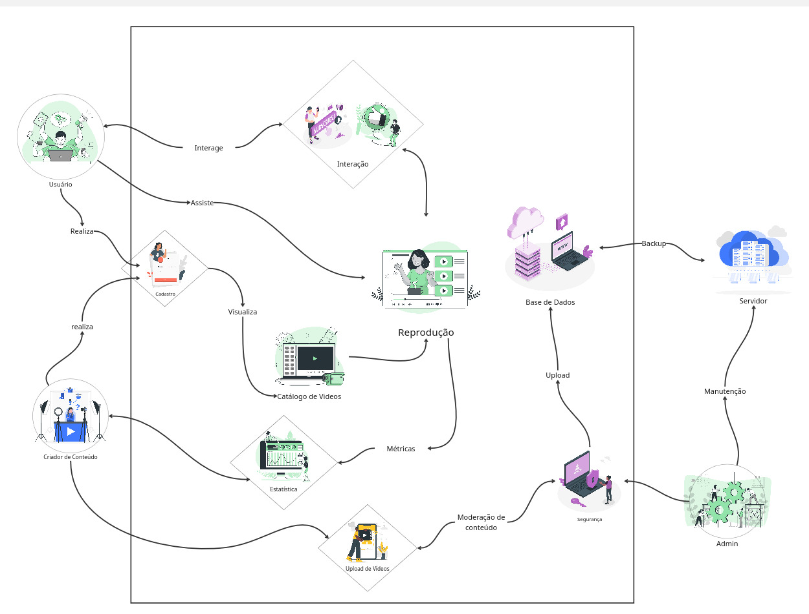
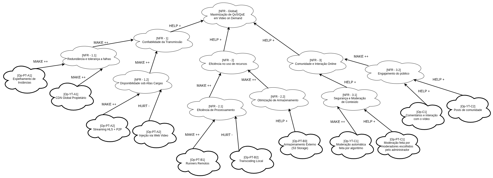
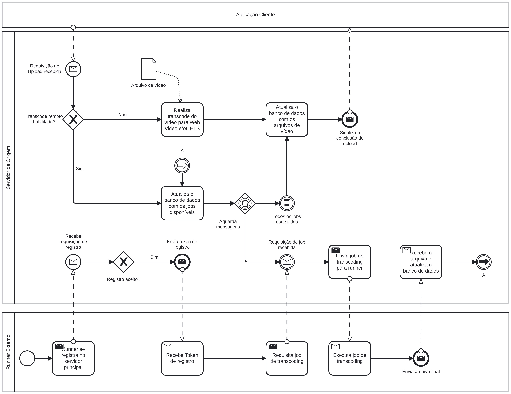

# SubEquipe_03

## Focos do Relatório:

### FOCO_01: Artefatos Generalistas & NFR Framework

### Participantes no Foco_01

| Nome do Membro |
| :-: |
| [Pedro Lucas](https://github.com/pwdrinho) |
| [José Augusto](https://github.com/JAugustoM) |
| [Giovana Barbosa](https://github.com/gio221) |

### Metodologia do Foco_01

A elaboração dos artefatos foi realizada de forma colaborativa por um grupo, utilizando uma abordagem baseada em levantamento, discussão e consolidação das informações obtidas sobre os softwares analisados, juntamente com reunião presencial entre os integrantes, com o objetivo de compartilhar os conhecimentos prévios sobre os sistemas com a finalidade de identificar as principais funcionalidades, atores, interações, problemas e características relevantes para a construção dos artefatos. Essa etapa permitiu estabelecer uma visão inicial e generalista dos softwares a partir das diferentes perspectivas dos integrantes.

Paralelamente, foi realizada a engenharia reversa para aprofundar a compreensão de funcionalidades e fluxos específicos, complementando e validando as informações levantadas. A partir desses resultados, foram elaborado um *Rich Picture*, representando de forma exploratória os principais elementos e relações dos sistemas, e um SIG NFR, utilizados para organizar os requisitos não funcionais e suas interdependências, com base no [NFR Framework proposto por Chung et al. (2012)](#ref1).

Video disponivel com [entrega parcial](/Atas/SubEquipe_03/26-08-26.md) e [entrega final](/Atas/SubEquipe_03/27-08-26.md) dos artefatos generalistas consta na ata da reuniões correspondentes.

### Rich Picture

#### Introdução

A **Rich Picture** é uma representação visual utilizada para compreender e comunicar uma situação de forma ampla, reunindo elementos como atores, processos, relações, problemas, interesses e diferentes pontos de vista presentes em determinado contexto. Sua construção não segue uma notação rígida, permitindo o uso de símbolos, textos, setas e outros elementos que contribuam para representar as características relevantes da situação analisada. Dessa forma, a técnica possibilita visualizar tanto os aspectos objetivos de um sistema quanto as interações, interesses e possíveis conflitos entre os envolvidos, auxiliando na compreensão do contexto analisado [(Monk; Howard, 1998)](#ref2). Neste trabalho, a Rich Picture é utilizada como ferramenta de apoio à **Engenharia Reversa dos softwares analisados**, permitindo representar visualmente os principais elementos e relações identificados durante a análise.

Considerando as orientações para desenvolvimento disponibilizadas no site da [disciplina](#ref3), a elaboração do *Rich Picture* tornou-se mais clara e intuitiva. Além disso, o uso das ilustrações vetorizadas encontradas no site [Storyset](#ref4) contribuiu para a representação dos elementos do sistema, facilitando a compreensão e a organização das informações.

<!--> <iframe width="768" height="496" src="https://miro.com/app/live-embed/uXjVHtjg9Ow=/?focusWidget=3458764681861921236&embedMode=view_only_without_ui&embedId=552180842256" frameborder="0" scrolling="no" allow="fullscreen; clipboard-read; clipboard-write" allowfullscreen></iframe>
<!-->

### NFR Framework

O _Softgoal Interdependency Graph_, ou SIG, segundo [Chung et al (2012)](#ref1), é uma forma de representar e recordar as considerações de design do desenvolvedor em relação aos _Softgoals_ da aplicação, isto é, os critérios de qualidade que a aplicação planeja alcançar. Além disso, o SIG permite a criação de um catálogo de conhecimento sobre os RNFs que contribuem para o critério de qualidade que se planeja alcançar, guiando o desenvolvimento da aplicação.

Neste contexto, o SIG abaixo foi criado para catalogar os achados durante o processo de engenharia reversa e como eles se relacionam com os requisitos não funcionais associados aos critérios de qualidade que planejamos explorar, que podem ser condensados como a "Maximização de QoS/QoE em plataformas de _Video on Demand_".

#
## FOCO_02: Engenharia Reversa & Modelagem BPMN

### Participantes no Foco_02

| Nome do Membro |
| :-: |
| [Pedro Lucas](https://github.com/pwdrinho) |
| [José Augusto](https://github.com/JAugustoM) |

### Metodologia do Foco_02

A pesquisa foi feita fazendo o levantamento do fluxo usando a documentação do PeerTube e fazendo a análise do serviço rodando localmente, com reuniões presenciais e remotas para consolidar os achados e para construir o diagrama BPMN baseado nos achados. Algo que também ajudou na elaboração do diagrama BPMN foi o uso da IA para sugerir ideias de como representar alguns fluxos mais complicados da aplicação, onde ela ajudou com ideias de como melhor usar a notação BPMN.

### Processo de Engenharia Reversa Aplicado

A engenharia reversa foi aplicada no contexto de estudar o _backend_
do PeerTube relacionado às funcionalidades de _video on demand_ ou
VOD, isto é, vídeos publicados pelos usuários que podem ser assistidos a qualquer momento.

Para entender o fluxo executado pelo PeerTube, foi feito um processo
de _Design Recovery_, como descrito por [Chikofsky e Cross (1990)](#ref5).Para executar este processo, foram utilizadas a documentação de arquitetura do PeerTube e a documentação da API do PeerTube. Por último, criamos uma instância privada do PeerTube para realizar testes locais e verificar o funcionamento real, observando os logs de execução do serviço em tempo real.

Utilizando essas fontes, foi possível descobrir vários detalhes da implementação da funcionalidade de VOD do PeerTube, que foram utilizados para abstrair um fluxo de tarefas que foi representado no BPMN.

### Modelagem BPMN

Como a subequipe estava focada na funcionalidade de vídeos sob demanda (_video on demand_ ou VOD), especialmente no backend relacionado a esta função, foram elaborados dois modelos BPMN, um focado no fluxo de upload de um vídeo pelo usuário e outro focado no envio do vídeo ao usuário.

No diagrama abaixo é representado o fluxo de upload de um vídeo para o PeerTube, começando com a requisição de upload vinda do aplicativo cliente para o servidor central e terminando com a sinalização de que o upload foi concluído com sucesso. Para que o modelo não ficasse muito denso ou poluído foi assumido um "caminho feliz" da aplicação, suprimindo rotinas de erro.

No diagrama abaixo é representado o fluxo relacionado ao usuário assistir um VOD no PeerTube, com foco no fluxo de backend, o fluxo começa com a requisição da aplicação cliente por um vídeo específico e termina ou com o download vindo apenas do servidor principal ou com o download usando também a rede P2P do PeerTube. Assim como no modelo anterior foram suprimidas as rotinas de erro.

#
### FOCO_03: IA Generativa

### Participantes no Foco_03

| Nome do Membro | Lições Aprendidas | Uso da IA Generativa (SENSO CRÍTICO) |
| :-: | :- | :- |
| [José Augusto](https://github.com/JAugustoM) | Expandi meus conhecimentos relacionados a arquitetura cliente servidor e a arquitetura distribuída graças ao processo de engenharia reversa. Além disso, ganhei maior familiaridade com o uso da Rich Picture, do SIG, e em menor escala do BPMN (que já tinha maior familiaridade) | Utilizei a IA generativa principalmente como assistente de pesquisa, aonde ela me ajudou a sintetizar ideias complexas e procurar fontes de pesquisa. A ajuda da IA na criação dos artefatos foi principalmente para sugerir ideias e soluções para melhor representar os aspectos da aplicação, não sendo utilizada para a geração de modelos prontos |
| [Pedro Lucas](https://github.com/pwdrinho) | Experiência desafiadora, principalmente com parte da engenharia reversa, tive pouco de dificuldade, mas consegui abstrair bastante informação sobre fluxos, processos, normas e padrões para fazer diagramas mais técnicos como o BPMN. Rich Picture não foi novidade para mim, já o SIG NFR foi parcialmente novo, o que conhecia tinha uma outra notação de dependência | Minha parte tentei usar IA para me auxiliar na engenharia reversa, mas ela me atrapalhou um pouco para entender qual rumo seguir, utilizei também para correções gramáticais e facilitar entendimento de alguns técnicos. |
| [Giovana Barbosa](https://github.com/gio221) | Foi muito enriquecedor retomar o estudo do NFR Framework com foco na engenharia de requisitos de software. A aplicação prática dos conceitos permitiu compreender melhor a estruturação de requisitos não funcionais, bem como o mapeamento de softgoals e suas interações. A construção do modelo e do diagrama no Lucidchart contribuiu para consolidar esses conhecimentos de forma prática e visual.| A IA generativa foi utilizada como uma ferramenta de apoio ao aprendizado, atuando como uma espécie de tutora durante o processo de modelagem. Seu uso auxiliou na compreensão e na estruturação dos requisitos não funcionais, como confiabilidade, escalabilidade, segurança e otimização de banda, além de orientar o processo de identificação e relacionamento dos softgoals. A partir dessas orientações, a modelagem foi realizada e materializada no Lucidchart, com revisão e aplicação dos conceitos no contexto do trabalho. |

#
## Versionamentos

| Versão | Nome do Membro | Contribuição | Data |
| :- | :-: | :- | :-: |
| 1.0 | José Augusto e Pedro Lucas | Adição dos modelos BPMN, lições aprendidas e uso de IA  | 26/08/2026 |
| 1.1 | José Augusto | Adição do processo de engenharia reversa do BPMN | 27/08/2026 |
| 1.2 | Pedro Lucas | Adição da Introdução e Metodologia utilizada no Foco 1 (Artefato Generalista [Rich Picture](#foco_01-artefatos-generalistas--nfr-framework)) | 27/08/2026 |
| 1.3 | José Augusto | Adição do SIG | 27/08/2026 |
| 1.4 | Pedro Lucas | Adiciona Metodologia foco 1 integral + correções de referências e rastreabilidade | 27/08/26 |
| 1.5 | Pedro Lucas | Correções Gerais | 27/08/26 |
| 1.6 | Pedro Lucas, José Augusto e Giovana Barbosa | Adiciona Foco 3 | 27/08/26 |
## Referências

CHUNG, L. et al. Non-Functional Requirements in Software Engineering. [S. l.]: Springer US, 2012. Disponível em: https://books.google.com.br/books?id=MNrcBwAAQBAJ.

MONK, Andrew; HOWARD, Steve. The Rich Picture: A Tool for Reasoning About Work Context. *Interactions*, v. 5, n. 2, p. 21–30, 1998. DOI: 10.1145/274430.274434.

FCTE_ARQ-DSW. Módulo Base. [S. l.: s. n.], [s.d.]. Disponível em: https://sites.google.com/view/unb-fcte-arqdsw/m%C3%B3dulos/m%C3%B3dulo-base?authuser=0. Acesso em: 27 ago. 2026.

STORYSET. Awesome free customizable illustrations for your next project. [S. l.: s. n.], [s.d.]. Disponível em: https://storyset.com/. Acesso em: 27 ago. 2026.

CHIKOFSKY, E. J.; CROSS, J. H. Reverse engineering and design recovery: a taxonomy.
**IEEE Software**, v. 7, n. 1, p. 13-17, 1990. DOI: 10.1109/52.43044.