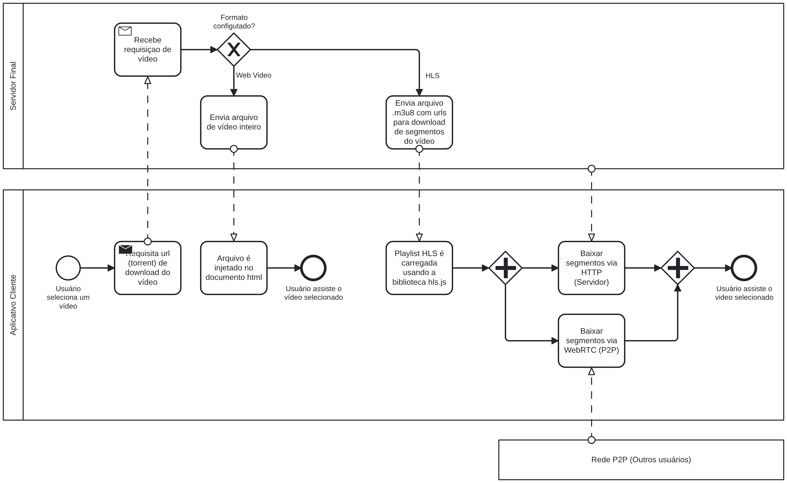

# SubEquipe_03

## Focos do Relatório:
### FOCO_01: Artefatos Generalistas & NFR Framework

### Participantes no Foco_01
| Nome do Membro |
| [Pedro Lucas](https://github.com/pwdrinho) |
| [José Augusto](https://github.com/JAugustoM) |

### Metodologia do Foco_01
Espaço para contar um pouco sobre como ocorreu o trabalho em equipe. Vídeos ajudam aqui.

### Rich Picture
#### Introdução

A **Rich Picture** é uma representação visual utilizada para compreender e comunicar uma situação de forma ampla, reunindo elementos como atores, processos, relações, problemas, interesses e diferentes pontos de vista presentes em determinado contexto. Sua construção não segue uma notação rígida, permitindo o uso de símbolos, textos, setas e outros elementos que contribuam para representar as características relevantes da situação analisada. Dessa forma, a técnica possibilita visualizar tanto os aspectos objetivos de um sistema quanto as interações, interesses e possíveis conflitos entre os envolvidos, auxiliando na compreensão do contexto analisado [(Monk; Howard, 1998)](ref). Neste trabalho, a Rich Picture é utilizada como ferramenta de apoio à **Engenharia Reversa dos softwares analisados**, permitindo representar visualmente os principais elementos e relações identificados durante a análise.

Levando em consideração a indicações encontradas no site da [disciplina](https://sites.google.com/view/unb-fcte-arqdsw/m%C3%B3dulos/m%C3%B3dulo-base?authuser=0) 

<iframe width="768" height="496" src="https://miro.com/app/live-embed/uXjVHtjg9Ow=/?focusWidget=3458764681861921236&embedMode=view_only_without_ui&embedId=552180842256" frameborder="0" scrolling="no" allow="fullscreen; clipboard-read; clipboard-write" allowfullscreen></iframe>

fonte

### NFR Framework
SIG de <<critério de qualidade>> na notação do NFR Framework.
#

### FOCO_02: Engenharia Reversa & Modelagem BPMN
Entrega Mínima: um modelo, na notação BPMN, do fluxo do software encontrado com a Engenharia Reversa.
Mira-se no MM no FOCO, com a entrega mínima.
### Participantes no Foco_02

| Nome do Membro | Contribuição | Significância da Contribuição para o Projeto (Excelente/Boa/Regular/Ruim/Nula) | Comprobatórios |
| :-: | :- | :- | :- |
| José Augusto | Pesquisa na documentação do PeerTube e elaboração dos diagramas | Excelente | Commit f8388f8 |
| Pedro Lucas | Pesquisa bibliográfica, ajuda no processo de engenharia reversa e revisão dos diagramas | Excelente | Commit f8388f8 |

### Metodologia do Foco_02

A pesquisa feita para a elaboração desse foco foi feita colaborativamente,
com discussões feitas em reuniões e no WhatsApp da equipe.
A elaboração dos diagramas foi feita principalmente pelo José Augusto,
e depois foi revisada e corrigido pelo Pedro Lucas e pela Giovana.

### Processo de Engenharia Reversa Aplicado

A engenharia reversa foi aplicada no contexto de estudar o _backend_
do PeerTube relacionado às funcionalidades de _video on demand_ ou
VOD, isto é, vídeos publicados pelos usuários que podem ser
assistidos a qualquer momento.

Para entender o fluxo executado pelo PeerTube, foi feito um processo
de _Design Recovery_, como descrito por Chikofsky e Cross (1990). Para
executar este processo, foram utilizadas a documentação de arquitetura
do PeerTube e a documentação da API do PeerTube. Por último, criamos
uma instância privada do PeerTube para realizar testes locais e verificar
o funcionamento real, observando os logs de execução do serviço em tempo real.

Utilizando essas fontes, foi possível descobrir vários detalhes da implementação
da funcionalidade de VOD do PeerTube, que foram utilizados para abstrair um
fluxo de tarefas que foi representado no BPMN.

CHIKOFSKY, E. J.; CROSS, J. H. Reverse engineering and design recovery: a taxonomy.
**IEEE Software**, v. 7, n. 1, p. 13-17, 1990. DOI: 10.1109/52.43044.

### Modelagem BPMN

Como a subequipe estava focada na funcionalidade de vídeos sob demanda (_video on demand_ ou VOD), especialmente no backend relacionado a esta função, foram elaborados dois modelos BPMN, um focado no fluxo de upload de um vídeo pelo usuário e outro focado no envio do vídeo ao usuário.

No diagrama abaixo é representado o fluxo de upload de um vídeo para o PeerTube, começando com a requisição de upload vinda do aplicativo cliente para o servidor central e terminando com a sinalização de que o upload foi concluído com sucesso. Para que o modelo não ficasse muito denso ou poluído foi assumido um "caminho feliz" da aplicação, suprimindo rotinas de erro.

No diagrama abaixo é representado o fluxo relacionado ao usuário assistir um VOD no PeerTube, com foco no fluxo de backend, o fluxo começa com a requisição da aplicação cliente por um vídeo específico e termina ou com o download vindo apenas do servidor principal ou com o download usando também a rede P2P do PeerTube. Assim como no modelo anterior foram suprimidas as rotinas de erro.

#
### FOCO_03: IA Generativa
Entrega Mínima: pontos de vista de cada membro da equipe sobre as lições aprendidas e uso da IA Generativa.
TODOS DEVEM PARTICIPAR!

### Participantes no Foco_03

| Nome do Membro | Lições Aprendidas | Uso da IA Generativa (SENSO CRÍTICO) |
| :-: | :- | :- |
| José Augusto | Expandi meus conhecimentos relacionados a arquitetura cliente servidor e a arquitetura distribuída graças ao processo de engenharia reversa. Além disso, ganhei maior familiaridade com o uso da Rich Picture, do SIG, e em menor escala do BPMN (que já tinha maior familiaridade) | Utilizei a IA generativa principalmente como assistente de pesquisa, aonde ela me ajudou a sintetizar ideias complexas e procurar fontes de pesquisa. A ajuda da IA na criação dos artefatos foi principalmente para sugerir ideias e soluções para melhor representar os aspectos da aplicação, não sendo utilizada para a geração de modelos prontos |

#
## Versionamentos

| Versão | Nome do Membro | Contribuição | Data |
| :- | :-: | :- | :-: |
| 1.0 | José Augusto e Pedro Lucas | Adição dos modelos BPMN, lições aprendidas e uso de IA  | 26/08/2026 |
| 1.1 | José Augusto | Adição do processo de engenharia reversa do BPMN | 27/08/2026 |
| 1.2 | Pedro Lucas | Adição da Introdução e Metodologia utilizada no Foco 1 (Artefato Generalista [Rich Picture](#foco_01-artefatos-generalistas--nfr-framework))

OBS: TODOS DEVEM PARTICIPAR, MOSTRANDO SEUS PONTOS DE VISTA E COMO COLABORARAM NA ENTREGA.

---
# Observações: 
Entregável: Relatório, documentado no GitPages, revelando:
## Entrega Mínima (por subgrupo da equipe): um artefato generalista (ESCOPO: Rich Picture ou Mapa Mental), um SIG na notação do NFR Framework, um modelo, na notação BPMN, do fluxo do software encontrado com a Engenharia Reversa, e pontos de vista de cada membro da equipe sobre as lições aprendidas e uso da IA Generativa. Mira-se no MM, com a entrega mínima.

## Como ir além, para conseguir menções superiores?
Embasar cada artefato gerado e cada decisão tomada na literatura;
Manter rastros claros para o trabalho em equipe (ex. vídeos das reuniões e atas bem elaboradas), evidenciando práticas metodológicas (ex. reuniões periódicas das metodologias ágeis; checklists; debates, e assim vai);
Usar os vários recursos de modelagem, seja do NFR Framework, seja da notação BPMN, e
Reportar os pontos de vista de forma fundamentada, clara e com senso crítico.

## 📌A ideia não é quantidade, e sim qualidade do que é entregue.

## Apresentação:
Apresentação (para a professora) explicando o artefato elaborado, com: (i) rastro claro aos membros participantes (MOSTRAR QUADRO DE PARTICIPAÇÕES & COMMITS); (ii) justificativas & senso crítico sobre o trabalho realizado, e (iii) comentários gerais sobre o trabalho em equipe. Tempo da Apresentação: +/- 10min. Recomendação: Apresentar diretamente via Wiki ou GitPages do Projeto. Baixar os conteúdos com antecedência, evitando problemas de internet no momento de exposição nas Dinâmicas de Avaliação.

A Wiki ou GitPages do Projeto deve conter, PARA CADA SUBGRUPO, um tópico dedicado ao relatório com a entrega mínima, versionamentos, referências, e demais detalhamentos gerados pela equipe nesse escopo.
Demais orientações disponíveis nas Diretrizes (vide Aprender3).

## Referências

MONK, Andrew; HOWARD, Steve. The Rich Picture: A Tool for Reasoning About Work Context. *Interactions*, v. 5, n. 2, p. 21–30, 1998. DOI: 10.1145/274430.274434.

OPEN UNIVERSITY. Rich pictures. OpenLearn, 2021. Disponível em: https://www.open.edu/openlearn/science-maths-technology/engineering-technology/rich-pictures. Acesso em: 27 ago. 2026.
