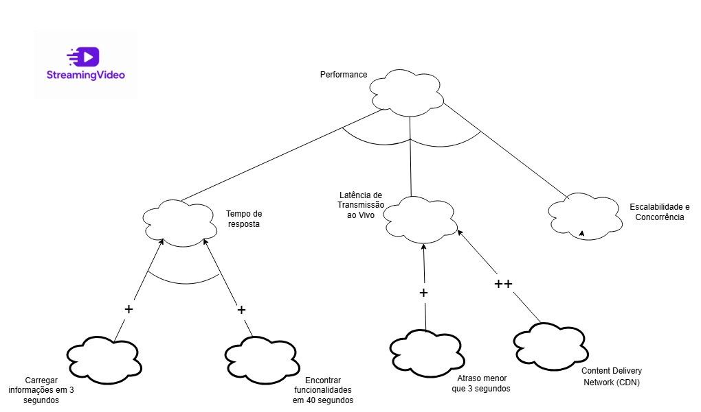

# Relatório da SubEquipe 02

Este relatório reúne o trabalho da SubEquipe 02 na primeira entrega da disciplina Arquitetura e Desenho de Software, no projeto **Streaming de Vídeo**. A equipe é composta por **Enzo Menali, Geovanna Umbelino, Lucas Oliveira e Paulo Vitor Gomes**.

O trabalho articula a representação do contexto de uma plataforma de streaming, a modelagem de requisitos não funcionais, a Engenharia Reversa do frontend do **PeerTube**, a representação de um fluxo em BPMN e as reflexões individuais sobre aprendizagem e uso de IA generativa. As atividades e versões registradas nos artefatos abrangem os dias **25 a 28 de agosto de 2026**.

## Focos do Relatório

| Foco | Trabalho desenvolvido | Documentação detalhada |
|---|---|---|
| FOCO_01 — Artefatos Generalistas & NFR Framework | Rich Picture e SIGs de Usabilidade, Performance e Segurança. | [Rich Picture](richpicture.md) e [NFR Framework](nfrframework.md). |
| FOCO_02 — Engenharia Reversa & Modelagem BPMN | Análise do frontend do PeerTube em quatro perspectivas e modelagem do cenário de pesquisa e reprodução de vídeo. | [Engenharia Reversa](Engenharia_reversa.md) e [Modelagem BPMN](modelagem_bpmn.md). |
| FOCO_03 — IA Generativa | Registro individual de lições aprendidas e avaliação crítica do uso de IA. | [Lições Aprendidas e IA Generativa](IA_generativa.md). |

### FOCO_01: Artefatos Generalistas & NFR Framework

O artefato generalista escolhido foi o **Rich Picture**. Para a modelagem de requisitos não funcionais, foram produzidos três **Softgoal Interdependency Graphs (SIGs)**, contemplando Usabilidade, Performance e Segurança.

#### Participantes no Foco_01

| Nome do membro | Participação registrada |
|---|---|
| [Enzo Menali](https://github.com/menali17) | Elaboração conjunta do Rich Picture e dos SIGs de Usabilidade, Performance e Segurança. |
| [Geovanna Umbelino](https://github.com/GeovannaUmbelino) | Elaboração conjunta do Rich Picture e dos SIGs de Usabilidade, Performance e Segurança. |
| [Lucas Oliveira](https://github.com/dev-LucasDpaula) | Elaboração conjunta do Rich Picture e dos SIGs de Usabilidade, Performance e Segurança. |
| [Paulo Vitor Gomes](https://github.com/gpaulovit) | Elaboração conjunta do Rich Picture e dos SIGs de Usabilidade, Performance e Segurança. |

#### Metodologia do Foco_01

A equipe utilizou o **Draw.io** para elaborar o Rich Picture, sua legenda e os SIGs. No Rich Picture, organizou os atores, as funcionalidades e as relações com os dados do domínio de streaming. Nos SIGs, decompôs os critérios de qualidade em aspectos mais específicos e associou propostas de operacionalização às contribuições representadas nos grafos.

A modelagem foi acompanhada de consulta à literatura e aos materiais da disciplina. O Rich Picture foi fundamentado na representação do contexto de trabalho discutida por Monk e Howard [1]; o NFR Framework foi fundamentado na obra de Chung e colaboradores e no material de apoio citado na documentação específica [2].

Estão disponibilizados dois registros de apoio à apresentação do trabalho:

- [Gravação da reunião de desenvolvimento do Rich Picture](https://youtu.be/Xbt89ENsTKw?is=u0kmqtoE0sZH0EPy).
- [Apresentação do NFR Framework](https://youtu.be/38vXSG_EEpw).

Os históricos dos artefatos registram a autoria conjunta dos quatro integrantes. Para os SIGs, também foram disponibilizadas versões com marcações de avaliação dos softgoals.

#### Rich Picture OU Mapa Mental

Foi elaborado um **Rich Picture da plataforma de Streaming de Vídeo**, com três atores principais: **usuário espectador, criador de conteúdo e administrador**. O desenho relaciona esses atores a ações como cadastro, login, pesquisa, compartilhamento, download, comentários, reações, criação de canal, upload, transmissão ao vivo e gerenciamento.

Vídeos, lives, perfil e armazenamento de dados aparecem associados às operações. A legenda explica os símbolos de atores, processos, dados, setas, fronteira e observações. Essa representação oferece uma visão geral do domínio; as sequências de execução são detalhadas posteriormente no BPMN.

*Figura 1 — Rich Picture de Streaming de Vídeo. Autoria: Enzo Menali, Geovanna Umbelino, Lucas Oliveira e Paulo Vitor Gomes.*

*Figura 2 — Legenda do Rich Picture. Autoria: Enzo Menali, Geovanna Umbelino, Lucas Oliveira e Paulo Vitor Gomes.*

A fundamentação, a gravação e o histórico estão reunidos na [documentação do Rich Picture](richpicture.md).

#### NFR Framework

O NFR Framework foi utilizado para organizar **metas de qualidade** e discutir como determinadas decisões podem contribuir para elas. Os SIGs registram decomposições e relações de contribuição entre os softgoals e as operacionalizações propostas [2].

| SIG | Aspectos representados | Exemplos presentes no modelo |
|---|---|---|
| Usabilidade | Interface, acessibilidade e disponibilidade em Android e iOS. | Clareza do contexto da busca, acesso às funções, prevenção de abandono acidental de publicação, acesso textual, operação sem mouse, contraste e suporte a Libras. |
| Performance | Tempo de resposta, latência de transmissão ao vivo e escalabilidade/concorrência. | Carregar informações em 3 segundos, encontrar funcionalidades em 40 segundos, atraso inferior a 3 segundos e uso de CDN. |
| Segurança | Autenticação, autorização, proteção contra requisições excessivas, integridade dos dados e validação de entradas. | Senha e OTP/2FA, perfis e tokens, rate limiting, SHA-256, assinaturas digitais e validadores de API. |

*Figura 3 — SIG de Usabilidade. Autoria: Enzo Menali, Geovanna Umbelino, Lucas Oliveira e Paulo Vitor Gomes.*

*Figura 4 — SIG de Performance. Autoria: Enzo Menali, Geovanna Umbelino, Lucas Oliveira e Paulo Vitor Gomes.*

*Figura 5 — SIG de Segurança. Autoria: Enzo Menali, Geovanna Umbelino, Lucas Oliveira e Paulo Vitor Gomes.*

Também estão disponíveis as versões com marcações de avaliação de [Usabilidade](../../../assets/NFR%20-%20Usabilidadecheck%20.drawio.png), [Performance](../../../assets/Performance_NFR%20%281%29.jpg) e [Segurança](../../../assets/NFR_seguran%C3%A7a.drawio.png).

Os modelos expressam a análise e as propostas da equipe. Os rótulos de satisfação não equivalem a medições de desempenho, testes de segurança ou comprovação de acessibilidade do PeerTube. Em particular, as metas temporais e os recursos propostos não devem ser apresentados como resultados obtidos nos cenários de Engenharia Reversa. A justificativa das contribuições e de sua propagação deve acompanhar a leitura dos grafos.

A descrição dos elementos, as referências e a evolução dos três SIGs estão na [documentação do NFR Framework](nfrframework.md).

### FOCO_02: Engenharia Reversa & Modelagem BPMN

A equipe analisou o frontend do PeerTube para recuperar funcionalidades, fluxos e elementos da sua estrutura. A partir dessa investigação, selecionou o cenário **Pesquisar e assistir a um vídeo** para representação em BPMN.

#### Participantes no Foco_02

| Nome do membro | Engenharia Reversa | Modelagem BPMN |
|---|---|---|
| [Lucas Oliveira](https://github.com/dev-LucasDpaula) | Uso da aplicação e funcionalidades principais. | Início do processo e descoberta de conteúdo; apoio à revisão geral do fluxo. |
| [Geovanna Umbelino](https://github.com/GeovannaUmbelino) | Documentação dos fluxos. | Interações com o conteúdo, autenticação e continuidade das interações; apoio à revisão final. |
| [Paulo Vitor Gomes](https://github.com/gpaulovit) | Análise de página e estrutura do frontend. | Seleção, carregamento, reprodução e caminho de erro; apoio à revisão das atividades do sistema. |
| [Enzo Menali](https://github.com/menali17) | Acessibilidade. | Pesquisa e refinamento de resultados; apoio à revisão dos gateways. |

#### Metodologia do Foco_02

O trabalho foi dividido em quatro perspectivas complementares: uso da aplicação, documentação de fluxos, inspeção estática do frontend e acessibilidade. A equipe reuniu os resultados para distinguir **comportamentos observados**, **etapas recuperadas pela documentação** e **mecanismos encontrados no código**.

A exploração prática registrou ações e respostas da interface com capturas de tela. Os fluxos foram organizados em **Início → Sequência de ações → Resultado**, incluindo decisões e exceções. A inspeção estática relacionou rotas, componentes, serviços e estados. A avaliação de acessibilidade utilizou teclado e DevTools em dois cenários públicos, com critérios selecionados da WCAG 2.2 e da ABNT NBR 17225:2025.

Para o BPMN, foi escolhido um cenário com execução prática documentada. A equipe distribuiu a modelagem entre início e descoberta, pesquisa e filtros, reprodução e tratamento de erro, e interações. As ações do usuário foram diferenciadas das respostas do sistema, e as decisões foram representadas por gateways.

#### Processo de Engenharia Reversa Aplicado

**Contexto e fundamentação.** O objeto da análise foi o frontend web do PeerTube, utilizando principalmente a instância **PeerTube.TV** e o [repositório oficial](https://github.com/Chocobozzz/PeerTube). A recuperação de componentes, relações e representações de um sistema existente foi orientada pela fundamentação de Engenharia Reversa de Chikofsky e Cross [3].

**Etapas e ferramentas.** Foram utilizadas a aplicação, a documentação oficial do PeerTube, o catálogo JoinPeerTube, o repositório, o Google Chrome e o DevTools. A investigação compreendeu:

1. **Exploração funcional:** pesquisa de vídeos, aplicação de filtros, tentativa de reprodução, observação de interações e tentativa de acesso à publicação.
2. **Organização dos fluxos:** levantamento de login, cadastro, pesquisa, reprodução, curtida, publicação, live, edição de perfil, comentários e assinatura de canal.
3. **Inspeção estática:** análise das rotas `/home`, `/search`, `/w/:videoId`, `/login` e `/videos/publish`, relacionando responsabilidades e estado.
4. **Acessibilidade:** avaliação de pesquisa/filtros e player, com atenção a teclado, foco, identificação dos campos, tamanho dos controles e legendas.
5. **Consolidação:** comparação dos resultados e escolha do fluxo de pesquisa e reprodução para a modelagem BPMN.

**Principais achados.** Na pesquisa por “Linux”, foram observados filtros, metadados e conteúdo associado a diferentes origens. O vídeo “Pocket Cars, Linux Client (Early Access)” apresentou falha de reprodução, enquanto sua página permaneceu disponível; “What Makes Great Enemy Design?” foi reproduzido. A tentativa de curtir sem autenticação exibiu a exigência de login.

O cadastro estava fechado nas instâncias diretamente testadas para acesso à publicação. Por isso, **não houve upload nem transmissão ao vivo executados pela equipe nesse cenário**; as etapas posteriores foram recuperadas pela documentação. A existência de menus de compartilhamento, comentários e assinatura também não comprova a conclusão de todas essas ações.

A inspeção estática identificou um cliente Angular organizado por funcionalidades, com serviços centrais e componentes compartilhados. Foram relacionados o estado da pesquisa à URL, a autenticação a usuário e tokens, e a reprodução a preferências do player. A inspeção não foi uma validação dinâmica de todos esses mecanismos nem estabeleceu equivalência exata entre o código e a instância acessada.

Na acessibilidade, a pesquisa e os controles avaliados puderam ser operados por teclado, com foco visível nos elementos observados. Foram registrados possíveis problemas nos rótulos dos campos de ano. A chegada do foco ao player e a avaliação de legendas permaneceram inconclusivas. As medidas de um elemento interno do player não comprovam, isoladamente, o tamanho do alvo interativo completo; o estudo não constitui uma declaração de conformidade global.

As capturas, os dez fluxos, os elementos arquiteturais e os critérios avaliados estão na [documentação de Engenharia Reversa](Engenharia_reversa.md).

#### Modelagem BPMN

O BPMN foi adotado para representar atividades, eventos, decisões e responsabilidades do cenário **Pesquisar e assistir a um vídeo**, com base na notação mantida pela OMG [4]. O modelo distingue as áreas de responsabilidade **Usuário** e **Sistema**.

**Início:** o usuário inicia a busca por conteúdo e acessa a plataforma.

**Sequência principal:** localizar um conteúdo ou informar um termo de pesquisa → visualizar resultados → aplicar filtros, se desejado → selecionar um vídeo → carregar e reproduzir o conteúdo → decidir sobre interações → encerrar.

**Decisões e exceções:** encontrar ou pesquisar conteúdo; aplicar filtros; verificar sucesso do carregamento; escolher outro vídeo após uma falha; selecionar uma interação; verificar autenticação e decidir sobre novas interações.

**Resultado representado:** reprodução e eventual interação com o conteúdo, ou encerramento após uma falha quando o usuário não escolhe outro vídeo.

*Figura 6 — BPMN do cenário Pesquisar e assistir a um vídeo no PeerTube. Autoria: Lucas Oliveira, Enzo Menali, Paulo Vitor Gomes e Geovanna Umbelino.*

[Abrir o diagrama em tamanho original](../../../assets/BPMN.jpg).

**Relação com a Engenharia Reversa.** A pesquisa, os filtros, a seleção, a reprodução e o caminho de falha têm apoio nas observações práticas. Os ramos de interação incluem resultados esperados que não foram todos executados.

Na versão atual, o modelo reúne as interações em um caminho comum de autenticação e registro. Esse trecho exige cuidado: a Engenharia Reversa confirmou a exigência de login para curtir, mas não para todas as modalidades de interação; opções de compartilhamento foram disponibilizadas no cenário sem autenticação. Além disso, solicitar autenticação não comprova que ela foi concluída. A distinção desses caminhos e dos resultados de falha ou cancelamento deve ser revisada no diagrama antes de tratar o fluxo como descrição integral do comportamento observado.

A explicação dos elementos, as decisões e a divisão da modelagem estão na [documentação BPMN](modelagem_bpmn.md).

### FOCO_03: IA Generativa

Este foco registra as lições aprendidas e a avaliação crítica de cada integrante sobre o uso de IA generativa. Os relatos abaixo preservam os conteúdos individuais disponíveis, sem atribuir aos demais integrantes experiências que ainda não registraram.

#### Participantes no Foco_03

| Nome do membro | Lições Aprendidas | Uso da IA Generativa (SENSO CRÍTICO) |
|---|---|---|
| [Geovanna Umbelino](https://github.com/GeovannaUmbelino) | Aprofundei meus conhecimentos em modelagem BPMN, conteúdo inédito para mim, o que exigiu maior pesquisa e imersão nos materiais teóricos. Quanto ao Rich Picture, NFR Framework e Engenharia Reversa (com foco na documentação de fluxos), o aprendizado foi de revisão e consolidação, uma vez que já havia aplicado esses conceitos em outra disciplina e apenas consultei os materiais disponibilizados pela professora para relembrar detalhes. | A IA Generativa foi muito útil para converter tabelas do Google Docs em Markdown e para aprimorar a redação de alguns textos e corrigir erros nas páginas. Em relação ao BPMN, utilizei a IA para tirar dúvidas iniciais sobre como começar, entender quais materiais eram necessários para montar o diagrama, buscar exemplos práticos e calibrar a nomenclatura dos elementos para garantir uma linguagem técnica adequada. No entanto, mantive o senso crítico e verifiquei todas as informações. |
| [Enzo Menali](https://github.com/menali17) | Compreendi e enriqueci meus conhecimentos ao produzir e estudar os artefatos da disciplina. Todos os artefatos com exceção do rich picture são produtos completamente novos para mim, mas que eu pude compreender e praticar para essa primeira entrega na disciplina. | A IA generativa atuou como um monitor para me explicar melhor o que são os artefatos dessa primeira entrega e como estão relacionados à arquitetura de software. Além disso, a IA me ajudou a estruturar documentos, dividir tarefas e criticar caso o material produzido, principalmente os que envolvam diagrama não estivessem feito de forma correta, haja vista que foram feitos manualmente entre os integrantes. |
| [Paulo Vitor Gomes](https://github.com/gpaulovit) | **Pendente de preenchimento pelo integrante.** | **Pendente de preenchimento pelo integrante.** |
| [Lucas Oliveira](https://github.com/dev-LucasDpaula) | **Pendente de preenchimento pelo integrante.** | **Pendente de preenchimento pelo integrante.** |

*Tabela de reflexões individuais. Os relatos de Geovanna e Enzo foram consolidados a partir do registro de [Lições Aprendidas e IA Generativa](IA_generativa.md).*

#### Metodologia do Foco_03

Cada integrante registra separadamente o que aprendeu e como utilizou a IA, incluindo a necessidade de verificar suas respostas. Nos relatos disponíveis, a ferramenta apoiou explicações conceituais, organização de documentos, conversão para Markdown e revisão textual. Enzo também registrou que os diagramas foram elaborados manualmente entre os integrantes.

A consolidação deste relatório contou com apoio de IA generativa para organizar as informações já documentadas. Esse apoio não substitui a revisão da equipe, a fundamentação na literatura nem o preenchimento pessoal dos relatos pendentes.

## Versionamentos

### Participação e contribuições por integrante

As datas abaixo correspondem aos registros de atividade e de versionamento dos artefatos; não indicam dedicação contínua durante todo o intervalo.

| Nome do membro | Contribuição | Datas registradas |
|---|---|---|
| [Enzo Menali](https://github.com/menali17) | Rich Picture; SIGs; acessibilidade na Engenharia Reversa; pesquisa e filtros no BPMN; reflexão individual sobre IA generativa. | 25 a 28/08/2026. |
| [Geovanna Umbelino](https://github.com/GeovannaUmbelino) | Rich Picture; SIGs; documentação de fluxos na Engenharia Reversa; interações no BPMN; reflexão individual e organização do registro sobre IA generativa. | 26 a 28/08/2026. |
| [Lucas Oliveira](https://github.com/dev-LucasDpaula) | Rich Picture; SIGs; uso da aplicação e funcionalidades na Engenharia Reversa; início e descoberta de conteúdo no BPMN; documentação da modelagem. | 26 a 28/08/2026. |
| [Paulo Vitor Gomes](https://github.com/gpaulovit) | Rich Picture; SIGs e documentação do NFR Framework; inspeção do frontend na Engenharia Reversa; reprodução e tratamento de erro no BPMN. | 26 a 28/08/2026.  |

### Evolução dos artefatos

| Artefato | Versão | Data registrada | Alteração |
|---|---|---|---|
| Rich Picture | 1.0 / 1.1 | 26/08/2026 | Elaboração do desenho e inclusão no artefato. |
| Engenharia Reversa | 1.0 / 1.1 |  26/08/2026 | Divisão das perspectivas e inclusão do documento consolidado. |
| Modelagem BPMN | 1.0 | 27/08/2026 | Documentação do cenário Pesquisar e assistir a um vídeo. |
| NFR Framework | 1.0 | 27/08/2026 | Documentação teórica e SIGs de Usabilidade e Performance. |
| NFR Framework | 1.1 | 28/08/2026 | Inclusão do SIG de Segurança e do link da apresentação. |
| IA Generativa | 1.0 | 27/08/2026 | Inclusão da tabela de reflexões 

## Histórico de Versões

| Versão | Data       | Descrição                                     | Autor                                                                                             | Revisores                                            |
| ------ | ---------- | --------------------------------------------- | ------------------------------------------------------------------------------------------------- | -------------------------------------------------- |
| 1.0    | 27/08/2026 | Elaboração do documento     | [Enzo Menali](https://github.com/menali17), [Geovanna Umbelino](https://github.com/GeovannaUmbelino), [Lucas Oliveira](https://github.com/dev-LucasDpaula) e [Paulo Vitor Gomes](https://github.com/gpaulovit)                                             | [Breno Teixeira](https://github.com/BrenoLTeixeira),[Gabriel Diniz](https://github.com/GabrielDiniz12) e [Pedro Américo](https://github.com/dev-americo) |

## Referências

1. MONK, Andrew; HOWARD, Steve. **The Rich Picture: A Tool for Reasoning About Work Context**. *Interactions*, mar./abr. 1998, p. 21–30. Disponível no [artigo](https://ics.uci.edu/~wscacchi/Software-Process/Readings/RichPicture.pdf).
2. CHUNG, Lawrence; NIXON, Brian A.; YU, Eric; MYLOPOULOS, John. **Non-Functional Requirements in Software Engineering**. Springer/Kluwer, 2000. Disponível na [página da obra](https://link.springer.com/book/10.1007/978-1-4615-5269-7). A fundamentação do artefato também utiliza o [material de NFR Framework da disciplina](https://drive.google.com/file/d/1barJrSu7LXNuprttazBs7J7nVgCTgul8/view).
3. CHIKOFSKY, Elliot J.; CROSS II, James H. **Reverse Engineering and Design Recovery: A Taxonomy**. *IEEE Software*, v. 7, n. 1, p. 13–17, 1990. [DOI: 10.1109/52.43044](https://doi.org/10.1109/52.43044).
4. OBJECT MANAGEMENT GROUP. **Business Process Model and Notation — BPMN, versão 2.0.2**. Disponível na [página da especificação](https://www.omg.org/spec/BPMN/2.0.2/About-BPMN).
5. CHOCOBOZZZ. **PeerTube**. [Repositório oficial](https://github.com/Chocobozzz/PeerTube).
6. PEERTUBE. **Search**. [Documentação de pesquisa](https://docs.joinpeertube.org/use/search).
7. PEERTUBE. **Watch, share, download a video**. [Documentação de reprodução e compartilhamento](https://docs.joinpeertube.org/use/watch-video).
8. PEERTUBE. **Publish a video or a live**. [Documentação de publicação](https://docs.joinpeertube.org/use/create-upload-video).
9. W3C. **Web Content Accessibility Guidelines (WCAG) 2.2**. [Recomendação WCAG 2.2](https://www.w3.org/TR/WCAG22/).
10. ASSOCIAÇÃO BRASILEIRA DE NORMAS TÉCNICAS. **ABNT NBR 17225:2025 — Acessibilidade em conteúdo e aplicações web — Requisitos**. 2025. Informações no [Centro Tecnológico de Acessibilidade do IFRS](https://cta.ifrs.edu.br/abnt-nbr-17225-2025-acessibilidade-em-conteudo-e-aplicacoes-web-requisitos/).

As referências complementares e os materiais específicos de cada análise permanecem nas respectivas páginas dos artefatos.
