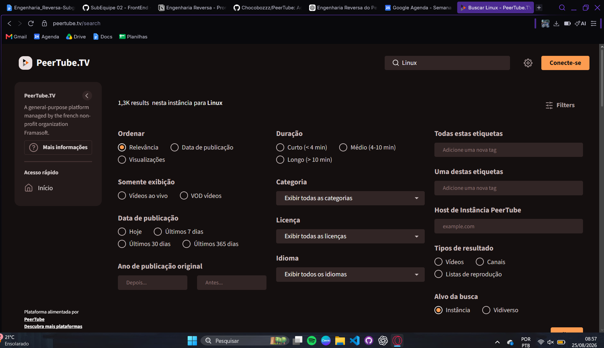
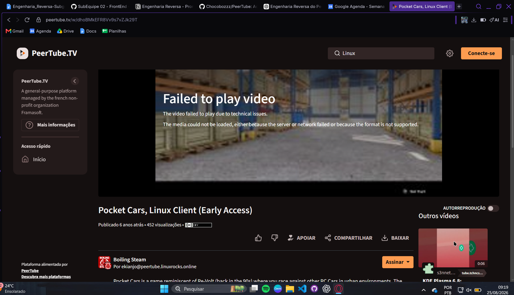
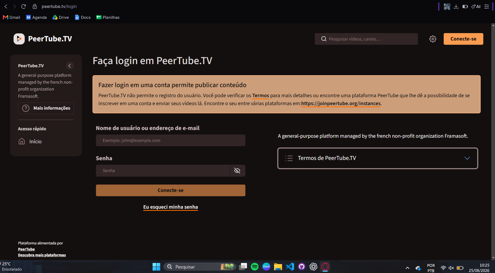
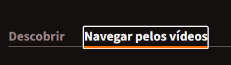
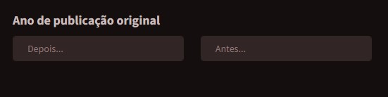
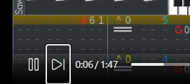
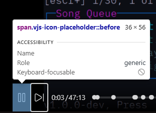
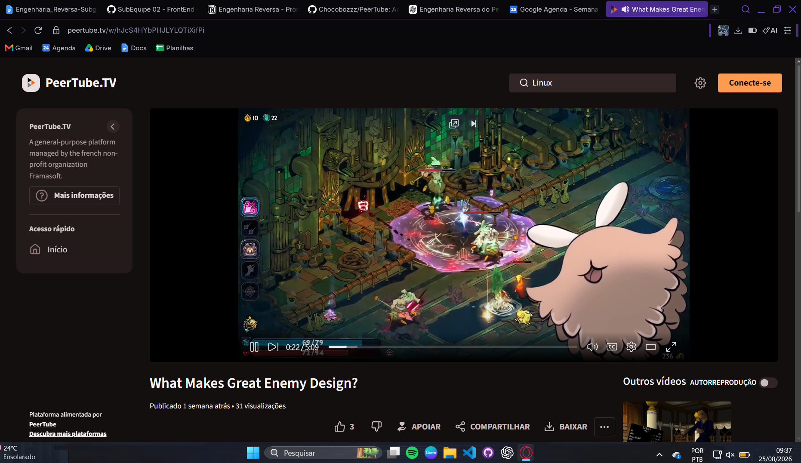
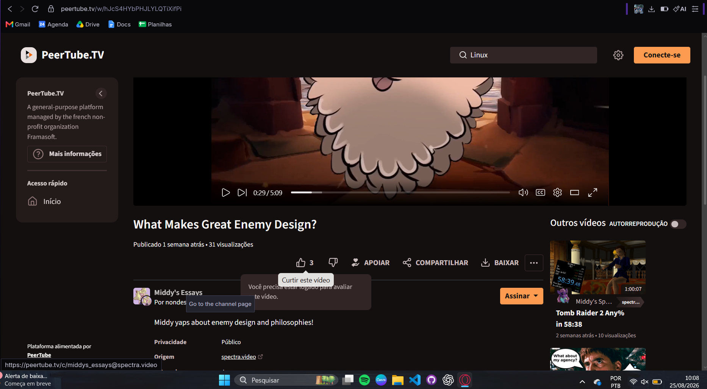
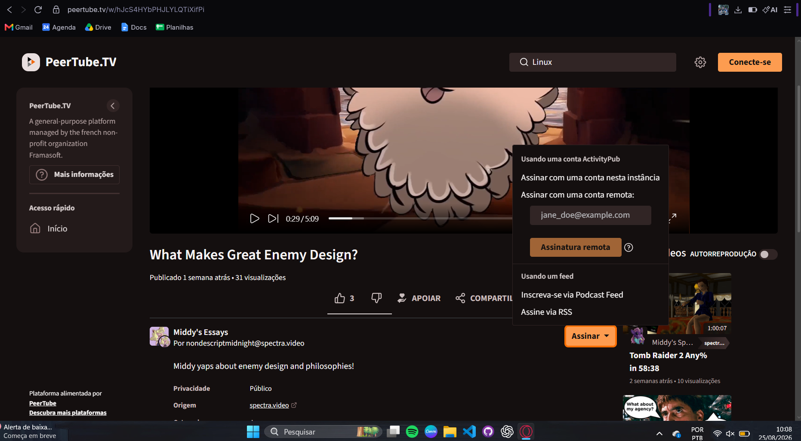

# Engenharia Reversa

A Engenharia Reversa de software consiste no processo de analisar um sistema existente com o objetivo de compreender seus componentes, relacionamentos, comportamentos e decisões de implementação, produzindo representações que auxiliem na recuperação do conhecimento sobre o software. 

Diferentemente do desenvolvimento convencional, em que se parte de requisitos e modelos para chegar à implementação, a Engenharia Reversa parte do sistema já existente para reconstruir informações sobre seu funcionamento e sua estrutura.

## 1. Objetivo

Compreender o funcionamento do PeerTube por meio da observação da aplicação, documentação de fluxos, inspeção da estrutura do frontend e análise de acessibilidade, consolidando os conhecimentos recuperados sobre o sistema.

O trabalho busca relacionar as ações disponíveis ao usuário com os componentes, serviços e estados descritos no código, identificando funcionalidades, decisões, restrições e exceções relevantes ao domínio de streaming de vídeo. 

## 2. Contexto da Análise

| Aspecto | Delimitação |
|---|---|
| Software analisado | PeerTube
| Escopo | Frontend web, com foco em descoberta e consumo de vídeos, interações, acesso à produção de conteúdo, fluxos de uso, estrutura do cliente e acessibilidade. |
| Instância principal | PeerTube.TV|
| Repositório de referência | [Chocobozzz/PeerTube](https://github.com/Chocobozzz/PeerTube)|
| Limitações gerais | Recorte de cenários, acesso sem conta autorizada nos testes de uso, dependência das políticas de cada instância e ausência de validação dinâmica dos mecanismos internos identificados na inspeção estática. |

A Engenharia Reversa foi dividida em quatro perspectivas complementares:

1. **Uso da Aplicação e Funcionalidades Principais:** execução de cenários, identificação de capacidades funcionais e registro de comportamentos e restrições.
2. **Documentação de Fluxos:** organização das ações na estrutura Início → Sequência de ações → Resultado.
3. **Análise de Página e Estrutura do Frontend:** inspeção estática de rotas, componentes, serviços, dados, estado e mecanismos internos.
4. **Acessibilidade:** análise prática de dois fluxos públicos sob critérios selecionados da WCAG 2.2 e da ABNT NBR 17225:2025.

Os resultados são apresentados conforme sua origem: **observação direta**, **recuperação documental** ou **inspeção estática**. Quando existe apenas uma descrição no levantamento de fluxos, sem registro de execução, essa condição é explicitada.

## 3. Ferramentas e Fontes Utilizadas

| Ferramenta ou fonte | Utilização registrada |
|---|---|
| PeerTube.TV | Exploração dos fluxos públicos de pesquisa, reprodução e interação; avaliação prática de acessibilidade. |
| Catálogo JoinPeerTube | Verificação de alternativa de acesso à publicação e consulta às políticas de outras instâncias. |
| Google Chrome | Navegador utilizado na avaliação de acessibilidade. |
| DevTools | Apoio à inspeção de rótulos, atributos ARIA e dimensões de elementos na análise de acessibilidade. |
| Repositório oficial do PeerTube | Inspeção estática de rotas, componentes e serviços, além da identificação da instância de demonstração. |
| Documentação oficial do PeerTube | Consulta sobre pesquisa, reprodução, conta, publicação, transmissões ao vivo, acessibilidade e API [3, 4, 5, 6, 7, 9]. |
| WCAG 2.2 e ABNT NBR 17225:2025 | Seleção e organização dos critérios utilizados na avaliação de acessibilidade [10, 11]. |
| Literatura de Engenharia Reversa | Fundamentação metodológica da análise de uso da aplicação [1]. |

## 4. Passos da Engenharia Reversa

### 4.1 Uso da Aplicação e Funcionalidades Principais

**Objetivo.** Recuperar as principais capacidades do frontend a partir de dois cenários representativos: consumir conteúdo e publicar um vídeo.

**Metodologia.** A exploração manual registrou ações e respostas da interface, selecionou capturas de tela e relacionou os elementos observados a funcionalidades mais amplas. A documentação oficial foi utilizada para contextualizar comportamentos e recuperar etapas que não puderam ser executadas.

#### Cenário 1 — Pesquisar e assistir a um vídeo

Na PeerTube.TV, sem autenticação, foi pesquisado o termo **“Linux”**. A equipe explorou os resultados e aplicou os filtros de tipo **Vídeos** e exibição **VOD**. Foram identificados recursos de ordenação e filtros por duração, data, categoria, licença, idioma, tags, instância de origem e alvo da busca.

*Figura 1 — Filtros utilizados na exploração da pesquisa. Fonte: elaboração própria.*

O vídeo **“Pocket Cars, Linux Client (Early Access)”** apresentou a mensagem **“Failed to play video”**, embora a página, os metadados e as ações continuassem disponíveis. Posteriormente, o vídeo **“What Makes Great Enemy Design?”** foi reproduzido. A causa da primeira falha não foi determinada.

*Figura 2 — Falha de reprodução sem impedir a apresentação da página do vídeo. Fonte: elaboração própria.*

Foram observados controles de reprodução, volume, progresso, velocidade, qualidade, legendas e modos de visualização. A interface também apresentou compartilhamento por URL, código QR e incorporação, opções de assinatura de canal, comentários, respostas e metadados. A tentativa de curtir sem autenticação revelou uma restrição de acesso. Abrir esses controles e observar sua disponibilidade não comprova a conclusão de uma assinatura, o envio de um comentário ou um download completo.

Resultados e identidades associados a outros domínios tornaram a federação perceptível na interface. Não foi inspecionada, nesse cenário, a propagação das interações entre servidores.

#### Cenário 2 — Publicar um vídeo

A equipe acessou a tela de login da PeerTube.TV e constatou que o cadastro de novos usuários estava desabilitado. Em seguida, consultou o catálogo JoinPeerTube, incluindo filtros para criadores e suporte a live, e identificou diferenças de armazenamento, moderação e prazo de aprovação. A instância de demonstração `peertube.cpy.re` também apresentou indisponibilidade de cadastro.

*Figura 3 — Restrição de cadastro encontrada antes do acesso à publicação. Fonte: elaboração própria.*

**Não houve upload real nesse cenário.** As etapas de publicação foram recuperadas pela documentação: seleção de canal, privacidade e origem do conteúdo; envio de arquivo ou importação por URL/torrent; preenchimento de metadados; processamento e disponibilização. O fluxo de live foi recuperado documentalmente, incluindo sua habilitação pela instância e a integração com um codificador externo por URL RTMP e chave de transmissão [5, 6].

**Limitações.** A análise foi orientada por dois cenários e não cobriu todo o produto. As ações posteriores à autenticação, o download completo, a publicação e a transmissão ao vivo não possuem comprovação de execução integral nos testes de uso.

### 4.2 Documentação de Fluxos

**Objetivo.** Organizar as ações do usuário e as respostas do sistema em sequências que possam apoiar a compreensão e a modelagem posterior dos processos.

**Metodologia.** Os fluxos foram organizados em três elementos: **Início**, que dispara o fluxo; **Sequência de ações**, que organiza os passos; e **Resultado**, que descreve o estado esperado ao final. As sequências do PeerTube foram relacionadas às observações de uso, à inspeção estática e à avaliação de acessibilidade.

Foram levantados dez fluxos: login, cadastro, assistir a um vídeo, curtir, publicar um vídeo, abrir uma live, editar perfil, pesquisar, comentar e seguir/assinar um canal. Os registros destacam autenticação por instância, condições de cadastro, seleção de canal na publicação, dependência de habilitação administrativa para live e alternativas de acompanhamento de canais.

**Limitações.** Não há confirmação de execução para todos os fluxos levantados. Por isso, as sequências são tratadas como **fluxos descritos**, e não como dez testes concluídos. Afirmações sobre propagação federada também não são tomadas como comprovação empírica. A seção 6 apresenta as decisões, exceções e condições de execução identificadas na análise.

### 4.3 Análise de Página e Estrutura do Frontend

**Objetivo.** Compreender como cinco rotas centrais se relacionam com componentes, serviços, requisições e estado, recuperando também mecanismos associados à resiliência, segurança e desempenho.

**Metodologia.** Foi realizada uma inspeção estática de arquivos de roteamento, componentes, serviços, modelos e utilitários. A análise partiu do cliente Angular e consultou elementos do servidor quando necessários para explicar autenticação, upload e processamento. Os caminhos e mecanismos abaixo foram identificados nessa inspeção, sem validação dinâmica de seu funcionamento.

#### Estrutura geral identificada

| Área | Organização recuperada |
|---|---|
| `client/src/app/app.routes.ts` | Roteamento raiz, com carregamento de áreas por `loadChildren`. |
| Pastas `+home`, `+search`, `+login`, `+video-watch` e `+videos-publish-manage` | Organização por funcionalidade, componentes standalone e serviços com escopo de rota quando declarados nos respectivos providers. |
| `client/src/app/core/` | Serviços centrais, incluindo autenticação, usuário, renderização e roteamento. |
| `client/src/app/shared/` | Componentes, modelos e serviços reutilizados por mais de uma área. |
| `client/src/standalone/player` | Player próprio, baseado em Video.js e integrado a mecanismos de reprodução HLS/P2P. |
| `server/core/` | Contexto complementar: controladores Express, middlewares, lógica de negócio e filas de processamento com BullMQ/Redis. |

#### Rotas, componentes, serviços e estado

| Rota do frontend | Elementos centrais registrados | Fluxo de dados e estado |
|---|---|---|
| `/home` | `HomeComponent`, `CustomPageService`, `CustomMarkupService` e `DynamicElementService`. | Busca conteúdo customizável da instância, processa Markdown/HTML e cria componentes dinâmicos. O levantamento registra serviços reativos e agrupamento de consultas a miniaturas. |
| `/search` | `SearchComponent`, `SearchFiltersComponent`, `SearchService` e modelo `AdvancedSearch`. | Constrói filtros a partir dos parâmetros da URL. Alterar filtros atualiza esses parâmetros e dispara nova busca. O carregamento adicional ocorre por rolagem infinita. |
| `/w/:videoId` | `VideoWatchComponent`, `VideoService`, serviços de comentários, recomendações, mensagens de estado e tokens de arquivos. | Reúne vídeo, legendas, capítulos e storyboards; configura o player e trata estados de conteúdo. Preferências e parte do histórico de reprodução são persistidas em `localStorage`. |
| `/login` | `LoginComponent`, `AuthService`, `ServerConfigResolver`, guards e interceptor de autenticação. | Envia credenciais a `/api/v1/users/token`, consulta `/api/v1/users/me` e mantém o usuário autenticado e seus tokens. O interceptor acrescenta o token às requisições e trata sua renovação. |
| `/videos/publish` | `VideoPublishComponent`, `VideoManageController`, modelo `VideoEdit` e componentes de upload, importação por URL/torrent e live. | Coordena envio e formulário de metadados. Eventos do upload atualizam progresso e estado; o modelo de edição gera os dados enviados à API conforme o modo escolhido. |

Esses endereços representam rotas da interface; não devem ser confundidos com os endpoints REST citados na coluna de dados. A rota `/home` inspecionada também não deve ser equiparada automaticamente à página `/videos/browse` utilizada no teste de acessibilidade.

#### Mecanismos encontrados no código

- **Página inicial:** sanitização do conteúdo customizável, reutilização de rota, agrupamento de requisições e tratamento específico de ausência de homepage. A inspeção também identificou falta de tratamento visual dedicado para determinados erros no componente.
- **Pesquisa:** estado serializado na URL, prevenção de buscas simultâneas na rolagem e tentativa de retorno aos resultados locais quando o índice externo falha, nas condições previstas no código analisado.
- **Reprodução:** tratamento de erros de mídia, tentativas de recuperação, fontes alternativas e mensagens para estados como espera de live e transcodificação. Foram identificados caminhos de fallback no código, sem demonstrar que foram acionados durante os testes práticos.
- **Autenticação:** guards, renovação de token e reenvio de requisição no cliente. A inspeção do servidor identificou limitação de tentativas, bloqueio temporário e respostas genéricas para determinadas falhas de login.
- **Publicação:** upload em partes com retomada, atualização de progresso, tratamento de expiração de token, validação de quota e avisos contra saída durante operações em andamento. A transcodificação é descrita como processamento assíncrono em filas.

Esses mecanismos indicam estratégias de implementação; sua presença não comprova, isoladamente, níveis de desempenho, disponibilidade ou segurança. O armazenamento de tokens em `localStorage` é uma decisão identificada na inspeção estática, não uma conclusão de que a autenticação seja livre de riscos.

**Limitações.** Não há registro de versão ou commit de referência, medições de desempenho, testes de falha, rastreamento de rede ou validação dinâmica das rotinas. A inspeção pontual do servidor contextualiza o frontend, sem constituir uma Engenharia Reversa completa do backend.

### 4.4 Acessibilidade

**Objetivo e escopo.** Avaliar dois fluxos públicos da PeerTube.TV: pesquisar, filtrar e selecionar um vídeo; e assistir e interagir com um vídeo. Os testes foram realizados em 25/08/2026 e relacionados a critérios selecionados da WCAG 2.2 e da ABNT NBR 17225:2025.

**Metodologia.** Foram consultadas as páginas oficiais de pesquisa, reprodução e acessibilidade; depois, os cenários foram executados com prioridade ao teclado. A equipe observou ordem e visibilidade do foco, identificação dos campos, dimensões de controles, operação do player e disponibilidade de legendas. O DevTools foi usado como apoio.

#### Cenários avaliados

1. **Pesquisa:** partir de `/videos/browse`, utilizar `s` para alcançar a busca, pesquisar **“Games”**, abrir filtros, alterar uma opção e selecionar um vídeo com teclado.
2. **Player:** no vídeo **“[8-Bit Cover] Azalea Town | Pokémon HeartGold/SoulSilver”**, operar reprodução, volume, navegação temporal, configurações e tela cheia. A URL registrada foi `https://peertube.tv/w/17WCndS3Zt9JzMwfecHBp6`.

Nos testes, foi observado o funcionamento de `Space`, `m`, setas, `5` e `f`, além do acesso às configurações por `Tab`. A pesquisa e a seleção também foram concluídas sem mouse. A documentação oficial descreve esses grupos de atalhos [9].

#### Critérios e resultados registrados

A tabela apresenta os critérios selecionados e os itens da NBR utilizados na avaliação. “Não foi identificada barreira” se refere exclusivamente ao recorte testado.

| Critério WCAG 2.2 | Itens da NBR utilizados | Pesquisa e filtros | Player |
|---|---|---|---|
| 2.1.1 — Teclado | 5.1.12 / 5.1.13 | Fluxo executado sem mouse. | Comandos avaliados executados sem mouse; legendas não avaliadas. |
| 2.4.3 — Ordem do foco | 5.1.4 | Ordem considerada coerente, sem saltos incomuns. | Inconclusivo: a chegada ao player não foi totalmente intuitiva. |
| 2.4.7 — Foco visível | 5.1.1 | Foco perceptível nos elementos observados. | Foco visível nos controles observados; legendas não avaliadas. |
| 2.5.8 — Tamanho do alvo | 5.8.7 | Opção de duração com cerca de 126 × 20 pixels CSS; depende de avaliação da exceção de espaçamento. | Não foi identificada barreira nos controles medidos, com a ressalva sobre a evidência de medição apresentada abaixo. |
| 3.3.2 — Rótulos ou instruções | 5.9.1 | Possível barreira nos campos de ano, especialmente `Antes...`. | Não avaliado nesse cenário. |
| 1.2.2 — Legendas pré-gravadas | 5.14.2 | Não avaliado nesse cenário. | Inconclusivo: o vídeo instrumental escolhido não ofereceu faixa de legenda. |

*Figura 4 — Exemplo de foco visível durante a navegação. Fonte: elaboração própria.*

**Rótulos.** Durante o teste, os textos `Depois...` e `Antes...` desapareceram após o preenchimento, dificultando reconhecer a finalidade dos campos. A imagem disponível mostra os placeholders antes do preenchimento; a constatação posterior é sustentada pelo registro textual do teste, e não por uma segunda captura.

*Figura 5 — Identificação dos campos por placeholders no estado anterior ao preenchimento. Fonte: elaboração própria.*

**Foco no player.** A equipe registrou foco visível nos controles observados. A captura abaixo ilustra um controle com contorno de foco, sem demonstrar sozinha toda a sequência de navegação.

*Figura 6 — Evidência visual de foco em um controle do player. Fonte: elaboração própria.*

**Dimensões.** As medidas registradas incluem 310 × 36 pixels CSS para a pesquisa, 114 × 36 para filtros e aproximadamente 36 × 56 para controles do player. O critério 2.5.8 considera o alvo de interação e prevê exceções; uma dimensão inferior a 24 pixels não determina, sozinha, uma falha quando ainda é necessário avaliar o espaçamento [10].

*Figura 7 — Verificação de dimensões no DevTools. O elemento destacado é `span.vjs-icon-placeholder::before`. Fonte: elaboração própria.*

**Ressalva de medição:** a Figura 7 destaca um elemento interno do ícone, e não comprova isoladamente a dimensão do alvo interativo completo. A confirmação das dimensões exige verificar a área que efetivamente recebe a ação do usuário e seu espaçamento.

**Legendas e limitações.** O vídeo selecionado era instrumental e não disponibilizou faixa de legenda. Não foi possível avaliar ativação pelo teclado, sincronização ou representação dos sons relevantes. A inexistência de fala não transforma o resultado em aprovação do critério. Também não foram abrangidos todos os critérios das normas, outros ambientes ou testes com tecnologias assistivas. Os resultados não constituem uma declaração de conformidade global do PeerTube.

## 5. Principais Observações do Sistema

### 5.1 Funcionalidades identificadas

| Grupo | Funcionalidades recuperadas | Sustentação e alcance |
|---|---|---|
| Descoberta | Navegar, pesquisar, filtrar, ordenar e selecionar vídeos; reconhecer canais e origens. | Observação direta, levantamento dos fluxos e inspeção dos mecanismos de pesquisa. |
| Consumo | Reproduzir, pausar, alterar volume, navegar no tempo e usar configurações e tela cheia. | Observação da interface e operação por teclado. |
| Recursos complementares | Compartilhar por URL, QR e incorporação; acessar download, legendas e outras opções. | Disponibilidade observada; download completo e avaliação das legendas não comprovados. |
| Interação | Reagir, acompanhar canais, visualizar comentários e respostas. | Interface e restrição de curtida observadas; sequências de interação levantadas. Envio de interações não demonstrado integralmente. |
| Conta | Login, recuperação de senha, cadastro condicionado à instância e edição de perfil. | Tela e restrições observadas; fluxos levantados e autenticação inspecionada no código. |
| Produção | Upload, importação por URL/torrent, canal, metadados, privacidade e processamento. | Recuperação pela documentação oficial e inspeção estática; sem upload real registrado. |
| Live | Criar transmissão e integrar codificador externo, quando o recurso estiver habilitado. | Recuperação pela documentação oficial e identificação de componente específico no código; sem transmissão executada. |

### 5.2 Comportamentos observados

As evidências práticas mostraram que a pesquisa distingue vídeos sob demanda e lives, que conteúdos de outras origens aparecem nos resultados e que o usuário consegue abrir uma página de vídeo mesmo quando sua mídia falha. Também revelaram exigência de autenticação para curtir, alternativas de acompanhamento de canais e indisponibilidade de cadastro nas instâncias diretamente testadas.

Na acessibilidade, os fluxos públicos puderam ser operados por teclado no recorte avaliado. Isso coexistiu com dificuldades de identificação de campos, uma dúvida sobre ordem de foco e limitações na avaliação das legendas.

### 5.3 Estrutura do frontend

A inspeção estática identificou um cliente Angular organizado por funcionalidades, com roteamento sob demanda, serviços centrais e recursos compartilhados. Pesquisa, autenticação, reprodução e publicação mantêm estados específicos: parâmetros na URL, usuário e tokens, preferências do player e modelo de edição do vídeo. As requisições e eventos desses elementos conectam a interface à API e ao processamento no servidor.

A inspeção permite relacionar responsabilidades, mas não demonstra que todos os mecanismos descritos estavam presentes ou ativos na versão implantada nas instâncias utilizadas.

### 5.4 Restrições e exceções

| Situação | Resultado da análise |
|---|---|
| Interação sem autenticação | A tentativa de curtir exibiu exigência de login; não houve confirmação de gravação da reação. |
| Cadastro fechado | PeerTube.TV e a instância de demonstração impediram a obtenção imediata de uma conta pelo caminho explorado. |
| Publicação e live | Dependem de conta autorizada e de recursos habilitados; suas etapas posteriores foram recuperadas documentalmente. |
| Mídia indisponível | Um vídeo apresentou falha enquanto a página e os metadados permaneceram acessíveis; a causa não foi isolada. |
| Variação entre instâncias | O catálogo apresentou políticas distintas de armazenamento, aprovação e moderação. As informações são registros da consulta, não garantias atuais. |
| Conteúdo local e federado | Foram observadas origens externas; não foi demonstrada uma busca por todo o conteúdo do ecossistema nem a propagação de interações. |
| Legendas | A disponibilidade do recurso não foi confirmada no vídeo selecionado para acessibilidade. |

### 5.5 Aspectos de acessibilidade

Os pontos positivos foram a operação por teclado e a visibilidade do foco nos controles observados. Os principais pontos de atenção foram a dependência de placeholders nos campos de ano e a opção de duração cuja avaliação requer examinar o espaçamento. Permaneceram inconclusivas a ordem de foco até o player e a avaliação de legendas. As dimensões registradas para o player exigem a ressalva de evidência apresentada na seção 4.4.

## 6. Fluxos Identificados

Os fluxos abaixo apresentam início, sequência principal, decisões ou exceções e resultado. Um **resultado esperado** descreve o comportamento previsto para o fluxo; um **resultado observado** corresponde ao que foi constatado durante sua execução.

### 6.1 Pesquisar, filtrar e selecionar um vídeo

**Início:** usuário acessa a busca da instância; no teste de acessibilidade, utiliza o atalho `s`.

**Sequência principal:** informar termo → confirmar pesquisa → abrir filtros → ajustar opções → examinar resultados → selecionar vídeo.

**Decisões ou exceções:** escolher tipos de resultado e VOD/live; considerar a origem e o alcance da busca. A inspeção estática identificou fallback para busca local em determinadas falhas do índice externo, mas esse caso não foi provocado nos testes.

**Resultado:** pesquisa, filtragem e seleção observadas; a seleção abre a página do vídeo. Os termos utilizados foram “Linux” no cenário de uso da aplicação e “Games” no cenário de acessibilidade, em testes distintos.

### 6.2 Assistir e operar o player

**Início:** usuário abre um vídeo a partir da navegação ou da pesquisa.

**Sequência principal:** carregar página → acessar player → iniciar reprodução → ajustar pausa, volume ou posição → utilizar configurações e modos de visualização.

**Decisões ou exceções:** a mídia pode falhar sem impedir o carregamento da página; a disponibilidade de legendas depende do conteúdo. Os testes de uso e de acessibilidade utilizaram vídeos diferentes.

**Resultado:** reprodução bem-sucedida registrada para “What Makes Great Enemy Design?”; operação por teclado registrada no cenário de acessibilidade com vídeo instrumental. A falha em “Pocket Cars” permaneceu sem causa determinada.

*Figura 8 — Reprodução bem-sucedida no cenário de uso. Fonte: elaboração própria.*

### 6.3 Fazer login

**Início:** usuário seleciona “Conecte-se” na instância escolhida.

**Sequência principal:** informar login/e-mail e senha → solicitar autenticação → validar credenciais → obter acesso às funcionalidades autorizadas.

**Decisões ou exceções:** credenciais ou fatores adicionais podem impedir a autenticação. A inspeção estática identificou tratamento de erros e renovação de tokens. A autenticação ocorre no contexto da instância; acompanhar conteúdo remoto não significa estar autenticado em outro servidor.

**Resultado:** a tela de login foi observada; a conclusão de uma autenticação não foi comprovada nos testes de uso. O estado autenticado é o resultado esperado do fluxo descrito.

### 6.4 Cadastrar uma conta

**Início:** usuário escolhe uma instância e procura a opção de criação de conta.

**Sequência principal:** se o cadastro estiver disponível, ler os termos → preencher dados da conta → configurar o canal inicial quando solicitado → concluir as etapas exigidas pela instância.

**Decisões ou exceções:** registro pode estar fechado ou depender de aprovação. Nessas condições, é necessário atender à política local ou procurar outra instância.

**Resultado:** a criação de conta é o resultado esperado, mas não foi concluída no cenário prático. O resultado observado foi a restrição de cadastro, inclusive no servidor de demonstração.

### 6.5 Curtir um vídeo

**Início:** usuário aciona a opção de curtir na página do vídeo.

**Sequência principal:** verificar autenticação → registrar reação, se autorizada → atualizar sua representação na interface.

**Decisões ou exceções:** sem autenticação, a interface informa a necessidade de login. O envio de uma curtida e sua eventual propagação federada não foram demonstrados.

**Resultado:** foi observado o bloqueio para visitante; a gravação da reação corresponde ao resultado esperado descrito no levantamento de fluxos.

*Figura 9 — Exigência de autenticação para curtir. Fonte: elaboração própria.*

### 6.6 Publicar um vídeo

**Início:** usuário autenticado e autorizado acessa a área de publicação.

**Sequência principal:** escolher modalidade de envio → selecionar canal e privacidade inicial → indicar arquivo ou origem → acompanhar envio e preencher metadados → salvar/publicar → aguardar processamento quando necessário.

**Decisões ou exceções:** a configuração da instância condiciona modalidades e permissões. A inspeção estática identificou limites de quota, tratamento de falhas de envio, retomada e proteção contra saída durante a operação. Enviar o arquivo não equivale a torná-lo imediatamente reproduzível.

**Resultado:** espera-se a disponibilização conforme privacidade e processamento. No cenário prático, o fluxo parou antes do envio por falta de conta autorizada; não houve publicação executada pela equipe nesse registro.

### 6.7 Abrir uma live

**Início:** usuário autorizado acessa “Go live” em uma instância com transmissão ao vivo habilitada.

**Sequência principal:** definir canal, privacidade e tipo de live → criar transmissão → obter URL RTMP e chave → configurar codificador externo → iniciar envio do fluxo audiovisual.

**Decisões ou exceções:** diferenciar live normal e recorrente, conforme a documentação; a criação do registro na interface não equivale ao início do envio pelo codificador. A habilitação administrativa e o acesso do usuário são pré-condições.

**Resultado:** transmissão disponibilizada após o início do envio, como resultado documental esperado. Não há registro de criação e execução de live pela equipe.

### 6.8 Editar perfil

**Início:** usuário autenticado acessa as configurações de perfil pelo avatar.

**Sequência principal:** alterar avatar, nome ou descrição → salvar alterações.

**Decisões ou exceções:** validações ou falhas de salvamento não foram avaliadas. Não se considera comprovada a propagação das alterações para outras instâncias, nem se equipara automaticamente perfil de usuário a canal.

**Resultado:** atualização do perfil descrita como resultado esperado, sem comprovação de execução durante a análise.

### 6.9 Comentar em um vídeo

**Início:** usuário acessa a área de comentários de um vídeo.

**Sequência principal:** selecionar o campo → escrever comentário → enviar → apresentar comentário, quando aceito pelas condições da publicação.

**Decisões ou exceções:** disponibilidade e política de comentários dependem das configurações aplicáveis. O levantamento não comprova envio, aprovação ou propagação de um novo comentário.

**Resultado:** comentários, respostas encadeadas e opções de ordenação foram observados; publicar um novo comentário permaneceu como fluxo descrito.

### 6.10 Seguir/assinar um canal

**Início:** usuário abre a opção “Assinar” na página do vídeo ou do canal.

**Sequência principal:** escolher acompanhamento por conta local, conta remota ou feed → seguir as etapas da modalidade selecionada.

**Decisões ou exceções:** a interface distingue assinatura com conta e acompanhamento por Podcast Feed/RSS. 

**Resultado:** menu e alternativas observados. A conclusão de uma assinatura e a chegada posterior de conteúdo não foram verificadas nos registros de uso.

*Figura 10 — Alternativas de acompanhamento de canais apresentadas pela interface.*

## 7. Síntese da Engenharia Reversa

A integração das quatro perspectivas permitiu compreender o frontend como o ponto de encontro entre descoberta de conteúdo, reprodução, interação e produção. Os fluxos descrevem a sequência de ações; os testes mostram quais delas foram possíveis no ambiente utilizado; a inspeção estática oferece uma explicação estrutural; e a acessibilidade examina as condições de operação desses mesmos recursos.

| Relação entre perspectivas | Compreensão recuperada | Limite da conclusão |
|---|---|---|
| Pesquisa em uso, fluxos, código e acessibilidade | O refinamento visível na interface corresponde ao modelo de filtros e ao estado na URL identificados no código; a operação por teclado foi possível no cenário avaliado. | Não houve rastreamento de requisições ligando cada interação ao código inspecionado. |
| Reprodução em uso e inspeção estática | A coexistência de metadados disponíveis e mídia com falha é compatível com a separação de responsabilidades entre página e player. | Trata-se de uma relação interpretativa entre observação prática e inspeção estática, não da identificação da causa da falha. |
| Controle de acesso em uso, fluxos e código | A exigência de login para interagir e publicar se relaciona aos serviços de autenticação e guards identificados no código. | Não foram exercitados login concluído, renovação de token ou mecanismos de bloqueio. |
| Publicação em documentação e código | A distinção entre envio, edição e processamento aparece tanto no fluxo documental quanto no controlador de publicação e nas filas descritas. | O upload não foi executado; a convergência é documental e estrutural. |
| Player em uso e acessibilidade | A presença de controles foi complementada pela comprovação de operação por teclado no recorte selecionado. | Legendas e parte da ordem de foco permaneceram inconclusivas; medir um elemento interno não basta para confirmar todo o alvo. |

Os achados recorrentes foram a centralidade da pesquisa e do player, a separação entre acesso público e ações autenticadas, a dependência das políticas de instância e a visibilidade de origens federadas. A recuperação dos dez fluxos ampliou a visão funcional, mas seus níveis de evidência não são uniformes: pesquisa e reprodução possuem execução documentada; cadastro e curtida revelam restrições observadas; publicação, live e edição de perfil dependem principalmente de descrições e inspeção estática.

A ausência de uma versão comum registrada impede afirmar equivalência exata entre o código e a instalação observada. Da mesma forma, um controle disponível não garante que a ação foi concluída, e a existência de atalhos não implica conformidade integral de acessibilidade. O resultado da Engenharia Reversa é, portanto, uma visão funcional e estrutural sustentada pelo recorte disponível, com lacunas identificadas para validação futura.

## 8. Tabela de contribuição

*Seção reservada para preenchimento pela equipe: Lucas Oliveira, Geovanna Umbelino, Enzo Menali e Paulo Vitor Gomes.*

| Integrante | Contribuição |
|---|---|
|Lucas Oliveira | Uso da Aplicação + Funcionalidades Principais |  
| Paulo Vitor Gomes | Análise de Página e Estrutura do Frontend  |  
| Geovanna Umbelino | Documentação de Fluxos |  
| Enzo Menali | Acessibilidade |

## 9. Histórico de Versões

| Versão | Data       | Descrição                                     | Autor                                                                                             | Revisores                                            |
| ------ | ---------- | --------------------------------------------- | ------------------------------------------------------------------------------------------------- | -------------------------------------------------- |
| 1.0    | 26/08/2026 | Divisão de subtarefas para Elaboração de Engenharia Reversa     | [Enzo Menali](https://github.com/menali17), [Geovanna Umbelino](https://github.com/GeovannaUmbelino), [Lucas Oliveira](https://github.com/dev-LucasDpaula) e [Paulo Vitor Gomes](https://github.com/gpaulovit)                                             | [Breno Teixeira](https://github.com/BrenoLTeixeira),[Gabriel Diniz](https://github.com/GabrielDiniz12) e [Pedro Américo](https://github.com/dev-americo) |
| 1.1   | 27/08/2026 | Adição do documento consolidado de Engenharia Reversa      | [Enzo Menali](https://github.com/menali17), [Geovanna Umbelino](https://github.com/GeovannaUmbelino), [Lucas Oliveira](https://github.com/dev-LucasDpaula) e [Paulo Vitor Gomes](https://github.com/gpaulovit)                                             | [Breno Teixeira](https://github.com/BrenoLTeixeira),[Gabriel Diniz](https://github.com/GabrielDiniz12) e [Pedro Américo](https://github.com/dev-americo) |

## 10. Referências

**[1]** CHIKOFSKY, Elliot J.; CROSS II, James H. **Reverse Engineering and Design Recovery: A Taxonomy.** *IEEE Software*, v. 7, n. 1, p. 13–17, 1990. DOI: [10.1109/52.43044](https://doi.org/10.1109/52.43044). Acesso em: 25 ago. 2026.

**[2]** CHOCOBOZZZ. **PeerTube — repositório oficial.** Disponível no [GitHub](https://github.com/Chocobozzz/PeerTube). Acesso em: 25 ago. 2026.

**[3]** PEERTUBE. **Search.** Disponível na [documentação de pesquisa](https://docs.joinpeertube.org/use/search). Acesso em: 25 ago. 2026.

**[4]** PEERTUBE. **Watch, share, download a video.** Disponível na [documentação de reprodução e compartilhamento](https://docs.joinpeertube.org/use/watch-video). Acesso em: 25 ago. 2026.

**[5]** PEERTUBE. **Setup your account.** Disponível na [documentação de conta](https://docs.joinpeertube.org/use/setup-account). Acesso em: 25 ago. 2026.

**[6]** PEERTUBE. **Publish a video or a live.** Disponível na [documentação de publicação](https://docs.joinpeertube.org/use/create-upload-video). Acesso em: 25 ago. 2026.

**[7]** PEERTUBE. **REST API Reference.** Disponível na [referência da API](https://docs.joinpeertube.org/api-rest-reference.html). Acesso em: 25 ago. 2026.

**[8]** JOINPEERTUBE. **Encontrar uma plataforma PeerTube.** Disponível no [catálogo de instâncias](https://joinpeertube.org/instances). Acesso em: 25 ago. 2026.

**[9]** PEERTUBE. **Web Accessibility.** Disponível na [documentação de acessibilidade](https://docs.joinpeertube.org/use/accessibility).

**[10]** W3C. **Web Content Accessibility Guidelines (WCAG) 2.2.** Disponível na [recomendação WCAG 2.2](https://www.w3.org/TR/WCAG22/). Ver também o [critério 2.5.8 — Target Size (Minimum)](https://www.w3.org/TR/WCAG22/#target-size-minimum).

**[11]** ASSOCIAÇÃO BRASILEIRA DE NORMAS TÉCNICAS. **ABNT NBR 17225:2025 — Acessibilidade em conteúdo e aplicações web — Requisitos.** 2025. Informações disponíveis no [Centro Tecnológico de Acessibilidade do IFRS](https://cta.ifrs.edu.br/abnt-nbr-17225-2025-acessibilidade-em-conteudo-e-aplicacoes-web-requisitos/).
