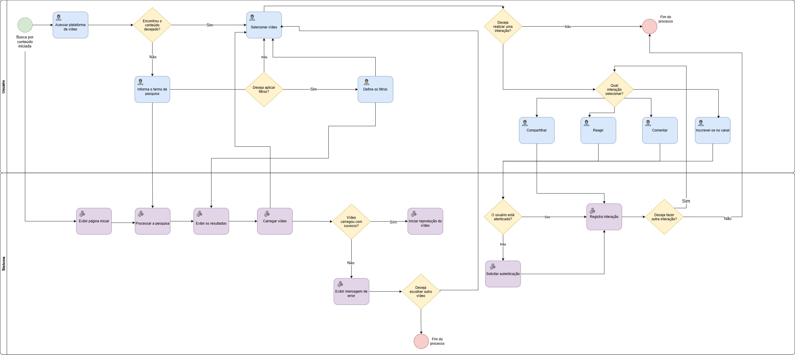

# Modelagem BPMN

## Introdução

O **BPMN (Business Process Model and Notation)** é uma notação padronizada para representação gráfica de processos. Seu objetivo é facilitar a compreensão e a comunicação dos fluxos de trabalho, evidenciando atividades, decisões, eventos, responsáveis e a sequência de execução do processo.

A notação BPMN é mantida pelo **Object Management Group (OMG)** e foi utilizada neste trabalho para representar, em um nível de abstração mais alto, um fluxo funcional recuperado durante a Engenharia Reversa do frontend do **PeerTube**.

A modelagem apresentada nesta seção corresponde ao **Cenário 1 — Pesquisar e assistir a um vídeo**, escolhido por ter sido executado majoritariamente por observação direta da aplicação durante o processo de Engenharia Reversa.

---

## Principais Abstrações da BPMN

### Objetos do Fluxo

#### Eventos

Eventos representam ocorrências que marcam pontos relevantes no processo. Podem indicar o início, acontecimentos intermediários ou o encerramento de um fluxo.

Na modelagem do PeerTube foram utilizados:

- **Evento de início:** `Busca por conteúdo iniciada`;
- **Eventos de fim:** utilizados para representar o encerramento do processo, tanto após o consumo/interação quanto após a decisão de não selecionar outro vídeo em caso de falha.

#### Atividades

Atividades representam ações executadas durante o processo.

Na modelagem foram utilizadas principalmente:

- **Tarefas humanas**, representando ações realizadas pelo usuário no frontend;
- **Tarefas de serviço/sistema**, representando respostas e operações executadas pelo PeerTube.

Exemplos de tarefas humanas presentes no fluxo:

- Acessar plataforma de vídeo;
- Informar o termo de pesquisa;
- Selecionar vídeo;
- Definir os filtros;
- Compartilhar;
- Reagir;
- Comentar;
- Inscrever-se no canal.

Exemplos de tarefas executadas pelo sistema:

- Exibir página inicial;
- Processar a pesquisa;
- Exibir os resultados;
- Carregar vídeo;
- Iniciar reprodução do vídeo;
- Exibir mensagem de erro;
- Solicitar autenticação;
- Registrar interação.

#### Gateways

Gateways representam pontos de decisão ou controle do fluxo. O diagrama utiliza **gateways exclusivos (XOR)**, pois cada decisão encaminha a execução por somente um dos caminhos possíveis.

Os gateways representados são:

- `Encontrou o conteúdo desejado?`;
- `Deseja aplicar filtros?`;
- `Vídeo carregou com sucesso?`;
- `Deseja escolher outro vídeo?`;
- `Deseja realizar uma interação?`;
- `Qual interação selecionar?`;
- `O usuário está autenticado?`;
- `Deseja fazer outra interação?`.

---

### Objetos de Conexão

#### Fluxo de Sequência

O fluxo de sequência representa a ordem em que eventos, atividades e gateways são executados dentro do processo.

No diagrama, os fluxos de sequência conectam as atividades das raias **Usuário** e **Sistema**, indicando a progressão do cenário desde a busca inicial até o encerramento do processo.

#### Fluxo de Mensagem

O fluxo de mensagem é utilizado, em BPMN, para representar a comunicação entre participantes pertencentes a pools distintas.

Nesta modelagem, o fluxo principal está organizado em uma única pool com duas raias. Portanto, a representação utiliza predominantemente **fluxos de sequência**, não sendo necessário representar troca de mensagens entre pools diferentes.

#### Associação

Associações podem ser utilizadas para conectar artefatos, observações ou documentos aos elementos BPMN sem alterar a execução do fluxo.

Não foram utilizadas associações como elemento central nesta versão do diagrama.

---

### Pistas de Responsabilidade (Swimlanes)

#### Piscina (Pool)

A pool representa o processo modelado como um todo.

Para fins de documentação, a pool deste diagrama é identificada como:

> **Pesquisar e assistir a um vídeo no PeerTube**

#### Raias (Lanes)

A pool foi dividida em duas raias:

- **Usuário:** reúne as ações realizadas pela pessoa que utiliza o frontend do PeerTube;
- **Sistema:** reúne as respostas e operações executadas pela aplicação.

Essa separação permite identificar de forma clara a responsabilidade de cada etapa do processo.

---

# Processo do grupo

Após a realização da Engenharia Reversa do frontend do PeerTube, o grupo selecionou o **Cenário 1 — Pesquisar e assistir a um vídeo** para ser representado em BPMN.

A escolha foi baseada no fato de que esse cenário pôde ser executado de forma majoritariamente direta durante a investigação. Foram observados o acesso à plataforma, a pesquisa de conteúdo, a aplicação de filtros, a seleção de vídeos, a reprodução, a ocorrência de falha de carregamento e diferentes possibilidades de interação.

A modelagem busca representar o comportamento funcional recuperado durante essa exploração, distinguindo as ações executadas pelo **Usuário** das respostas executadas pelo **Sistema**.

---

## PESQUISAR E ASSISTIR A UM VÍDEO

O processo começa quando o usuário inicia uma busca por conteúdo e acessa a plataforma de vídeo. O sistema apresenta a página inicial e o usuário verifica se encontrou diretamente o conteúdo desejado.

A partir desse ponto, existem dois caminhos:

- **Se o conteúdo desejado já foi encontrado**, o usuário seleciona o vídeo;
- **Se o conteúdo desejado não foi encontrado**, o usuário informa um termo de pesquisa, o sistema processa a busca e exibe os resultados.

Após a apresentação dos resultados, o usuário pode decidir se deseja aplicar filtros:

- **Se não desejar aplicar filtros**, segue para a seleção do vídeo;
- **Se desejar aplicar filtros**, define os critérios desejados antes de continuar para a seleção do conteúdo.

Depois que o vídeo é selecionado, o sistema tenta carregá-lo.

### Carregamento do vídeo

O gateway `Vídeo carregou com sucesso?` representa os dois resultados possíveis:

- **Sim:** o sistema inicia a reprodução do vídeo;
- **Não:** o sistema exibe uma mensagem de erro.

Quando ocorre uma falha, o usuário decide se deseja escolher outro vídeo:

- **Sim:** retorna ao ponto de seleção do vídeo;
- **Não:** o processo é encerrado.

### Interações após a reprodução

Quando a reprodução é iniciada, o usuário pode decidir se deseja realizar uma interação.

Caso não deseje interagir, o processo é finalizado.

Caso deseje, o gateway `Qual interação selecionar?` apresenta as alternativas modeladas:

- Compartilhar;
- Reagir;
- Comentar;
- Inscrever-se no canal.

Na versão atual do BPMN, as interações convergem para a verificação `O usuário está autenticado?`.

- **Se estiver autenticado**, o sistema registra a interação;
- **Se não estiver autenticado**, o sistema solicita autenticação e, em seguida, o fluxo converge para o registro da interação.

Após o registro, o usuário decide se deseja fazer outra interação:

- **Sim:** retorna ao gateway de escolha da interação;
- **Não:** o processo é encerrado.

**Figura 1 - BPMN do fluxo Pesquisar e Assistir a um Vídeo no PeerTube**  

Autor(es):<a href="https://github.com/dev-LucasDpaula">Lucas Oliveira</a>, <a href="https://github.com/menali17">Enzo Menali</a>, <a href="https://github.com/gpaulovit">Paulo Vitor</a> e <a href="https://github.com/GeovannaUmbelino">Geovanna Umbelino</a>

---

# Modelagem BPMN do PeerTube

O diagrama modela uma funcionalidade do frontend do PeerTube a partir do fluxo recuperado durante a Engenharia Reversa.

A pool foi dividida entre **Usuário** e **Sistema**, permitindo visualizar a alternância entre ações humanas e respostas da aplicação. Os pontos de decisão foram modelados com gateways exclusivos, uma vez que representam escolhas ou resultados mutuamente exclusivos em cada passagem do fluxo.

## Resumo dos principais elementos do diagrama

| **Elemento** | **Representação no modelo** |
|---|---|
| Pool | Pesquisar e assistir a um vídeo no PeerTube |
| Lane 1 | Usuário |
| Lane 2 | Sistema |
| Evento inicial | Busca por conteúdo iniciada |
| Tarefas humanas | Acesso, pesquisa, seleção, filtros e interações |
| Tarefas do sistema | Exibição, processamento, carregamento, reprodução, autenticação e registro |
| Gateways | Decisões sobre conteúdo, filtros, carregamento, interação e autenticação |
| Evento(s) final(is) | Fim do processo |
| Conector principal | Fluxo de sequência |

## Decisões representadas

| **Gateway** | **Possíveis caminhos** |
|---|---|
| Encontrou o conteúdo desejado? | Sim / Não |
| Deseja aplicar filtros? | Sim / Não |
| Vídeo carregou com sucesso? | Sim / Não |
| Deseja escolher outro vídeo? | Sim / Não |
| Deseja realizar uma interação? | Sim / Não |
| Qual interação selecionar? | Compartilhar / Reagir / Comentar / Inscrever-se no canal |
| O usuário está autenticado? | Sim / Não |
| Deseja fazer outra interação? | Sim / Não |

---

## Quadro de Colaboração do BPMN

<a>Tabela 1:</a> Quadro de colaboração do BPMN

| **Aluno** | **Participação** |
|---|---|
| [Lucas Oliveira](https://github.com/dev-LucasDpaula) | Modelagem do **início do processo e descoberta de conteúdo**, incluindo evento inicial, acesso à plataforma, exibição da página inicial e decisão sobre encontrar ou pesquisar um conteúdo. Auxílio na revisão geral do fluxo. |
| [Enzo Menali](https://github.com/menali17) | Modelagem do **fluxo de pesquisa e refinamento dos resultados**, incluindo pesquisa, exibição dos resultados, decisão sobre aplicação de filtros e definição dos filtros. Auxílio na revisão dos gateways. |
| [Paulo Vitor](https://github.com/gpaulovit) | Modelagem do **fluxo de seleção e reprodução do vídeo**, incluindo seleção do conteúdo, carregamento, verificação de sucesso, início da reprodução e tratamento do caminho de erro/seleção de outro vídeo. Auxílio na revisão das atividades do sistema. |
| [Geovanna Umbelino](https://github.com/GeovannaUmbelino) | Modelagem do **fluxo de interação com o conteúdo**, incluindo decisão de interação, compartilhamento, reação, comentário, inscrição no canal, verificação de autenticação, registro da interação e decisão sobre novas interações. Auxílio na revisão final do diagrama. |

<b>Fonte: </b><a href="https://github.com/dev-LucasDpaula">Lucas Oliveira</a>

---

## Referências Bibliográficas

> **OBJECT MANAGEMENT GROUP (OMG).** Business Process Model and Notation (BPMN). Disponível em: [https://www.omg.org/bpmn/](https://www.omg.org/bpmn/). Acesso em: 27 ago. 2026.

> **SERRANO, Milene.** Arquitetura e Desenho de Software – Aula BPMN Exemplos. *Universidade de Brasília*. Disponível em: [https://aprender3.unb.br/pluginfile.php/3178527/mod_page/content/2/Arquitetura%20e%20Desenho%20de%20software%20-%20Aula%20BPMN%20Exemplos%20-%20Profa.%20Milene.pdf](https://aprender3.unb.br/pluginfile.php/3178527/mod_page/content/2/Arquitetura%20e%20Desenho%20de%20software%20-%20Aula%20BPMN%20Exemplos%20-%20Profa.%20Milene.pdf). Acesso em: 27 ago. 2026.

> **PEERTUBE.** Search — PeerTube documentation. Disponível em: [https://docs.joinpeertube.org/use/search](https://docs.joinpeertube.org/use/search). Acesso em: 27 ago. 2026.

> **PEERTUBE.** Watch, share, download a video — PeerTube documentation. Disponível em: [https://docs.joinpeertube.org/use/watch-video](https://docs.joinpeertube.org/use/watch-video). Acesso em: 27 ago. 2026.

> **G3.** Relatório de Engenharia Reversa do Frontend do PeerTube. Disponível em: [Engenharia Reversa do Frontend do PeerTube](./Engenharia_reversa.md). Acesso em: 27 ago. 2026.

---

## Histórico de Versões

| Versão | Data | Descrição | Autor | Revisor |
| :---: | :--- | :--- | :--- | :--- |
| 1.0 | 27/08/2026 | Criação da documentação da modelagem BPMN do cenário “Pesquisar e assistir a um vídeo” | [Lucas Oliveira](https://github.com/dev-LucasDpaula) | [Enzo Menali](https://github.com/menali17) |

