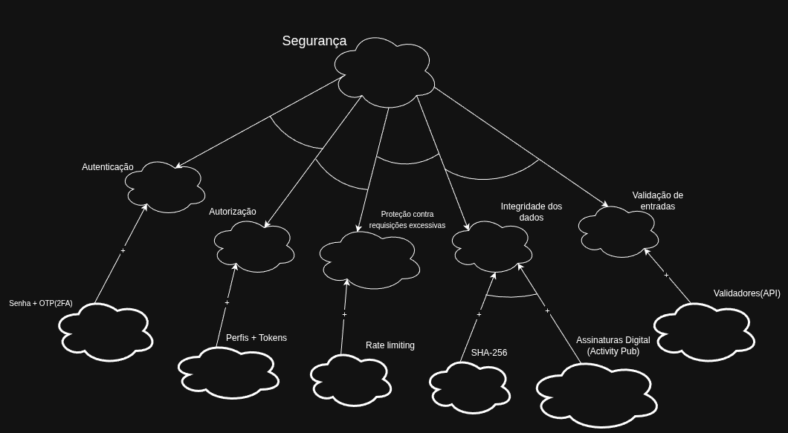
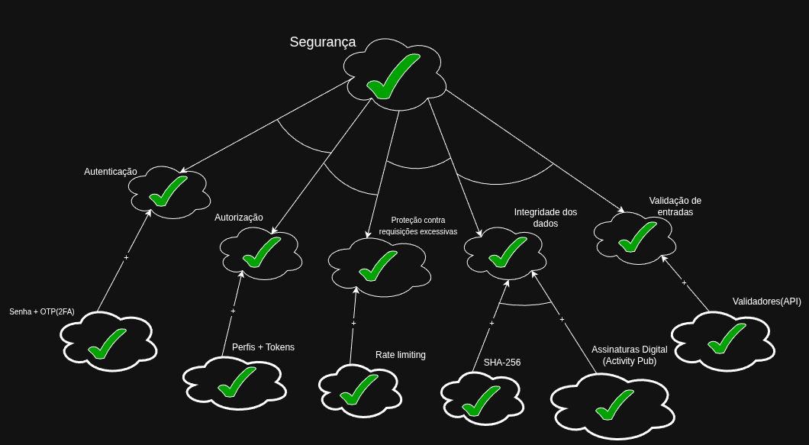

# NFR Framework

## Introdução

O NFR Framework é um framework conceitual voltado à condução da Engenharia de Requisitos orientada aos requisitos não funcionais (NFRs), no qual esses requisitos passam a ser tratados como cidadãos de primeira ordem do processo de modelagem, e não mais como restrições secundárias aos requisitos funcionais<a id="anchor_2" href="#/Base/Relatórios/1.2.SubEquipe_02/nfrframework?id=REF2">[2]</a>. Nele, um requisito não funcional é representado como um *softgoal*: uma meta cujo critério de satisfação não é precisamente definido, sendo avaliada por aproximação (satisfeita ou não satisfeita), a partir das evidências reunidas ao longo da análise<a id="anchor_2" href="#/Base/Relatórios/1.2.SubEquipe_02/nfrframework?id=REF2">[2]</a>.

Para representar e analisar esses softgoals e como eles se relacionam entre si, o NFR Framework utiliza o **Softgoal Interdependency Graph (SIG)**. Na Streaming de Vídeo, esse recurso foi usado pela SubEquipe_02 para modelar três critérios de qualidade do sistema, Usabilidade, Performance e Segurança, decompondo-os em subcaracterísticas mais concretas e avaliando o impacto das soluções de operacionalização propostas sobre cada um deles.

## Participantes

A seguir, a Tabela 1 indica os participantes da elaboração dos SIGs de Usabilidade, Performance e Segurança deste artefato.

Tabela 1: Participantes

  <table border="1" cellspacing="0" cellpadding="5">
    <thead>
      <tr>
        <th>Nome</th>
        <th>Quais etapas participou</th>
        <th>Data</th>
      </tr>
    </thead>
    <tbody>
      <tr>
        <td><a href="https://github.com/menali17">Enzo Menali</a></td>
        <td>Colaborou na elaboração dos SIGs (Usabilidade, Performance e Segurança) do NFR Framework</td>
        <td>26/08/2026</td>
      </tr>
      <tr>
        <td><a href="https://github.com/GeovannaUmbelino">Geovanna Umbelino</a></td>
        <td>Colaborou na elaboração dos SIGs (Usabilidade, Performance e Segurança) do NFR Framework</td>
        <td>26/08/2026</td>
      </tr>
      <tr>
        <td><a href="https://github.com/dev-LucasDpaula">Lucas Oliveira</a></td>
        <td>Colaborou na elaboração dos SIGs (Usabilidade, Performance e Segurança) do NFR Framework</td>
        <td>26/08/2026</td>
      </tr>
      <tr>
        <td><a href="https://github.com/gpaulovit">Paulo Vitor Gomes</a></td>
        <td>Colaborou na elaboração dos SIGs (Usabilidade, Performance e Segurança) do NFR Framework</td>
        <td>26/08/2026</td>
      </tr>
    </tbody>
  </table>

 Autor: <a href="https://github.com/gpaulovit">Paulo Vitor Gomes</a>

Link da apresentação: [NFR Framework](https://youtu.be/38vXSG_EEpw)

  <iframe width="560" height="315" src="https://www.youtube.com/embed/38vXSG_EEpw" title="Apresentação NFR Framework" frameborder="0" allow="accelerometer; autoplay; clipboard-write; encrypted-media; gyroscope; picture-in-picture; web-share" referrerpolicy="strict-origin-when-cross-origin" allowfullscreen></iframe>

## Softgoal Interdependency Graph

O Softgoal Interdependency Graph (SIG) é o modelo gráfico utilizado pelo NFR Framework para registrar o posicionamento da equipe de desenvolvimento sobre os softgoals de um sistema, explicitando suas interdependências de forma visual e concisa<a id="anchor_2b" href="#/Base/Relatórios/1.2.SubEquipe_02/nfrframework?id=REF2">[2]</a>.

### Tipos de Softgoal

Para compreender o SIG, é necessário distinguir os três tipos de softgoal que compõem o grafo<a id="anchor_1" href="#/Base/Relatórios/1.2.SubEquipe_02/nfrframework?id=REF1">[1]</a>:

- **NFR Softgoal**: representa a característica abstrata que se deseja avaliar (o próprio requisito não funcional), cujo critério de satisfação é impreciso e só é resolvido ao final da análise. É representado pela nuvem "em branco", sem preenchimento.
- **Operationalizing Softgoal (Softgoal de Operacionalização)**: representa a forma concreta de viabilizar (ou não) as características abstratas descritas pelos NFR Softgoals; no fundo, tratam-se de funcionalidades ou decisões de projeto. Correspondem aos nós-folha do SIG.
- **Claim Softgoal (Softgoal de Afirmação)**: é uma anotação escrita em linguagem natural que pode ser incrementada ao modelo para argumentar a favor ou contra um ponto específico da modelagem, sem alterar a estrutura formal do grafo.

Nos SIGs elaborados para a Streaming de Vídeo (Figuras 1 a 6), os softgoals de topo (Usabilidade, Performance e Segurança) e suas subcaracterísticas (por exemplo, Interface, Acessibilidade, Tempo de Resposta, Latência de Transmissão ao Vivo, Autenticação e Integridade dos Dados) são NFR Softgoals, enquanto os nós-folha (por exemplo, "Carregar funções em até 5 segundos", "Content Delivery Network (CDN)" e "Senha + OTP(2FA)") são Softgoals de Operacionalização.

### Interdependências

As interdependências definem como os softgoals se relacionam entre si dentro do SIG, dividindo-se em decomposições e contribuições.

#### Decomposições

As decomposições podem ocorrer em qualquer nível de abstração do grafo, subdividindo um softgoal em softgoals mais específicos<a id="anchor_1b" href="#/Base/Relatórios/1.2.SubEquipe_02/nfrframework?id=REF1">[1]</a>:

- **Decomposição NFR**: divide um softgoal mais abrangente em partes menores, reduzindo ambiguidades e facilitando sua priorização — é o tipo de decomposição empregado nos três SIGs do projeto (ex.: Usabilidade → Interface + Acessibilidade; Performance → Tempo de Resposta + Latência de Transmissão ao Vivo + Escalabilidade e Concorrência; Segurança → Autenticação + Autorização + Proteção contra Requisições Excessivas + Integridade dos Dados + Validação de Entradas).
- **Decomposição de Operacionalização**: refina uma solução geral em soluções mais específicas de implementação.
- **Decomposição de Afirmação**: subdivide uma justificativa (Claim) em afirmações mais específicas.
- **Decomposição de Priorização**: caso especial em que um softgoal é refinado em outro softgoal de mesmo tipo e tópico, associando-lhe uma prioridade.

Nos SIGs do projeto, os softgoals-filhos conectam-se ao softgoal-pai por meio de arcos de decomposição, que expressam a regra de combinação (AND/OR) definida pela equipe para a satisfação conjunta do softgoal-pai, e as operacionalizações-folha conectam-se aos softgoals por meio de links de contribuição rotulados, conforme descrito a seguir.

#### Contribuições

Como os softgoals se especializam progressivamente ao longo do SIG, um softgoal derivado pode contribuir de forma integral ou parcial, positiva ou negativa, para o softgoal do qual derivou. Os tipos de contribuição são<a id="anchor_2c" href="#/Base/Relatórios/1.2.SubEquipe_02/nfrframework?id=REF2">[2]</a>:

- **AND**: o softgoal-pai só é satisfeito se todos os softgoals-filhos forem satisfeitos.
- **OR**: o softgoal-pai é satisfeito se ao menos um dos softgoals-filhos for satisfeito.
- **MAKE (++)**: contribuição plenamente positiva do filho, suficiente para satisfazer o pai.
- **BREAK (--)**: contribuição plenamente negativa do filho, suficiente para negar o pai.
- **HELP (+)**: contribuição positiva do filho, mas insuficiente, isoladamente, para satisfazer o pai.
- **HURT (-)**: contribuição negativa do filho, mas insuficiente, isoladamente, para negar o pai.
- **UNKNOWN (?)**: o filho não afeta o pai de forma conhecida.
- **EQUALS (=)**: o pai e o filho compartilham o mesmo rótulo de satisfação.
- **SOME+ / SOME-**: o sentido da contribuição (positivo ou negativo) é conhecido, mas sua intensidade não pode ser determinada.

No SIG de Performance, por exemplo, as contribuições "Atraso menor que 3 segundos" (+) e "Content Delivery Network (CDN)" (++) sobre "Latência de Transmissão ao Vivo" ilustram, respectivamente, uma contribuição HELP e uma contribuição MAKE. Já no SIG de Segurança, todas as operacionalizações-folha (ex.: "Senha + OTP(2FA)" sobre Autenticação, "SHA-256" e "Assinaturas Digital (Activity Pub)" sobre Integridade dos Dados) foram rotuladas com contribuições HELP (+).

#### Propagação de Impactos

A propagação de impactos consiste em identificar as relações de dependência entre os requisitos não funcionais e analisar como a satisfação (ou negação) de um softgoal se propaga para os softgoals dos quais ele deriva, apoiando decisões informadas sobre trade-offs entre requisitos concorrentes<a id="anchor_2d" href="#/Base/Relatórios/1.2.SubEquipe_02/nfrframework?id=REF2">[2]</a>. Os rótulos de impacto utilizados são<a id="anchor_2e" href="#/Base/Relatórios/1.2.SubEquipe_02/nfrframework?id=REF2">[2]</a>:

- **✓ (satisfeito)**: o requisito não funcional contribui de forma suficiente para a satisfação do softgoal.
- **𝒲+ (fracamente satisfeito)**: há indícios positivos de satisfação, porém mais fracos que os do rótulo ✓.
- **X (negado)**: o requisito não funcional nega ou contradiz a satisfação do softgoal.
- **𝒲- (fracamente negado)**: há indícios contrários à satisfação, mais fracos que os do rótulo X.
- **🗲 (conflitante)**: há indícios tanto positivos quanto negativos para a satisfação do softgoal.
- **u (indeterminado)**: não há informações suficientes para determinar o impacto sobre o softgoal.

Nas versões avaliadas dos SIGs do projeto (Figuras 2, 4 e 6), todos os softgoals foram marcados com o rótulo **✓ (satisfeito)**, indicando que, segundo a análise da equipe, as operacionalizações propostas atendem às subcaracterísticas de Usabilidade, Performance e Segurança levantadas.

## SIGs do Projeto

### SIG de Usabilidade

O SIG de Usabilidade decompõe o softgoal em duas subcaracterísticas — Interface e Acessibilidade —, além do softgoal "Disponibilidade em Android e iOS". Interface é, por sua vez, decomposta em operacionalizações relacionadas ao acesso às funções do aplicativo, à clareza do contexto de busca e ao feedback contra abandono acidental de publicações; Acessibilidade reúne as operacionalizações de acesso textual ao conteúdo, acessibilidade sem uso do mouse (decomposta em contraste de cores e suporte a Libras) e disponibilidade multiplataforma.

<b>Figura 1</b> - SIG de Usabilidade (estrutura de decomposição e contribuições)

 Fonte: Autoria de <a href="https://github.com/menali17">Enzo Menali</a>, <a href="https://github.com/GeovannaUmbelino">Geovanna Umbelino</a>, <a href="https://github.com/dev-LucasDpaula">Lucas Oliveira</a> e <a href="https://github.com/gpaulovit">Paulo Vitor Gomes</a>.

<b>Figura 2</b> - SIG de Usabilidade com os rótulos de propagação de impacto (softgoals satisfeitos)

 Fonte: Autoria de <a href="https://github.com/menali17">Enzo Menali</a>, <a href="https://github.com/GeovannaUmbelino">Geovanna Umbelino</a>, <a href="https://github.com/dev-LucasDpaula">Lucas Oliveira</a> e <a href="https://github.com/gpaulovit">Paulo Vitor Gomes</a>.

### SIG de Performance

O SIG de Performance decompõe o softgoal em três subcaracterísticas: Tempo de Resposta, Latência de Transmissão ao Vivo e Escalabilidade e Concorrência. Tempo de Resposta é decomposto nas operacionalizações "Carregar informações em 3 segundos" e "Encontrar funcionalidades em 40 segundos" (contribuições HELP); Latência de Transmissão ao Vivo é decomposta em "Atraso menor que 3 segundos" (HELP) e "Content Delivery Network (CDN)" (MAKE).

<b>Figura 3</b> - SIG de Performance (estrutura de decomposição e contribuições)

 Fonte: Autoria de <a href="https://github.com/menali17">Enzo Menali</a>, <a href="https://github.com/GeovannaUmbelino">Geovanna Umbelino</a>, <a href="https://github.com/dev-LucasDpaula">Lucas Oliveira</a> e <a href="https://github.com/gpaulovit">Paulo Vitor Gomes</a>.

<b>Figura 4</b> - SIG de Performance com os rótulos de propagação de impacto (softgoals satisfeitos)

.jpg)

 Fonte: Autoria de <a href="https://github.com/menali17">Enzo Menali</a>, <a href="https://github.com/GeovannaUmbelino">Geovanna Umbelino</a>, <a href="https://github.com/dev-LucasDpaula">Lucas Oliveira</a> e <a href="https://github.com/gpaulovit">Paulo Vitor Gomes</a>.

### SIG de Segurança

O SIG de Segurança decompõe o softgoal em cinco subcaracterísticas: Autenticação, Autorização, Proteção contra Requisições Excessivas, Integridade dos Dados e Validação de Entradas. Autenticação é operacionalizada por "Senha + OTP (2FA)"; Autorização, por "Perfis + Tokens"; Proteção contra Requisições Excessivas, por "Rate limiting"; Validação de Entradas, por "Validadores (API)"; e Integridade dos Dados é decomposta em duas operacionalizações — "SHA-256" e "Assinaturas Digital (Activity Pub)". Todas as contribuições das operacionalizações-folha sobre suas respectivas subcaracterísticas estão rotuladas como HELP (+).

<b>Figura 5</b> - SIG de Segurança (estrutura de decomposição e contribuições)

 Fonte: Autoria de <a href="https://github.com/menali17">Enzo Menali</a>, <a href="https://github.com/GeovannaUmbelino">Geovanna Umbelino</a>, <a href="https://github.com/dev-LucasDpaula">Lucas Oliveira</a> e <a href="https://github.com/gpaulovit">Paulo Vitor Gomes</a>.

<b>Figura 6</b> - SIG de Segurança com os rótulos de propagação de impacto (softgoals satisfeitos)

 Fonte: Autoria de <a href="https://github.com/menali17">Enzo Menali</a>, <a href="https://github.com/GeovannaUmbelino">Geovanna Umbelino</a>, <a href="https://github.com/dev-LucasDpaula">Lucas Oliveira</a> e <a href="https://github.com/gpaulovit">Paulo Vitor Gomes</a>.

## Metodologia e Ferramentas

O Draw.io foi a ferramenta escolhida para a modelagem dos SIGs de Usabilidade, Performance e Segurança, seguindo a notação de nuvens (softgoals), arcos de decomposição e links de contribuição do NFR Framework, conforme apresentado no material de referência da disciplina<a id="anchor_2f" href="#/Base/Relatórios/1.2.SubEquipe_02/nfrframework?id=REF2">[2]</a>.

## Referências Bibliográficas

1. SILVA, Reinaldo Antônio. **NFR4ES: Um Catálogo de Requisitos Não-Funcionais para Sistemas Embarcados**. Centro de Informática, UFPE, Recife, 2019. Disponível em: [https://repositorio.ufpe.br/handle/123456789/34150](https://repositorio.ufpe.br/handle/123456789/34150). Acesso em: 27 ago. 2026.
2. CHUNG, L.; NIXON, B. A.; YU, E.; MYLOPOULOS, J. **Non-Functional Requirements in Software Engineering**. International Series in Software Engineering, v. 5. Boston: Springer/Kluwer Academic Publishers, 2000. Conteúdo verificado a partir do material de apoio da disciplina de Arquitetura e Desenho de Software (SERRANO, Milene; SERRANO, Maurício. Requisitos – Aula 17: Modelagem de Requisitos, NFR Framework. Faculdade UnB Gama, 2023) disponível em: [NFR Framework](https://drive.google.com/file/d/1barJrSu7LXNuprttazBs7J7nVgCTgul8/view), que cita a mesma obra como referência primária do NFR Framework.

## Leitura Complementar

As referências a seguir ficam indicadas para aprofundamento sobre o NFR Framework aplicado a outros domínios:

1. PAIM, F. R. S.; CASTRO, J. F. B. **Enhancing Data Warehouse Design with the NFR Framework**. Centro de Informática, UFPE, Recife, 2019. Disponível em: [http://wer.inf.puc-rio.br/WERpapers/artigos/artigos_WER02/paim.pdf](http://wer.inf.puc-rio.br/WERpapers/artigos/artigos_WER02/paim.pdf). Acesso em: 27 ago. 2026.

## Histórico de Versões

| Versão | Data       | Descrição                                                         | Autor                                                                                                                                                                                                                     | Revisores    |
| ------ | ---------- | ------------------------------------------------------------------ | -------------------------------------------------------------------------------------------------------------------------------------------------------------------------------------------------------------------- | ------------ |
| 1.0    | 27/08/2026 | Elaboração do artefato NFR Framework (SIGs de Usabilidade e Performance) e documentação teórica base | [Enzo Menali](https://github.com/menali17), [Geovanna Umbelino](https://github.com/GeovannaUmbelino), [Lucas Oliveira](https://github.com/dev-LucasDpaula) e [Paulo Vitor Gomes](https://github.com/gpaulovit) | [Breno Teixeira](https://github.com/BrenoLTeixeira),[Gabriel Diniz](https://github.com/GabrielDiniz12) e [Pedro Américo](https://github.com/dev-americo) |
| 1.1    | 28/08/2026 | Adição do SIG de Segurança e do link da apresentação do artefato | [Enzo Menali](https://github.com/menali17), [Geovanna Umbelino](https://github.com/GeovannaUmbelino), [Lucas Oliveira](https://github.com/dev-LucasDpaula) e [Paulo Vitor Gomes](https://github.com/gpaulovit) | [Breno Teixeira](https://github.com/BrenoLTeixeira),[Gabriel Diniz](https://github.com/GabrielDiniz12) e [Pedro Américo](https://github.com/dev-americo) |
